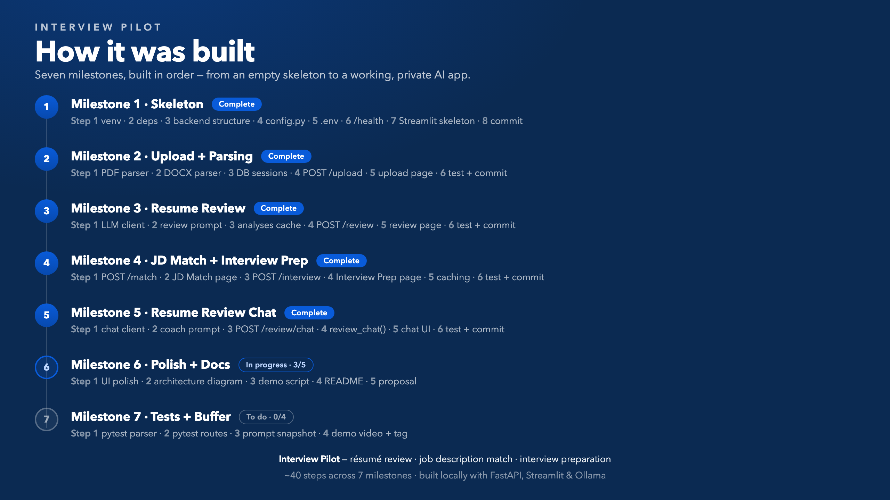
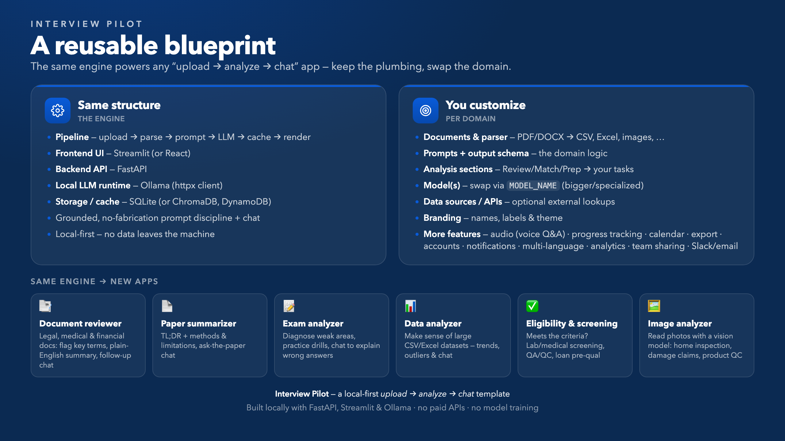

# interview-pilot-steps & tips



## Part 1 — Milestone Tracker

### Milestone 1 — Skeleton ✅ (complete)

- ✅ Step 1 — Backend venv
- ✅ Step 2 — Deps + requirements.txt
- ✅ Step 3 — Backend structure (b13aa4a)
- ✅ Step 4 — config.py
- ✅ Step 5 — .env.example + .env
- ✅ Step 6 — main.py + /health under uvicorn (9a661a5)
- ✅ Step 7 — Streamlit skeleton (759d2b5)
- ✅ Step 8 — Commit

### Milestone 2 — Upload + Parsing ✅ (complete)

- ✅ Step 1 — PDF parser (7a42f11)
- ✅ Step 2 — DOCX parser (same commit)
- ✅ Step 3 — db.py + models.py sessions (3e648fa)
- ✅ Step 4 — POST /upload (a68b726)
- ✅ Step 5 — Upload page (3c3985d) — later refactored to inline upload per section
- ✅ Step 6 — Test + commit

### Milestone 3 — Resume Review end-to-end ✅ (complete)

- ✅ Step 1 — LLMClient (9b3f4d8)
- ✅ Step 2 — Section-1 prompt (7b23644)
- ✅ Step 3 — analyses table (116de91)
- ✅ Step 4 — POST /review (153a044)
- ✅ Step 5 — Resume Review page (8e80a27)
- ✅ Step 6 — Test + commit

### Milestone 4 — Sections 2 & 3 ✅ (complete)

- ✅ Step 1 — /match (9aa84ff)
- ✅ Step 2 — JD Match page (e0c534b)
- ✅ Step 3 — /interview (db18c68)
- ✅ Step 4 — Interview Prep page (07afcc8)
- ✅ Step 5 — Caching across sections (+ JD-change invalidation 346afdb)
- ✅ Step 6 — Test + commit

### Milestone 5 — Resume Review Chat ✅ (was M7)

- ✅ Step 1 — chat_messages() (c586fa5)
- ✅ Step 2 — chat system prompt (9ff6460)
- ✅ Step 3 — POST /review/chat (ac87fd3)
- ✅ Step 4 — review_chat() in lib/api.py (36708ac)
- ✅ Step 5 — chat UI (36708ac)
- ✅ Step 6 — Test + commit

### Milestone 6 — Polish + Docs ⏳ (3 of 5) (was M5)

- ⬜ Step 1 — UI polish: partial — severity & matching-skills chips ✅; no score gauge / copy buttons yet (theme/color/chat polish done — f081677, 6b630bc)
- ✅ Step 2 — Architecture/workflow diagram → docs/architecture.png
- ⬜ Step 3 — docs/demo-script.md — not created
- ✅ Step 4 — README with setup (+ 5 diagram/slide PNGs)
- ⬜ Step 5 — docs/proposal.md — not created

Notes: ✅ theme color · ✅ chat (M5) · ✅ chat-history list · ✅ upload moved into each section · ⬜ collapse landing page · ✅ JD-change invalidation · DB at interview_pilot_backend/interview_pilot.db

### Milestone 7 — Tests + Buffer ⬜ (0 of 4) (was M6)

- ⬜ Step 1 — pytest parser (only tests/__init__.py; manual scripts/smoke_*.py exist)
- ⬜ Step 2 — pytest routes
- ⬜ Step 3 — prompt snapshot test
- ⬜ Step 4 — backup demo video + final commit/tag

Grand total: ~18–30 hours across 6 milestones — comfortably the "1 week" your plan budgets (Days 1–7), with buffer. Pace varies a lot with how much Ollama/debugging fights you and how much you pause to learn.

## A reusable blueprint

The same engine powers other "upload → analyze → chat" apps — keep the plumbing, swap the domain.



## Part 2 — Detailed Build Walkthrough

### Milestone 1 · Step 1 — Create & activate the backend venv

In your terminal:

cd "/Users/yiwenzhang/Library/CloudStorage/OneDrive-Personal/All_YZHot/5_Software/vscode/26-ai/_capstone/interview-pilot

/interview_pilot_backend"

```
# create the isolated environment
python3 -m venv .venv
# activate it (zsh/bash on macOS)
source .venv/bin/activate
```

# confirm you're inside it — should point to the .venv path, not /opt/anaconda3

```
which python
python --version
```

What this does: creates a private Python environment in interview_pilot_backend/.venv/ so the packages we install don't

```
touch your Anaconda base.
```

Success looks like:

- Your prompt now starts with (.venv)
- which python prints .../interview_pilot_backend/.venv/bin/python
- python --version prints Python 3.12.7

### Milestone 1 · Step 2 — Pin dependencies & install the backend stack

Stay in interview_pilot_backend with (.venv) active.

File to create: requirements.txt the authentic install-then-freeze workflow. So you're all set; run them as-is:

```
pip install --upgrade pip
pip install fastapi "uvicorn[standard]" sqlalchemy httpx pypdf
python-docx python-multipart
```

pydantic pydantic-settings python-dotenv pytest

```
pip freeze > requirements.txt
```

What makes this the "real" way:

- You install only what you actually need — the top-level packages, by name.
- pip freeze captures the full truth — every package plus the sub-dependencies pip pulled in, each pinned to the exact version that landed in your env. That's why the resulting file is ~30+ lines, not 11.
- The file is reproducible — anyone (a grader, future-you) runs pip install -r requirements.txt and gets the identical environment.

Run it, then paste cat requirements.txt so I can sanity-check the versions before Step 3 — scaffold the backend folders.

- fastapi — the web framework that defines your API endpoints (/upload, /review, etc.) and auto-generates interactive docs.
- uvicorn[standard] — the ASGI server that actually runs the FastAPI app and listens for HTTP requests; [standard] adds faster, production-grade extras.
- sqlalchemy — the ORM that lets you read/write the SQLite database (sessions + cached analyses)

using Python objects instead of raw SQL.

- httpx — the async HTTP client your backend uses to call the local Ollama LLM at localhost:11434.
- pypdf — extracts plain text from uploaded PDF resumes.
- python-docx — extracts plain text from uploaded DOCX (Word) resumes.
- python-multipart — lets FastAPI receive uploaded files (multipart form data); without it, file upload endpoints fail.
- pydantic — validates and shapes your request/response data, so inputs and LLM outputs match a defined schema instead of arbitrary dicts.
- pydantic-settings — loads configuration (Ollama host, model name, DB URL) from environment variables / .env into a typed settings object.
- python-dotenv — reads your .env file so those config values are available as environment variables during local development.
- pytest — the testing framework for your parser and API tests (Milestone 7).

You can create it in one shot from the terminal with this heredoc (paste the whole block):

```
cat > requirements.txt <<'EOF'
# --- Web framework ---
fastapi==0.115.6
uvicorn[standard]==0.34.0
# --- Data validation / settings ---
pydantic==2.10.4
pydantic-settings==2.7.1
# --- Database ---
SQLAlchemy==2.0.36
# --- LLM + HTTP ---
httpx==0.28.1
# --- File parsing ---
pypdf==5.1.0
python-docx==1.1.2
# --- Multipart uploads (FastAPI file upload) ---
python-multipart==0.0.20
# --- Env management ---
python-dotenv==1.0.1
# --- Testing ---
pytest==8.3.4
EOF
```

(Or just create requirements.txt in VS Code and paste the part between the EOF markers.)

Then install:

```
pip install --upgrade pip
pip install -r requirements.txt
```

What this does: requirements.txt pins exact versions so your environment is reproducible (and graders can rebuild it). The install pulls FastAPI (API server), Uvicorn (the server that runs it),

SQLAlchemy (SQLite ORM), httpx (to call Ollama), the PDF/DOCX parsers, and pytest.

Success looks like:

- pip install ends with Successfully installed fastapi-0.115.6 … pytest-8.3.4 (a long list, no red

ERROR lines).

- pip list | grep -iE "fastapi|uvicorn|sqlalchemy|httpx|pypdf" shows all of them.

Run it, then paste the tail of the install output (or any error) and I'll confirm before Step 3 — scaffold the backend folder structure.

#### ✅ Milestone 1 · Step 2 — Complete

All 11 of your top-level packages are there, plus their sub-dependencies — exactly what pip freeze should produce. Quick map of the "extras" so they're not mysterious:

- starlette, anyio, h11, click, httptools, uvloop, watchfiles, websockets → pulled in by fastapi/uvicorn
- httpcore, certifi, idna → pulled in by httpx
- pydantic_core, annotated-types, typing_extensions, typing-inspection → pulled in by pydantic
- lxml → python-docx; pluggy, iniconfig, Pygments → pytest; PyYAML, packaging → shared utilities

That's a healthy, reproducible file. 👍

### Milestone 1 · Step 3 — Scaffold the backend folder structure

Now we create the empty Python package layout (folders + empty files) so later steps have a home. From interview_pilot_backend with (.venv) active:

```
# package directories
mkdir -p app/routers app/services app/utils tests
# package marker files (make folders importable as Python packages)
touch app/__init__.py app/routers/__init__.py app/services/__init__.py
app/utils/__init__.py tests/__init__.py
# core module placeholders (we'll fill these in upcoming steps)
touch app/main.py app/config.py app/db.py app/models.py app/schemas.py
touch app/routers/upload.py app/routers/review.py app/routers/match.py
app/routers/interview.py
touch app/services/parser.py app/services/llm.py app/services/prompts.py
touch app/utils/text.py
```

What this does:

- mkdir -p creates the nested folders (app/, app/routers/, etc.) in one go.
- The __init__.py files (even empty) tell Python "this folder is an importable
```
package," so from app.services.llm import ... works later.
```

- The other touched files are empty placeholders matching Section 4 of your plan — we'll write real code into them step by step.

Success looks like — run this to verify:

```
find app tests -type f | sort
```

You should see all the files listed under app/... and tests/.... Or if you have

```
tree:
tree -a app tests
```

Run it and paste the find output — I'll confirm the structure before Step 4 —

```
write config.py (the settings module).
```

is the step 3 the authentic way to do this? Honest answer: partly. The directory creation and __init__.py files are authentic, but pre-touching a dozen empty .py files is a bit artificial — empty files do nothing, and most developers create a module the moment they actually write code into it, not before.

Here's how real projects usually do it:

What's genuinely "authentic":

- mkdir -p for the folder tree — yes.
- Creating __init__.py in each package folder — yes, this is standard and necessary so Python treats the folders as importable packages. (Technically Python

3 has "namespace packages" that work without them, but explicit __init__.py is the conventional, recommended practice.)

What's not how people normally work:

- Pre-creating empty main.py, config.py, llm.py, etc. Developers typically create each file when they're about to fill it in. An empty main.py can't even run, so it's just a placeholder.

So the more authentic version is: make the directories + __init__.py now, and create each module file at the step where we write its code. Like this:

```
# directories
mkdir -p app/routers app/services app/utils tests
# package markers — these are real and needed now
touch app/__init__.py app/routers/__init__.py app/services/__init__.py
app/utils/__init__.py tests/__init__.py
```

That's it for Step 3. Then in Step 4 you'll create app/config.py by pasting its real contents, Step 5 creates app/main.py, and so on — each file born with actual code in it.

Verify:

```
find app tests -type f | sort
You should see exactly the five __init__.py files.
```

Want to go with this leaner version? Run those two commands and paste the find

```
output, and we'll move to Step 4 — config.py.
```

### Milestone 1 · Step 3 — Scaffold the backend structure

✅ Authentic way (recommended — what real devs do)

Create only the directories and the package markers now. Each module file gets born later, at the step where you actually write its code.

```
# directories
mkdir -p app/routers app/services app/utils tests
# package markers — real and needed now
touch app/__init__.py app/routers/__init__.py app/services/__init__.py
app/utils/__init__.py tests/__init__.py
```

Why this is the authentic way: An empty main.py does nothing and can't run — so devs don't create it until they're about to fill it. Directories and __init__.py files, on the other hand, are real structural scaffolding Python needs to treat your folders as importable packages, so those are created up front.

Verify:

```
find app tests -type f | sort
Expect exactly the five __init__.py files.
```

📚 Learning aid / big-picture (optional — NOT how devs normally work)

If you'd rather see the whole skeleton laid out so you can picture the finished app, you can also pre-create the empty module files. This is purely a visualization crutch — totally fine for learning, just know it's not standard practice.

```
# core module placeholders (we'll fill these in upcoming steps)
touch app/main.py app/config.py app/db.py app/models.py app/schemas.py
touch app/routers/upload.py app/routers/review.py app/routers/match.py
app/routers/interview.py
touch app/services/parser.py app/services/llm.py app/services/prompts.py
touch app/utils/text.py
```

What this does: lays down empty placeholders matching Section 4 of your plan, so

```
find/tree shows the full intended shape immediately.
```

See the whole picture:

```
find app tests -type f | sort # flat list
tree -a app tests # tree view, if you have `tree`
```

My recommendation: run the Authentic way block. If you just want the map in your head once, glance at the placeholder list above (or even run it once and rm the empties later) — but you don't need to.

Pick one, run it, and paste the find output. Then we go to Step 4 — write

```
config.py (settings module).
```

📦 Optional — install tree for the nicer indented view

```
brew install tree
```

Then tree -a app tests will work and show the visual tree. Worth having long-term, but totally optional for this project.

#### ✅ Milestone 1 · Step 3 — Complete

You ran both blocks, so you now have the full skeleton matching Section 4 of your plan. Everything's there:

- Package markers ✔ — all five __init__.py files
- Core modules ✔ — main.py, config.py, db.py, models.py, schemas.py
- Routers ✔ — upload.py, review.py, match.py, interview.py
- Services ✔ — parser.py, llm.py, prompts.py
- Utils ✔ — text.py

The module files are empty placeholders right now — that's fine, we'll fill each one with real code at its step. The whole-picture view you wanted is now visible in that find output. 👍

### Milestone 1 · Step 4 — Write config.py (the settings module)

This is the first file with real code. config.py centralizes every configurable value (Ollama address, model name, database location) into one typed object, loaded from environment variables / a .env file. Everything else in the app imports settings from here instead of hard-coding values.

config.py is already an empty file, so open it in VS Code and paste this in:

```
"""Application settings.
```

All configurable values live here, loaded from environment variables

(or a local .env file) via pydantic-settings. Import `settings` anywhere:

```
from app.config import settings
```

settings.model_name

```
"""
from pydantic_settings import BaseSettings, SettingsConfigDict
class Settings(BaseSettings):
# --- Ollama (local LLM runtime) ---
ollama_host: str = "http://localhost:11434"
model_name: str = "llama3.1:8b"
request_timeout: float = 60.0 # seconds to wait on an LLM call
# --- Database ---
database_url: str = "sqlite:///./interview_pilot.db"
# --- Uploads ---
max_upload_mb: int = 5 # reject resumes larger than this
# Load values from a .env file in the backend folder if present.
model_config = SettingsConfigDict(
```

env_file=".env",

env_file_encoding="utf-8",

extra="ignore",

)

```
# Single shared instance imported throughout the app.
settings = Settings()
```

What this does, line by line (the parts worth understanding):

- class Settings(BaseSettings) — pydantic-settings reads each attribute from an environment variable of the same name (e.g. MODEL_NAME env var → model_name).

Case-insensitive.

- The values you see ("http://localhost:11434", "llama3.1:8b", etc.) are defaults

— used when no env var / .env entry overrides them. So the app runs with zero config out of the box.

- model_config = SettingsConfigDict(env_file=".env", …) — tells it to also read a

.env file in the current folder. extra="ignore" means unknown keys in .env won't crash it.

- settings = Settings() at the bottom — creates one shared instance. Other modules do from app.config import settings and read settings.model_name, etc. (This is the standard pattern, vs. re-reading env vars everywhere.)

Verify it loads correctly (from interview_pilot_backend, .venv active):

```
python -c "from app.config import settings; print(settings.model_name,
```

settings.ollama_host, settings.database_url)"

Success looks like:

llama3.1:8b http://localhost:11434 sqlite:///./interview_pilot.db

Paste that output (or any error) and we'll go to Step 5 — .env.example + .env,

```
then wire up main.py with the /health endpoint.
```

Here's the situation in your repo:

- Your repo already has an initial commit (fb515c3 Initial commit + ab8b333 Add files via upload — that's your README.md and implementation_plan.md).
- Everything you've built today (interview_pilot_backend/) is untracked (??

interview_pilot_backend/).

- ⚠️ .venv is sitting inside that untracked folder. If you git add it now, you'd commit your entire virtual environment — thousands of files, hundreds of MB. You must add a .gitignore first.

When to commit (authentic practice)

Commit at logical, working checkpoints — "commit early, commit often." Your build plan's milestones are natural commit points. You're at the end of Milestone 1's scaffolding, so right now is a great first backend commit — once .gitignore is in

```
place and config.py verifies.
```

Rough cadence going forward: one commit per milestone (or per meaningful unit, like "add /health endpoint"). Small, themed commits with clear messages beat one giant commit at the end.

### Pre-commit · Step A — Create .gitignore

Create a file named .gitignore at the repo root (interview-pilot/, not inside the backend). Paste this:

```
# --- Python ---
```

__pycache__/

```
*.py[cod]
```

*.egg-info/

```
# --- Virtual environments ---
```

.venv/

venv/

env/

```
# --- Environment / secrets ---
```

.env

```
# --- Databases (local SQLite) ---
```

*.db

*.sqlite3

```
# --- OS / editor cruft ---
```

.DS_Store

.idea/

*.log

Why each matters: .venv/ keeps your huge environment out of git (it's rebuildable from requirements.txt). .env keeps secrets/local config out. *.db keeps your local

SQLite data out. __pycache__/.DS_Store are auto-generated junk.

### Pre-commit · Step B — Verify git will ignore the venv

cd "/Users/yiwenzhang/Library/CloudStorage/OneDrive-Personal/All_YZHot/5_Software/ vscode/26-ai/_capstone/interview-pilot"

```
git status --short
```

Success looks like: you see interview_pilot_backend/ and .gitignore listed, but no

.venv paths. Double-check with:

git status --porcelain | grep -c "\.venv" || echo "venv correctly ignored (0 matches)"

Should print venv correctly ignored (0 matches).

### Pre-commit · Step C — Make the commit

```
Only after config.py verifies (Step 4) and .venv is confirmed ignored:
git add .gitignore interview_pilot_backend/
git status # review exactly what's staged — should be source files,
```

requirements.txt, NO .venv

```
git commit -m "Scaffold FastAPI backend: structure, deps, settings"
```

#### ✅ Milestone 1 · Step 4 — Complete

llama3.1:8b http://localhost:11434 sqlite:///./interview_pilot.db config.py loads cleanly and all three values print correctly. Settings module works. 🎉

Now to your first backend commit. Here are the three pre-commit steps again, in order:

### Pre-commit · Step A — Create .gitignore (repo root)

Create .gitignore in interview-pilot/ (the repo root, not the backend folder).

Paste:

```
# --- Python ---
```

__pycache__/

```
*.py[cod]
```

*.egg-info/

```
# --- Virtual environments ---
```

.venv/

venv/

env/

```
# --- Environment / secrets ---
```

.env

```
# --- Databases (local SQLite) ---
```

*.db

*.sqlite3

```
# --- OS / editor cruft ---
```

.DS_Store

.idea/

*.log

### Pre-commit · Step B — Confirm .venv is ignored

cd "/Users/yiwenzhang/Library/CloudStorage/OneDrive-Personal/All_YZHot/5_Software/ vscode/26-ai/_capstone/interview-pilot"

```
git status --short
```

git status --porcelain | grep -c "\.venv" && echo "(.venv NOT ignored — stop!)" ||

```
echo "venv correctly ignored"
```

Success: you see .gitignore and interview_pilot_backend/ listed, and the last line prints venv correctly ignored (no .venv/... paths).

### Pre-commit · Step C — Commit

```
git add .gitignore interview_pilot_backend/ implementation_plan.md
git status # review staged files — source + requirements.txt, NO .venv,
```

NO .env, NO *.db

```
git commit -m "Scaffold FastAPI backend: structure, deps, settings"
```

Run Step A, then Step B, and paste the Step B output. I want to eyeball that .venv is excluded before you run the git add in Step C — that's the one thing worth double-checking.

Nice — first backend commit pushed. 👍 Here's the next step so you can pick it up whenever.

### Milestone 1 · Step 5 — Create .env.example and .env

Your config.py already knows how to read a .env file. Now you create two files:

- .env.example — a committed template showing which variables exist (no secrets).

Other people (and graders) copy it.

- .env — your actual local values. This is git-ignored (we added it to

.gitignore), so it never gets committed.

Both go in interview_pilot_backend/ (next to requirements.txt).

✅ Authentic way

Most projects keep .env.example in git and create the real .env by copying it. So:

- Create .env.example (paste this into a new file interview_pilot_backend/.env.example):
```
# Ollama (local LLM runtime)
```

OLLAMA_HOST=http://localhost:11434

MODEL_NAME=llama3.1:8b

REQUEST_TIMEOUT=60

```
# Database
```

DATABASE_URL=sqlite:///./interview_pilot.db

```
# Uploads
```

MAX_UPLOAD_MB=5

- Create your real .env by copying the template (from interview_pilot_backend/,

.venv active):

cp .env.example .env

For now the defaults are fine, so .env can be an exact copy. Later, if you switch models (e.g. to mistral:7b), you'd edit only .env, not the code.

Why the names are UPPERCASE: pydantic-settings matches env vars to your Settings fields case-insensitively, so MODEL_NAME (env) → model_name (Python). Uppercase is the conventional style for environment variables.

📚 Learning aid — prove .env actually overrides defaults

To see the override mechanism work, temporarily change one value in .env and watch it take effect:

# temporarily set a different model in .env, then check what config loads:

```
echo "MODEL_NAME=mistral:7b" >> .env
python -c "from app.config import settings; print('model is:',
```

settings.model_name)"

Expect: model is: mistral:7b — proving .env overrode the llama3.1:8b default in code. Then undo it (delete that last line from .env, or just cp .env.example .env again to reset).

Verify

```
ls -a | grep env # should list .env and .env.example
```

git status --short # .env.example shows up; .env should NOT (it's ignored)

Success: .env.example appears as a new untracked file; .env does not appear

(confirming .gitignore is protecting it).

After this: Step 6 — write app/main.py with the /health endpoint that pings Ollama

— the first thing you'll actually run as a server (uvicorn) and hit in a browser.

That's the finish line for Milestone 1.

When you're back and have run Step 5, paste the ls/git status output and we'll do

Step 6.

#### ✅ Milestone 1 · Step 5 — Complete

- ls shows .env, .env.example, .venv all present ✔
- git status shows only ?? .env.example — meaning .env and .venv are correctly ignored (not showing up) ✔

Your secrets/local config are protected, the template is tracked. 👍

### Milestone 1 · Step 6 — main.py + the /health endpoint (the finish line

for Milestone 1)

This is the first thing you'll run as an actual server. The /health endpoint does two jobs:

confirms your API is alive, and pings Ollama to confirm the LLM runtime is reachable.

Create the code

```
Open app/main.py (currently empty) and paste:
"""FastAPI application entry point.
```

Run locally with:

```
uvicorn app.main:app --reload --port 8000
```

Then open:

```
http://localhost:8000/health -> JSON health check
http://localhost:8000/docs -> auto-generated interactive API docs
"""
import httpx
from fastapi import FastAPI
from app.config import settings
app = FastAPI(title="InterviewPilot API", version="0.1.0")
@app.get("/health")
async def health() -> dict:
"""Liveness check + confirms the local Ollama server is reachable."""
ollama_reachable = False
```

try:

async with httpx.AsyncClient(timeout=5.0) as client:

```
# /api/tags lists installed models; a 200 means Ollama is up.
resp = await client.get(f"{settings.ollama_host}/api/tags")
ollama_reachable = resp.status_code == 200
```

except httpx.HTTPError:

```
ollama_reachable = False
return {
```

"status": "ok",

"ollama_reachable": ollama_reachable,

"model": settings.model_name,

```
}
```

What this does:

- app = FastAPI(...) — creates the application object. uvicorn app.main:app means "in module app.main, run the object named app."
- @app.get("/health") — registers a GET route at /health.
- async def + httpx.AsyncClient — async so the server isn't blocked while waiting on Ollama. The

5s timeout keeps the health check snappy.

- The try/except means: if Ollama is down, you get ollama_reachable: false instead of a crash — the endpoint always responds.

Run the server

From interview_pilot_backend with (.venv) active:

```
uvicorn app.main:app --reload --port 8000
```

This takes over the terminal (it's a long-running server). --reload auto-restarts it when you edit code. Leave it running.

the endpoint always responds.

Run the server

From interview_pilot_backend with (.venv) active:

```
uvicorn app.main:app --reload --port 8000
```

This takes over the terminal (it's a long-running server). --reload auto-restarts it when you edit code. Leave it running.

Success looks like — the terminal shows:

```
INFO: Uvicorn running on http://127.0.0.1:8000 (Press CTRL+C to quit)
INFO: Application startup complete.
```

Test it (two options)

Browser: open http://localhost:8000/health — and also try http://localhost:8000/docs for the auto-generated Swagger UI (a nice demo feature).

Or a second terminal (keep the server running in the first):

```
curl -s http://localhost:8000/health
```

Expected JSON:

```
{"status":"ok","ollama_reachable":true,"model":"llama3.1:8b"}
```

- ollama_reachable: true → Ollama is running (you ran ollama serve earlier).
- ollama_reachable: false → API works, but Ollama isn't up. Start it with ollama serve & in another terminal, then refresh /health. status stays "ok" either way — that's intentional.

To stop the server: Ctrl+C in its terminal.

Run it, paste the /health JSON (and a note on whether the INFO: Uvicorn running line appeared).

If it works, Milestone 1 is done and we'll commit it, then start Milestone 2 (upload + parsing).

```
curl -s http://localhost:8000/health
```

{"status":"ok","ollama_reachable":false,"model":"llama3.1:8b"}% /health works — your API is alive and returning correct JSON. ✅ That's Step 6's core goal achieved.

```
{"status":"ok","ollama_reachable":false,"model":"llama3.1:8b"}
```

ollama_reachable: false is expected — it just means the Ollama server isn't running right now.

The endpoint correctly detected that instead of crashing. Let's flip it to true to confirm the full health check end-to-end.

Start Ollama and re-check

In a new terminal (leave uvicorn running):

```
ollama --version # confirm Ollama is installed
ollama serve # starts the LLM server at localhost:11434
```

If ollama serve says the address is already in use, it's already running — that's fine.

Then re-hit health (another terminal, or just refresh the browser):

```
curl -s http://localhost:8000/health
```

Expected now:

```
{"status":"ok","ollama_reachable":true,"model":"llama3.1:8b"}
```

If ollama --version says "command not found," Ollama isn't installed yet — tell me and I'll give you the install + ollama pull llama3.1:8b steps (you'll need the model pulled before Milestone 3 anyway).

Let me mark Step 6 done in the tracker. Step 6 checked off. Once you've confirmed ollama_reachable: true (or told me Ollama needs installing), we move to Step 7 — the Streamlit frontend skeleton, then Step 8 — commit Milestone

1.

Ollama is installed (client version 0.24.0) — the warning just means the server isn't running yet. Start it:

In a new/dedicated terminal (it stays running like uvicorn):

```
ollama serve
```

You'll see log lines and it'll hold the terminal. Leave it.

Then re-check health (browser refresh, or another terminal):

```
curl -s http://localhost:8000/health
```

Expected:

```
{"status":"ok","ollama_reachable":true,"model":"llama3.1:8b"}
```

You now have three terminals running long-lived processes — worth keeping straight:

- uvicorn (your API, port 8000)
- ollama serve (the LLM runtime, port 11434)
- a free terminal for commands like curl, git, etc.

One thing to verify for later: you'll need the actual model pulled before Milestone 3. Check in your free terminal:

```
ollama list
```

If llama3.1:8b isn't listed, pull it (it's a ~4.7 GB download, so start it whenever convenient):

```
ollama pull llama3.1:8b
```

Paste the /health result showing ollama_reachable: true and we'll start Step 7 — Streamlit frontend skeleton.

```
ollama list
```

NAME ID SIZE MODIFIED

llama3.1:8b 46e0c10c039e 4.9 GB 6 days ago

{"status":"ok","ollama_reachable":true,"model":"llama3.1:8b"} ✅ Step 6 fully verified — ollama_reachable: true. Your backend talks to Ollama, the health check works end-to-end. Backend skeleton is done. 🎉

Now the other half of Milestone 1.

### Milestone 1 · Step 7 — Streamlit frontend skeleton

Same pattern as the backend: its own venv, its own deps, then an entry file + empty page stubs.

The frontend is a separate app (separate venv) that talks to your backend over HTTP — that's why it gets its own environment.

All of this happens in the interview_pilot_frontend/ folder. Open a new terminal for it (keep

```
uvicorn + ollama running in theirs).
```

7a — Create & activate the frontend venv cd "/Users/yiwenzhang/Library/CloudStorage/OneDrive-Personal/All_YZHot/5_Software/vscode/26-ai/_c apstone/interview-pilot/interview_pilot_frontend"

```
python3 -m venv .venv
source .venv/bin/activate
which python # should point inside interview_pilot_frontend/.venv
```

interview_pilot_frontend % which python

/Users/yiwenzhang/Library/CloudStorage/OneDrive-Personal/All_YZHot/5_Software/vscode/26-ai/_capstone/interview-pilot/interview_pilot_frontend/.venv/bin/python

7b — Install deps + freeze (authentic install-then-freeze)

The frontend needs far less than the backend: Streamlit (UI), httpx (to call your backend),

```
python-dotenv (read .env).
pip install --upgrade pip
pip install streamlit httpx python-dotenv
pip freeze > requirements.txt
7c — Create streamlit_app.py (entry point + sidebar)
Create interview_pilot_frontend/streamlit_app.py:
"""InterviewPilot — Streamlit frontend entry point.
```

Run with:

```
streamlit run streamlit_app.py
```

Opens at http://localhost:8501

```
"""
```

st.set_page_config(page_title="InterviewPilot", page_icon="🎯", layout="wide")

```
st.title("🎯 InterviewPilot")
```

st.write("AI-powered resume review and interview prep — all running locally.")

st.info("Navigate with the sidebar: **Upload → Resume Review → JD Match → Interview Prep**.")

```
# Sidebar always shows where the user is in the flow.
with st.sidebar:
st.header("Session")
session_id = st.session_state.get("session_id")
resume_name = st.session_state.get("resume_filename")
st.write(f"**Session ID:** {session_id or '— none yet —'}")
st.write(f"**Resume:** {resume_name or '— none uploaded —'}")
```

7d — Create the 4 page stubs

Streamlit auto-builds sidebar navigation from a pages/ folder, ordered by the number prefix.

Create the folder and four placeholder pages:

```
mkdir -p pages
```

Then create these four files (each is a tiny placeholder we'll fill in later milestones):

```
pages/1_Upload.py
import streamlit as st
st.title("1 · Upload")
st.write("Resume upload — built in Milestone 2.")
pages/2_Resume_Review.py
import streamlit as st
st.title("2 · Resume Review")
st.write("Section 1 analysis — built in Milestone 3.")
pages/3_JD_Match.py
import streamlit as st
st.title("3 · JD Match")
st.write("Section 2 analysis — built in Milestone 4.")
pages/4_Interview_Prep.py
import streamlit as st
st.title("4 · Interview Prep")
st.write("Section 3 analysis — built in Milestone 4.")
```

7e — Create .env.example (and .env)

The frontend needs to know where the backend lives. Create interview_pilot_frontend/.env.example:

```
# Backend API base URL
```

BACKEND_URL=http://localhost:8000

Then copy it to your real local config:

cp .env.example .env

(.env is already covered by the repo-root .gitignore you made earlier.)

7f — Run it

```
streamlit run streamlit_app.py
```

This takes over the terminal (4th long-running process) and should auto-open your browser.

Success looks like:

- Terminal prints You can now view your Streamlit app... Local URL: http://localhost:8501.
- Browser opens to the 🎯 InterviewPilot title page.
- Sidebar shows: a navigation list (app, 1 Upload, 2 Resume Review, 3 JD Match, 4 Interview Prep)

plus your "Session" box reading "Session ID: — none yet —" and "Resume: — none uploaded —".

- Clicking each page in the sidebar shows its placeholder text.

Run through 7a–7f and tell me what the browser shows (or paste any error). Then Step 8 — commit

Milestone 1 and we're done with the skeleton.

🎉 Frontend skeleton is running — sidebar shows all 4 pages + the Session box. That's Step 7 complete. Milestone 1's whole skeleton (backend /health + frontend) is now working.

You now have all the moving parts up: uvicorn (8000), ollama serve (11434), streamlit (8501).

A couple of harmless notes from that output, no action required:

- The "install Watchdog" tip just means file-watching for auto-reload is a bit slower without it

— totally optional. If you want snappier reloads later: pip install watchdog (in the frontend venv).

- You can silence the telemetry/email prompt permanently with the gatherUsageStats = false snippet it mentioned — also optional.

Let me check off Step 7. Milestone 1 · Step 8 — Commit the frontend skeleton (closes Milestone 1)

From the repo root. First, stop and stage carefully — the frontend has its own .venv and .env that must NOT be committed.

cd "/Users/yiwenzhang/Library/CloudStorage/OneDrive-Personal/All_YZHot/5_Software/vscode/26-ai/_c apstone/interview-pilot"

# stage the whole frontend folder (gitignore should exclude .venv and .env)

```
git add interview_pilot_frontend/
# CRITICAL CHECK — review exactly what's staged before committing
git status
```

Confirm git status shows (staged, green):

- interview_pilot_frontend/streamlit_app.py
- interview_pilot_frontend/requirements.txt
- interview_pilot_frontend/.env.example
- interview_pilot_frontend/pages/1_Upload.py … 4_Interview_Prep.py

And does NOT show: anything under interview_pilot_frontend/.venv/ or a bare .env. Quick guard:

git status --porcelain | grep "frontend/.venv" && echo ">>> STOP: .venv staged!" || echo "venv correctly ignored"

Should print venv correctly ignored.

Then commit (and push if you want):

git commit -m "Add Streamlit frontend skeleton: entry page, 4 stubs, sidebar"

```
git push
```

Paste the git status (or the venv correctly ignored line) before you commit if you want me to eyeball it — that's the one risky moment. Once committed, Milestone 1 is done ✅ and we start

## Milestone 2 — Upload + Parsing.

Milestone 1 complete. 🎉 Backend /health + frontend skeleton both built, running, and committed. One quick sanity check worth running (since I didn't get to verify the staging) — confirm your

.venv didn't accidentally get committed:

git ls-files interview_pilot_frontend/ | grep -c "\.venv" && echo ">>> .venv WAS committed — tell me, we'll fix" || echo "clean: no .venv tracked"

Should print clean: no .venv tracked. If it shows a number > 0, ping me and we'll untrack it.

## Milestone 2 — Upload + Parsing

Goal: user uploads a resume (PDF/DOCX) → backend extracts the text → saves a session in SQLite → returns a session_id. By the end, your Streamlit Upload page works end-to-end.

The steps (6 total):

- parser.py — extract text from PDF (pypdf)
- parser.py — handle DOCX (python-docx)
- db.py + models.py — SQLAlchemy sessions table + DB setup
- POST /upload router — save file → parse → create session → return session_id
- Streamlit Upload page — posts the file, stores session_id
- Manual test with 2–3 real resumes, then commit

We'll go one step at a time as usual.

### Milestone 2 · Step 1 — Extract text from PDF (services/parser.py)

parser.py is the module that turns an uploaded file into plain text the LLM can read. We start

```
with PDF. Open app/services/parser.py (currently empty) and paste:
"""Resume text extraction.
```

Turns an uploaded resume (PDF or DOCX) into plain text for the LLM.

DOCX support is added in the next step.

```
"""
from io import BytesIO
from io import BytesIO
from pypdf import PdfReader
def extract_text_from_pdf(data: bytes) -> str:
```

Args:

```
data: Raw bytes of the uploaded PDF.
```

Returns:

The concatenated text of all pages, stripped of leading/trailing whitespace. Pages with no extractable text contribute nothing.

```
"""
reader = PdfReader(BytesIO(data))
pages = [page.extract_text() or "" for page in
```

reader.pages]

```
return "\n".join(pages).strip()
```

What this does:

- Takes raw bytes (what an upload gives you) rather than a file path — more flexible, works directly with FastAPI's uploaded files.
- BytesIO(data) wraps the bytes so pypdf can read them like a file.
- page.extract_text() or "" — extract_text() can return None on image-only pages; the or ""

guards against that so "\n".join(...) never crashes.

- Returns the text with surrounding whitespace stripped.

Quick test — let's confirm it works on a real PDF. In your backend terminal (.venv active), point it at any PDF you have (even a non-resume, just to test extraction):

```
python -c "from app.services.parser import extract_text_from_pdf;
```

print(extract_text_from_pdf(open('/path/to/some.pdf','rb').read())[:500])"

Replace /path/to/some.pdf with a real file. Success: it prints the first 500 characters of the

PDF's text.

Then rerun:

```
python -c "from app.services.parser import
```

extract_text_from_pdf; print(extract_text_from_pdf(open('../re sume_sample1_Frontend_Engineer.pdf','rb').read())[:500])"

```
Success: it prints the first 500 characters of your sample
```

resume's text. Paste what shows.

Got a PDF resume handy? Run it and paste what prints (or any error), and we'll add DOCX support in Step 2.

PDF extraction works perfectly — clean text, proper formatting. ✅ Step 1 done.

Let me update the tracker and give Step 2. Milestone 2 · Step 2 — DOCX support + a dispatcher

Now we add DOCX extraction and one dispatcher function that picks the right parser based on the filename — so the rest of the app calls a single extract_text(filename, data) and doesn't care about the format.

```
Add these to app/services/parser.py. First, add the import
near the top (under the pypdf import):
from docx import Document
▎ Note: the package is python-docx, but you import it as docx
```

▎ — a common gotcha.

Then add these two functions at the bottom of the file:

```
def extract_text_from_docx(data: bytes) -> str:
"""Extract plain text from DOCX file bytes.
```

Reads every paragraph in document order and joins them with newlines.

```
"""
document = Document(BytesIO(data))
paragraphs = [para.text for para in document.paragraphs]
return "\n".join(paragraphs).strip()
def extract_text(filename: str, data: bytes) -> str:
"""Dispatch to the right extractor based on the file
```

extension.

Args:

```
filename: Original upload name, used only to read the
```

extension.

```
data: Raw file bytes.
```

Returns:

Extracted plain text.

Raises:

```
ValueError: If the extension is not .pdf or .docx.
"""
lower = filename.lower()
if lower.endswith(".pdf"):
return extract_text_from_pdf(data)
```

if lower.endswith(".docx"):

```
return extract_text_from_docx(data)
raise ValueError(f"Unsupported file type: {filename!r}.
```

Use PDF or DOCX.")

What this does:

- extract_text_from_docx — python-docx reads a .docx as a

Document; .paragraphs gives every text paragraph in order. (It ignores tables/headers, which is fine for resumes.)

- extract_text(filename, data) — the single entry point the

/upload route will call. It inspects the extension and routes to PDF or DOCX, and raises a clear ValueError for anything else (which the route will turn into a friendly error message).

- {filename!r} in the error uses repr() so the filename shows with quotes — easier to read in logs.

Test both paths. PDF (should still work):

```
python -c "from app.services.parser import extract_text;
```

print(extract_text('resume.pdf', open('../resume_sample1_Front end_Engineer.pdf','rb').read())[:300])"

If you have a .docx resume handy, test that too (swap in its path):

```
python -c "from app.services.parser import extract_text;
```

print(extract_text('resume.docx', open('../SOME_RESUME.docx','rb').read())[:300])"

python -c "from app.services.parser import extract_text; print(extract_text('resume.docx',open('../resume_sample1_Frontend_Engineer.docx','rb').read())[:500])"

And confirm the error path works:

```
python -c "from app.services.parser import extract_text;
```

extract_text('resume.txt', b'hello')"

```
Success: the PDF (and DOCX if you tested it) print text; the
```

.txt call raises ValueError: Unsupported file type:

'resume.txt'. Use PDF or DOCX.

```
Paste the results — then Step 3: the database (db.py +
models.py).
```

DOCX extraction works — same clean text as the PDF, through the single extract_text dispatcher. ✅ Step 2 done. Both formats now route through one function. Milestone 2 · Step 3 — Database setup (db.py + models.py)

Now we set up SQLite so uploads persist. Two files:

- db.py — the plumbing: engine, session factory, base class, and helpers.
- models.py — the sessions table defined as a Python class.
```
Create app/db.py
Open the empty app/db.py and paste:
"""Database setup: SQLAlchemy engine, session factory, and helpers."""
from sqlalchemy import create_engine
from sqlalchemy.orm import declarative_base, sessionmaker
from app.config import settings
# check_same_thread=False is required for SQLite under FastAPI,
# which may touch the connection from different threads.
engine = create_engine(
```

settings.database_url,

```
connect_args={"check_same_thread": False},
)
# Factory that produces individual DB sessions (one per request).
```

SessionLocal = sessionmaker(bind=engine, autoflush=False, autocommit=False)

```
# Base class all ORM models inherit from.
Base = declarative_base()
def init_db() -> None:
"""Create any tables that don't exist yet (no migrations for MVP)."""
from app import models # noqa: F401 (import so models register on Base)
```

Base.metadata.create_all(bind=engine)

```
def get_db():
"""FastAPI dependency: hand out a DB session, always close it."""
db = SessionLocal()
```

try:

yield db

finally:

```
db.close()
Create app/models.py
Open the empty app/models.py and paste:
"""SQLAlchemy ORM models."""
import uuid
from datetime import datetime
from sqlalchemy import Column, DateTime, String, Text
from app.db import Base
def _new_uuid() -> str:
return str(uuid.uuid4())
class Session(Base):
"""One upload session: the resume now, the pasted JD later."""
__tablename__ = "sessions"
id = Column(String, primary_key=True, default=_new_uuid)
created_at = Column(DateTime, default=datetime.utcnow)
resume_filename = Column(String, nullable=False)
resume_text = Column(Text, nullable=False)
jd_text = Column(Text, nullable=True) # set later in Section 2
```

What this does (the parts worth understanding):

- engine — the actual connection to your SQLite file (interview_pilot.db, from your config.py). Created lazily; the file appears on first write.
- SessionLocal — a factory. Each web request gets its own short-lived db = SessionLocal() to talk to the database, then closes it. (Confusingly, SQLAlchemy's "Session" is unrelated to your sessions table — same word, different meaning.)
- Base — the parent class; every model subclasses it so SQLAlchemy knows about it.
- init_db() — creates tables from your models. We'll call this once on app startup. create_all only creates missing tables, so it's safe to run repeatedly.
- get_db() — the FastAPI dependency pattern: it yields a session and guarantees .close() afterward, even on error.
- In models.py, id defaults to a random UUID string, created_at to the current time — both filled automatically when you create a row.

Test it

From the backend terminal (.venv active), create the DB and insert one row:

```
python -c "
from app.db import init_db, SessionLocal
from app.models import Session
```

init_db()

```
db = SessionLocal()
s = Session(resume_filename='emily.pdf', resume_text='hello world')
db.add(s); db.commit()
```

print('created session id:', s.id, '| created_at:', s.created_at)

```
db.close()
"
```

Success looks like:

- Prints something like created session id: 3f2a... | created_at: 2026-06-12 ...
- A new file interview_pilot.db appears in the backend folder (check with ls *.db).

(You may see a DeprecationWarning about datetime.utcnow on Python 3.12 — harmless for the MVP; ignore it.)

Run it and paste the output. Then Step 4 — the POST /upload endpoint that ties parsing + DB together.

```
python -c "from app.db import init_db, SessionLocal; from app.models
import Session; init_db(); db = SessionLocal(); s =
Session(resume_filename='emily.pdf', resume_text='hello world');
db.add(s); db.commit(); print('created session id:', s.id, '|
created_at:', s.created_at); db.close()"
```

created session id: e78ddb05-1725-4fc8-b0b4-1ff8df3639ac | created_at: 2026-06-12 22:23:25.447424

Database works — session created with an auto-generated UUID and timestamp, and interview_pilot.db now exists. ✅ Step 3 done. (That test row is harmless dev data.) Milestone 2 · Step 4 — The POST /upload endpoint

This ties everything together: receive a file → enforce size limit → extract text → save a session →

```
return the session_id + a preview. Three files: a response schema, the
router, and wiring into main.py.
4a — Create the response schema (app/schemas.py)
Open the empty app/schemas.py and paste:
"""Pydantic request/response models (the shapes the API accepts and
returns)."""
from pydantic import BaseModel
class UploadResponse(BaseModel):
session_id: str
resume_filename: str
resume_preview: str
4b — Create the upload router (app/routers/upload.py)
Open the empty app/routers/upload.py and paste:
"""POST /upload — accept a resume file, extract its text, create a
session."""
from fastapi import APIRouter, Depends, File, HTTPException, UploadFile
from sqlalchemy.orm import Session as DBSession
from app.config import settings
from app.db import get_db
from app.models import Session
from app.schemas import UploadResponse
from app.services.parser import extract_text
router = APIRouter()
@router.post("/upload", response_model=UploadResponse)
async def upload_resume(
file: UploadFile = File(...),
db: DBSession = Depends(get_db),
) -> UploadResponse:
data = await file.read()
# 1. Enforce the size limit from config.
max_bytes = settings.max_upload_mb * 1024 * 1024
```

if len(data) > max_bytes:

```
raise HTTPException(
status_code=413,
detail=f"File too large. Max {settings.max_upload_mb} MB.",
)
# 2. Extract text; parser raises ValueError on unsupported types.
```

try:

```
text = extract_text(file.filename, data)
```

except ValueError as exc:

```
raise HTTPException(status_code=400, detail=str(exc))
# 3. Reject empty / image-only files.
```

if not text:

```
raise HTTPException(
status_code=422,
```

detail="No text could be extracted. The file may be empty or image-only.",

)

```
# 4. Persist the session.
session = Session(resume_filename=file.filename, resume_text=text)
db.add(session)
db.commit()
db.refresh(session)
```

# 5. Return the id + a short preview so the UI can confirm parsing worked.

```
return UploadResponse(
```

session_id=session.id,

resume_filename=session.resume_filename, resume_preview=text[:500],

)

```
4c — Wire it into main.py
```

Your main.py needs three additions: import the router and init_db, run init_db() on startup, and register the router. The cleanest way is to replace the whole file with this version (it keeps your /health endpoint unchanged):

```
"""FastAPI application entry point.
```

Run locally with:

```
uvicorn app.main:app --reload --port 8000
```

Then open:

```
http://localhost:8000/health -> JSON health check
http://localhost:8000/docs -> auto-generated interactive API docs
"""
from contextlib import asynccontextmanager
import httpx
from fastapi import FastAPI
from app.config import settings
from app.db import init_db
from app.routers import upload
@asynccontextmanager
async def lifespan(app: FastAPI):
# Runs once on startup: create DB tables if they don't exist yet.
```

init_db()

yield

```
# (nothing to clean up on shutdown for now)
```

app = FastAPI(title="InterviewPilot API", version="0.1.0", lifespan=lifespan)

```
# Register routers.
```

app.include_router(upload.router)

```
@app.get("/health")
async def health() -> dict:
"""Liveness check + confirms the local Ollama server is reachable."""
ollama_reachable = False
```

try:

async with httpx.AsyncClient(timeout=5.0) as client:

```
# /api/tags lists installed models; a 200 means Ollama is up.
resp = await client.get(f"{settings.ollama_host}/api/tags")
ollama_reachable = resp.status_code == 200
```

except httpx.HTTPError:

```
ollama_reachable = False
return {
```

"status": "ok",

"ollama_reachable": ollama_reachable,

"model": settings.model_name,

```
}
```

What changed & why:

- lifespan — the modern FastAPI startup hook. init_db() runs once when the server boots, so your tables always exist. (Replaces the older @app.on_event("startup"), which is deprecated.)
- app.include_router(upload.router) — mounts the /upload route onto the app.
- The UploadFile = File(...) in the router is why you needed python-multipart installed back in Milestone

1 — FastAPI uses it to parse uploaded files.

Test it

Your uvicorn server should auto-reload when you save (watch its terminal for Application startup complete again — and no errors). Then in your free terminal, upload a real resume:

curl -s -F "file=@../resume_sample1_Frontend_Engineer.pdf" http://localhost:8000/upload

```
Expected: JSON like
{"session_id":"<uuid>","resume_filename":"resume_sample1_Frontend_Engineer.pdf","resume_preview":"Emily
Carter\nFrontend Software Engineer\n..."}
```

Also try the error path (unsupported type):

```
curl -s -F "file=@requirements.txt" http://localhost:8000/upload
Expected: {"detail":"Unsupported file type: 'requirements.txt'. Use PDF
or DOCX."}
```

You can also do this visually at http://localhost:8000/docs → expand POST /upload → "Try it out" → choose a file → Execute.

Paste the /upload JSON (and watch the uvicorn terminal for any reload errors). Then Step 5 — the Streamlit

Upload page.

```
from contextlib import asynccontextmanager
```

whaht is this used for? asynccontextmanager is a decorator from Python's standard library that turns an async function into an async context manager — something you can use with async with, that runs setup code, then "pauses," then runs cleanup code afterward.

```
In your main.py it's used to build FastAPI's lifespan handler:
@asynccontextmanager
async def lifespan(app: FastAPI):
```

init_db() # ← SETUP: runs once, when the server starts up yield # ← the app runs here, serving requests, until shutdown

```
# (cleanup) # ← TEARDOWN: runs once, when the server shuts down
```

The key is the single yield. It splits the function into two halves:

- Before yield → runs on startup. That's where init_db() lives, so your database tables get created the moment the server boots.
- After yield → runs on shutdown. Empty for now, but it's where you'd close DB connections, flush logs, etc.

FastAPI knows how to drive this because you passed it in:

```
app = FastAPI(..., lifespan=lifespan)
```

On startup FastAPI enters the context manager (runs the setup half), keeps it

"open" while serving traffic, and on shutdown exits it (runs the teardown half).

Why this pattern instead of just calling init_db() at the top of the file?

Code at module top-level runs on import — which also happens during tests, tooling, etc. The lifespan hook runs only when the server actually starts,

```
which is the correct, predictable moment for setup/teardown.
```

It's asynccontextmanager (not the plain contextmanager) because FastAPI's lifespan protocol is asynchronous — it awaits entering/exiting it. The decorator just saves you from writing a full class with __aenter__/__aexit__ methods by hand.

```
(Historically people used @app.on_event("startup") for this, but that's
```

deprecated now — lifespan is the current recommended approach.)

Both paths work perfectly:

- ✅ Valid PDF → session_id + filename + clean preview, persisted to the DB
- ✅ Invalid type → friendly {"detail":"Unsupported file type..."} error

Step 4 done — your backend upload pipeline is complete end-to-end (receive → validate → parse → persist → respond). Good commit point before we switch to the frontend again (schemas + router +

```
main.py wiring are a complete unit):
```

cd "/Users/yiwenzhang/Library/CloudStorage/OneDrive-Personal/All_YZHot/5_Softw are/vscode/26-ai/_capstone/interview-pilot"

```
git add interview_pilot_backend/app/schemas.py
interview_pilot_backend/app/routers/upload.py
interview_pilot_backend/app/main.py
```

git commit -m "Add POST /upload endpoint: parse resume and create session"

```
git push
```

### Milestone 2 · Step 5 — Streamlit Upload page

Now the frontend. The user picks a file, clicks a button, and Streamlit posts it to your /upload endpoint and stores the returned session_id so later pages can use it. Two files: a small API-client helper, then the page itself.

```
5a — Create the backend client (lib/api.py)
```

This is the "thin client" from your plan — one place that knows how to talk to the backend, so pages stay clean. In the frontend folder, create lib/ and an

```
__init__.py, then lib/api.py:
```

cd "/Users/yiwenzhang/Library/CloudStorage/OneDrive-Personal/All_YZHot/5_Softw are/vscode/26-ai/_capstone/interview-pilot/interview_pilot_frontend"

```
mkdir -p lib
touch lib/__init__.py
Then create lib/api.py:
"""Thin HTTP client for the InterviewPilot backend."""
import os
import httpx
from dotenv import load_dotenv
```

load_dotenv() # read BACKEND_URL from .env if present

```
BACKEND_URL = os.getenv("BACKEND_URL", "http://localhost:8000")
```

def upload_resume(filename: str, data: bytes, content_type: str) -> dict:

```
"""POST a resume file to the backend /upload endpoint.
```

Returns the parsed JSON on success. Raises RuntimeError with the backend's error message on failure (e.g. unsupported file type).

```
"""
files = {"file": (filename, data, content_type)}
resp = httpx.post(f"{BACKEND_URL}/upload", files=files, timeout=30.0)
```

if resp.status_code != 200:

```
# Backend returns {"detail": "..."} for errors.
```

try:

```
detail = resp.json().get("detail", resp.text)
```

except Exception:

```
detail = resp.text
```

raise RuntimeError(detail)

```
return resp.json()
5b — Fill in the Upload page (pages/1_Upload.py)
Replace the placeholder contents of pages/1_Upload.py with:
import streamlit as st
from lib.api import upload_resume
st.title("1 · Upload")
st.write("Upload your resume (PDF or DOCX). We'll extract the text for
```

analysis.")

```
uploaded = st.file_uploader("Choose a resume", type=["pdf", "docx"])
if uploaded is not None and st.button("Upload & parse"):
with st.spinner("Uploading and extracting text…"):
```

try:

```
result = upload_resume(
```

uploaded.name,

uploaded.getvalue(),

uploaded.type or "application/octet-stream",

)

except Exception as exc:

```
st.error(f"Upload failed: {exc}")
```

else:

```
# Store in session_state so other pages + the sidebar can see it.
st.session_state["session_id"] = result["session_id"]
st.session_state["resume_filename"] = result["resume_filename"]
st.success(f"Uploaded! Session ID: {result['session_id']}")
with st.expander("Preview extracted text"):
st.text(result["resume_preview"])
```

What this does:

- st.file_uploader(..., type=["pdf","docx"]) — Streamlit's file picker, restricted to those extensions.
- uploaded.getvalue() — the file's raw bytes; uploaded.name / uploaded.type — its filename and MIME type. These map straight to your upload_resume() args.
- On success it saves session_id + resume_filename into st.session_state —

Streamlit's per-user memory that survives page switches. That's why your sidebar "Session" box (which reads those keys) will now light up across all pages.

- The try/except/else shows the backend's friendly error (e.g. unsupported type) instead of a crash.

Test it

Your Streamlit app should auto-reload. (If it's not running: streamlit run streamlit_app.py from the frontend folder with its .venv active.) Then in the browser:

- Click 1 · Upload in the sidebar.
- Choose your sample resume PDF.
- Click Upload & parse.

Success looks like:

- A green "Uploaded! Session ID: …" message.
- An expander showing the extracted text preview.
- The sidebar "Session" box now shows the real Session ID and resume filename

(instead of "— none yet —") — and stays filled when you click other pages.

⚠️ Make sure your backend (uvicorn) is still running in its terminal — the page calls it. If you get "Upload failed: … Connection refused," the backend isn't up.

Paste what the browser shows (or any error), and that's Step 5. Then Step 6 — test 2–3 resumes and commit closes Milestone 2.

🎉 Upload works end-to-end through the UI — file picked → posted to backend → parsed → session created → preview shown. Step 5 done.

Quick check: click another sidebar page (e.g. 2 · Resume Review) and confirm the sidebar "Session" box now shows that Session ID + the resume filename and

```
keeps showing it across pages. That confirms st.session_state is wired
```

correctly for the later sections. Milestone 2 · Step 6 — Test a few resumes, then commit (closes Milestone 2)

Test matrix

Run through these in the Upload page to make sure it's robust (you've already done #1 and #2):

- ✅ A DOCX resume → works.
- A PDF resume → upload one, confirm preview + Session ID.
- An unsupported type (e.g. a .txt or image) → the picker only allows pdf/docx, but if you force one through, you should get a clean "Upload failed:

Unsupported file type…" — not a crash.

- Re-upload (a second file) → confirm the Session ID in the sidebar changes to the new one (each upload = a new session row).

You can also confirm rows are actually persisting in SQLite (from the backend terminal, .venv active):

```
python -c "
from app.db import SessionLocal
from app.models import Session
db = SessionLocal()
rows = db.query(Session).all()
print(f'{len(rows)} sessions stored:')
```

for r in rows:

print(' -', r.id, '|', r.resume_filename, '|', len(r.resume_text),

'chars')

```
db.close()
"
Success: prints one row per upload you've done, each with a filename and
```

character count.

Option A — an inline-safe one-liner (replaces the loop with a generator inside join, so no for statement):

python -c "from app.db import SessionLocal; from app.models import Session; db=SessionLocal(); rows=db.query(Session).all(); print(f'{len(rows)} sessions

```
stored:'); print(chr(10).join(f' - {r.id} | {r.resume_filename} |
{len(r.resume_text)} chars' for r in rows)); db.close()"
```

Then commit Milestone 2's frontend work cd "/Users/yiwenzhang/Library/CloudStorage/OneDrive-Personal/All_YZHot/5_Softw are/vscode/26-ai/_capstone/interview-pilot"

```
git status --short # expect: lib/__init__.py, lib/api.py,
pages/1_Upload.py
```

(NOT .venv, NOT *.db)

```
git add interview_pilot_frontend/lib/
interview_pilot_frontend/pages/1_Upload.py
git commit -m "Add Streamlit upload page and backend API client"
git push
```

If git status surprises you (e.g. shows __pycache__ or a .db), paste it before committing and I'll check. __pycache__ should be ignored by your .gitignore; if it isn't, tell me.

Run the test matrix + the DB query, then commit. Paste the DB query output

(and anything odd), and that closes Milestone 2 — next up is the fun one,

Milestone 3: the first real LLM section.

Both behaviors are expected — nothing's broken:

- Can't even select a .txt/image — that's by design. Your st.file_uploader(..., type=["pdf", "docx"]) filters the OS file picker so only

PDF/DOCX are selectable. That's a nice first line of defense. Your backend still has the real guard too (the ValueError → friendly error you tested earlier with curl), in case a bad file ever reaches it another way. So you're protected at both layers. ✅

- New Session ID on every click — also expected, given the current code. Each click of "Upload & Parse" re-runs upload_resume(), which creates a new row in the sessions table. So clicking 3 times = 3 sessions, same file or not. For your MVP this is perfectly fine (each click = "start a fresh analysis session").

If you ever want to avoid duplicate rows from accidental double-clicks, the common fix is to only upload when the file changes, e.g.:

```
if uploaded is not None and st.button("Upload & parse"):
# ... only create a session if this file hasn't been uploaded already
if st.session_state.get("uploaded_name") != uploaded.name:
```

... # call upload_resume, store session_id

```
st.session_state["uploaded_name"] = uploaded.name
```

Not needed for the MVP — just noting it. Leave it as-is unless you want the polish.

Milestone 2 complete. ✅ Upload → parse → persist → display works fully across backend and frontend.

## Milestone 3 — Section 1: Resume Review (the first real LLM feature)

This is the exciting one — the first time you actually call the LLM. Goal:

given a stored resume, ask the local model to analyze it and return structured

JSON (strengths, weaknesses, story prompts), cache the result, and render it in Streamlit.

The 6 steps:

- LLMClient in services/llm.py — httpx call to Ollama, JSON mode, retry on bad JSON.
- Section-1 prompt in services/prompts.py.
- analyses table for caching LLM results (so re-renders are instant).
- POST /review — load resume → build prompt → call LLM → cache → return JSON.
- Streamlit Resume Review page — Strengths / Weaknesses / Stories columns.
- Test end-to-end, then commit.

This is the "vertical slice" your plan mentions — once it works, Sections 2 and 3 (Milestone 4) are largely the same pattern with different prompts.

Before we start: confirm Ollama is running and the model is pulled (we'll lean on it now):

```
ollama list # should list llama3.1:8b
curl -s http://localhost:8000/health # ollama_reachable should be true
```

Ready to start Step 1 (the LLMClient)? It's the most important piece of the whole project — I'll explain the Ollama call, JSON mode, and the retry logic as we build it. Say go (or run those two checks first and paste the output).

Everything's green — model pulled (4.9 GB), Ollama reachable, last commit done. Let's build the LLM client.

### Milestone 3 · Step 1 — The LLMClient (services/llm.py)

This is the heart of the project: one reusable class that talks to Ollama, forces JSON output, and retries once if the model returns junk. Every section

(1, 2, 3) will call it.

```
Open the empty app/services/llm.py and paste:
"""Ollama LLM client.
```

A thin wrapper around Ollama's /api/chat endpoint that:

- forces JSON output (format="json"),
- parses the response string into a Python dict,
- retries once with a stricter reminder if the first reply isn't valid JSON.
```
"""
import json
import logging
import httpx
from app.config import settings
logger = logging.getLogger(__name__)
class LLMError(Exception):
"""Raised when the LLM call fails or never returns valid JSON."""
class LLMClient:
def __init__(self, model: str | None = None) -> None:
self.model = model or settings.model_name
self.base_url = settings.ollama_host
self.timeout = settings.request_timeout
async def chat(self, system: str, user: str) -> dict:
"""Send a system+user prompt; return the parsed JSON object.
```

Retries once if the model's first reply isn't valid JSON.

```
"""
messages = [
{"role": "system", "content": system},
{"role": "user", "content": user},
```

]

for attempt in range(2): # initial try + 1 retry

```
content = await self._call(messages)
```

try:

```
return json.loads(content)
```

except json.JSONDecodeError:

logger.warning("LLM returned invalid JSON (attempt %d)", attempt + 1)

```
# Feed back the bad reply + a stricter reminder, then retry.
messages.append({"role": "assistant", "content": content})
messages.append({
```

"role": "user",

"content": "That was not valid JSON. Respond with ONLY a valid JSON object, no prose.",

```
})
raise LLMError("Model did not return valid JSON after retry.")
async def _call(self, messages: list[dict]) -> str:
"""One raw call to Ollama /api/chat; returns the message content
string."""
payload = {
"model": self.model,
```

"messages": messages,

"format": "json", # ask Ollama to constrain output to valid JSON

"stream": False, # get one complete response, not token-by-token

```
}
```

try:

```
async with httpx.AsyncClient(timeout=self.timeout) as client:
resp = await client.post(f"{self.base_url}/api/chat",
```

json=payload)

resp.raise_for_status()

except httpx.HTTPError as exc:

```
raise LLMError(f"Ollama request failed: {exc}") from exc
data = resp.json()
return data["message"]["content"]
```

How it works:

- _call does one HTTP POST to Ollama's /api/chat. The payload has format:

"json" (Ollama then guarantees the output parses as JSON) and stream: False

```
(one complete reply). Ollama returns {"message": {"content": "<the json
string>"}, ...}, so we pull out data["message"]["content"] — a string.
```

- chat wraps _call with the parse + retry loop: it json.loads() the string into a dict. If that fails (rare, but format:"json" isn't 100% foolproof on complex schemas), it appends the bad reply + a "JSON only" reminder and tries once more. After 2 failed attempts it raises LLMError.
- LLMError is a custom exception so callers (the /review route) can catch LLM
```
failures specifically and return a clean error instead of a 500 crash.
```

- It's async to match FastAPI — the route will await client.chat(...).

Test it directly

This calls the real model, so it'll take a few seconds (longer the very first time, while the model loads into memory). From the backend terminal (.venv active, Ollama running):

```
python -c "
import asyncio
from app.services.llm import LLMClient
async def main():
client = LLMClient()
out = await client.chat(
```

system='You are a helpful assistant that replies only in JSON.', user='Return a JSON object with keys \"greeting\" and \"language\" for a friendly hello in French.'

)

print(type(out), out)

asyncio.run(main())

"

Success looks like:

```
<class 'dict'> {'greeting': 'Bonjour', 'language': 'French'}
```

The key things to confirm: it returns a dict (not a string), and the call completes without LLMError.

Run it and paste the output (and roughly how long it took). Then Step 2 — the

Section-1 prompt template.

the deeper problem is that

you can't define an async def function inline in python -c with semicolons — def is a compound statement and won't collapse onto one line (same trap as the for loop earlier). Let me give you a clean approach: a tiny throwaway script file.

```
Create a temp file test_llm.py in interview_pilot_backend/:
import asyncio
from app.services.llm import LLMClient
async def main():
client = LLMClient()
out = await client.chat(
```

system="You are a helpful assistant that replies only in JSON.", user='Return a JSON object with keys "greeting" and "language" '

"for a friendly hello in French.",

)

print(type(out), out)

asyncio.run(main())

Run it (backend terminal, .venv active, Ollama running):

```
python test_llm.py
```

Success looks like:

```
<class 'dict'> {'greeting': 'Bonjour', 'language': 'French'}
```

(It may take a few seconds — longer on the first call while the model loads into memory.)

Then delete the temp file (it was just a smoke test):

```
rm test_llm.py
```

This file-based approach is the right tool whenever a quick test needs more than one simple line (functions, loops, async) — much less error-prone than cramming it into python -c. Run it and paste the output (and roughly how long it took).

can i keep test_llm.py and move it into tests folder? You can keep it — it's a handy smoke-check — but I'd not drop it into tests/ as-is. Two reasons:

- pytest would try to run it automatically. pytest collects any file matching test_*.py. Your test_llm.py has a top-level asyncio.run(main()) and no def test_...() function, so when pytest imports it during collection, it would execute the live LLM call but report "no tests" — confusing and slow.
- It hits the real model — slow (10–30s), needs Ollama running, and non-deterministic. That's an integration smoke script, not a unit test. Your real tests/ (Milestone 7) will be fast, deterministic tests of the parser and routes.

So pick one:

✅ Recommended — keep it as a manual smoke script (not in tests/)

Move it to a scripts/ folder and give it a name pytest won't collect:

cd "/Users/yiwenzhang/Library/CloudStorage/OneDrive-Personal/All_YZHot/5_Software

/vscode/26-ai/_capstone/interview-pilot/interview_pilot_backend"

```
mkdir -p scripts
git mv test_llm.py scripts/smoke_llm.py # (or plain `mv` if it's still
```

untracked)

Then run it anytime with python scripts/smoke_llm.py to confirm Ollama + the client still work. Commit it as a dev utility.

Alternative — defer to Milestone 7

Delete it now and, in Milestone 7, write a proper pytest version (mocking the

HTTP call so it's fast and doesn't need Ollama). The plan already budgets test-writing there.

My vote: the smoke-script route — it's genuinely useful for "is my LLM stack alive?" checks, and keeping it costs nothing. If you go that way, commit it

```
alongside llm.py:
git add interview_pilot_backend/app/services/llm.py
interview_pilot_backend/scripts/smoke_llm.py
```

git commit -m "Add Ollama LLM client with JSON mode and retry, plus smoke script"

```
git push
```

🎉 The LLMClient works — it called the live Ollama model and returned a parsed dict ({'greeting': 'Bonjour !', 'language': 'French'}). The whole pipeline (HTTP

→ JSON mode → parse → dict) is solid. Step 1 done — and that's the hardest piece of the project behind you.

Clean up the throwaway test file:

```
rm test_llm.py
Milestone 3 · Step 2 — The Section-1 prompt (services/prompts.py)
```

Now the prompt that turns a resume into structured review feedback. A good prompt does four things (from your plan): sets a role, specifies the exact JSON schema, shows the rules, and demands JSON-only output.

```
Open the empty app/services/prompts.py and paste:
"""Prompt templates — one set per section.
```

Each section provides a SYSTEM prompt (role + rules + output schema) and a function that builds the USER prompt from the input data.

```
"""
```

# ---------------------------------------------------------------------------

```
# Section 1 — Resume Review (no job description)
```

# ---------------------------------------------------------------------------

REVIEW_SYSTEM = """You are a senior career coach reviewing a resume on its own \ merits (no job description). Analyze it and respond with ONLY a valid JSON \ object, no prose, in exactly this shape:

```
{
```

"strengths": ["short phrase", ...],

"weaknesses": ["short phrase", ...],

"story_prompts": ["open-ended question", ...]

```
}
```

Rules:

- "strengths": 3-5 concrete strong points actually present in the resume.
- "weaknesses": 3-5 specific, actionable gaps or weak spots.
- "story_prompts": 3-5 open-ended questions that nudge the candidate to share measurable accomplishments or stories that are missing or vague. Each should reference something specific in the resume (e.g. "You mention 'led a team' — how big was the team and what was the measurable outcome?").
- Use only information present in the resume. Do not invent experience.
- Respond with JSON only."""
```
def build_review_user(resume_text: str) -> str:
"""Build the user message for the resume-review call."""
return f"Here is the resume to review:\n\n{resume_text}"
```

What this does:

- REVIEW_SYSTEM is the system prompt — the role + the exact JSON schema + rules.

Putting the schema inline (with a tiny example inside the story_prompts rule) is what makes the model's output predictable. (The backslashes at line-ends just join long lines into one string without embedding newlines — purely for readable

```
source.)
```

- build_review_user(resume_text) assembles the user message — just the resume text, kept separate from the instructions. Splitting "instructions" (system) from

"data" (user) is good practice: it's clearer and lets you reuse the system prompt across many resumes.

- These two feed directly into client.chat(system=REVIEW_SYSTEM, user=build_review_user(text)) in the next step.

Quick test (optional but satisfying)

You can sanity-check the prompt against a real resume now, before wiring the

```
route. Make a temp test_review.py in the backend folder:
import asyncio
from app.db import SessionLocal
from app.models import Session
from app.services.llm import LLMClient
from app.services.prompts import REVIEW_SYSTEM, build_review_user
async def main():
db = SessionLocal()
session = db.query(Session).filter(Session.resume_text != "hello
```

world").first()

```
db.close()
```

print("Reviewing:", session.resume_filename)

```
client = LLMClient()
result = await client.chat(REVIEW_SYSTEM,
```

build_review_user(session.resume_text))

for key in ("strengths", "weaknesses", "story_prompts"):

```
print(f"\n{key.upper()}:")
```

for item in result.get(key, []):

print(" -", item)

asyncio.run(main())

Run it (this calls the model on a real resume — give it 10–30s):

```
python test_review.py
```

Success: prints Strengths / Weaknesses / Story prompts, each a list of sensible bullet points drawn from Emily's resume. Then:

```
rm test_review.py
```

Run it and paste the output — it's the first time you'll see the actual product working. Then Step 3 — the analyses cache table.

```
python test_review.py
Reviewing: resume_sample1_Frontend_Engineer.pdf
```

STRENGTHS:

- 3+ years of experience with frontend engineering and React/TypeScript
- Strong skills in responsive design, web accessibility, and CI/CD
- Experience with a variety of testing frameworks and tools (Jest, Cypress, etc.)
- Proven track record of improving performance and maintainability through code optimization and refactoring

WEAKNESSES:

- Limited experience working on large-scale or complex projects beyond Brightwave Technologies
- No experience with backend engineering or full-stack development
- May benefit from additional training or experience in agile project management or team leadership
- Job history shows a relatively short tenure at Nimbus Apps (1.5 years)
- Education is more than 4 years ago, may impact recentness of learning

STORY_PROMPTS:

- Can you walk me through your process for migrating the legacy class-component codebase to React Hooks and TypeScript?
- How did you optimize page load time by 35% at Brightwave Technologies? What specific techniques or tools did you use?
- You mentioned building a shared component library in Storybook. Can you tell me more about how that was adopted across different teams?
- What was your experience like working in an Agile team with designers and backend engineers at Brightwave Technologies? How did you contribute to the development process?
- Can you describe your approach to improving unit and integration test coverage from 45% to 80% using Jest and React Testing Library?

That's genuinely impressive output — every point is specific and grounded in

Emily's actual resume (the 35% load-time improvement, the Storybook library, the

45%→80% test coverage). The story prompts are exactly the "nudge the candidate to elaborate" questions your plan envisioned. Step 2 done — the prompt works beautifully. First, handle the temp file — same choice as before. I'd keep it as a smoke script (consistent with smoke_llm.py), since "review a real resume" is a useful manual check:

```
mv test_review.py scripts/smoke_review.py
(Or rm test_review.py if you'd rather not keep it.)
```

### Milestone 3 · Step 3 — The analyses cache table

LLM calls take 10–30s (you just felt it). We cache every result in an analyses table so re-renders and page-switches are instant, and so the demo stays snappy.

One new model.

```
Add to app/models.py. First, extend the imports at the top — you
currently import
```

Column, DateTime, String, Text; add ForeignKey and Integer:

from sqlalchemy import Column, DateTime, ForeignKey, Integer, String, Text

Then add this class at the bottom of models.py (after the Session class):

```
class Analysis(Base):
"""A cached LLM result for one section of one session."""
__tablename__ = "analyses"
id = Column(Integer, primary_key=True, autoincrement=True)
session_id = Column(String, ForeignKey("sessions.id"), nullable=False)
kind = Column(String, nullable=False) # "review" | "match" |
```

"interview"

```
created_at = Column(DateTime, default=datetime.utcnow)
```

payload_json = Column(Text, nullable=False) # the full LLM JSON response, as text

```
model_name = Column(String, nullable=False) # e.g. "llama3.1:8b"
```

What this does:

- One row = one LLM result. kind distinguishes the three sections so all three can share the table.
- session_id is a foreign key to sessions.id — links each analysis back to its resume session.
- payload_json stores the entire LLM JSON response as a string (json.dumps(...)).

On a repeat request you load and return it directly — no second LLM call.

- model_name records which model produced it (useful for your writeup's

"Challenges" section).

- id is a plain auto-incrementing integer (unlike Session's UUID) — fine for an internal cache table.

Create the table

init_db() calls create_all, which creates any missing tables — so it'll add analyses without touching sessions. Run it:

python -c "from app.db import init_db; init_db(); print('tables ensured')"

Verify the table exists (and see its columns):

```
python -c "
import sqlite3
con = sqlite3.connect('interview_pilot.db')
```

print('tables:', [r[0] for r in con.execute(\"SELECT name FROM sqlite_master

WHERE type='table'\")])

print('analyses columns:', [r[1] for r in con.execute('PRAGMA table_info(analyses)')])

con.close()

"

```
Success: tables: includes both sessions and analyses, and analyses
columns: lists
```

['id', 'session_id', 'kind', 'created_at', 'payload_json', 'model_name'].

Run those and paste the output — then Step 4 — the POST /review endpoint that ties prompt + LLM + cache together.

```
python -c "from app.db import init_db;
```

init_db(); print('tables ensured')"

tables ensured

python -c "import sqlite3; con = sqlite3.connect('interview_pilot.db'); print('table:', [r[0] for r in con.execute(\"SELECT name FROM sqlite_master WHERE type='table'\")]); print('analyses column:', [r[1] for r in con.execute('PRAGMA table_info(analyses)')]); con.close();"

```
table: ['sessions', 'analyses']
```

analyses column: ['id', 'session_id', 'kind', 'created_at', 'payload_json', 'model_name'] analyses column: []

The analyses table exists with all 6 columns. Step 3 done. ✅

Commit (Step 3)

cd "/Users/yiwenzhang/Library/CloudStorage/OneDrive-Personal/All_YZHot/5_Software

/vscode/26-ai/_capstone/interview-pilot"

```
git add interview_pilot_backend/app/models.py
git commit -m "Add Analysis model for caching LLM results"
git push
```

(interview_pilot.db changed too, but it's gitignored — confirm it doesn't appear in git status.)

### Milestone 3 · Step 4 — The POST /review endpoint

This ties it all together: load the session's resume → check the cache → if missed, call the LLM and store the result → return the JSON. Two files: a response schema and the router.

```
4a — Add the response schema (app/schemas.py)
Add to the bottom of app/schemas.py (keep the existing UploadResponse):
class ReviewResponse(BaseModel):
strengths: list[str]
weaknesses: list[str]
story_prompts: list[str]
```

cached: bool = False # True if served from the cache, not a fresh LLM call

```
4b — Create the review router (app/routers/review.py)
Open the empty app/routers/review.py and paste:
"""POST /review — Section 1: analyze a resume on its own merits."""
import json
from fastapi import APIRouter, Depends, HTTPException
from pydantic import BaseModel
from sqlalchemy.orm import Session as DBSession
from app.config import settings
from app.db import get_db
from app.models import Analysis, Session
from app.schemas import ReviewResponse
from app.services.llm import LLMClient, LLMError
from app.services.prompts import REVIEW_SYSTEM, build_review_user
router = APIRouter()
class ReviewRequest(BaseModel):
session_id: str
@router.post("/review", response_model=ReviewResponse)
async def review_resume(
body: ReviewRequest,
db: DBSession = Depends(get_db),
) -> ReviewResponse:
# 1. Load the session (404 if the id is unknown).
session = db.get(Session, body.session_id)
```

if session is None:

```
raise HTTPException(status_code=404, detail="Session not found.")
# 2. Cache hit? Return the stored result without calling the LLM.
cached = (
db.query(Analysis)
.filter(Analysis.session_id == session.id, Analysis.kind == "review")
```

.order_by(Analysis.created_at.desc())

.first()

)

if cached is not None:

```
payload = json.loads(cached.payload_json)
return ReviewResponse(**payload, cached=True)
# 3. Cache miss: call the LLM.
client = LLMClient()
```

try:

```
result = await client.chat(REVIEW_SYSTEM,
```

build_review_user(session.resume_text))

except LLMError as exc:

```
raise HTTPException(status_code=502, detail=f"LLM error: {exc}")
# 4. Keep only the fields we expect (guards against extra keys).
payload = {
```

"strengths": result.get("strengths", []),

"weaknesses": result.get("weaknesses", []),

"story_prompts": result.get("story_prompts", []),

```
}
# 5. Cache the result.
analysis = Analysis(
```

session_id=session.id,

kind="review",

payload_json=json.dumps(payload), model_name=settings.model_name,

)

```
db.add(analysis)
db.commit()
return ReviewResponse(**payload, cached=False)
4c — Register the router in main.py
```

In app/main.py, add the import and register it alongside the upload router:

```
from app.routers import review, upload
```

and

app.include_router(upload.router)

app.include_router(review.router)

What this does:

- Cache-first: it looks for an existing review analysis for this session and returns it (cached=True) without hitting the LLM. So the first call is slow

(~20s), every call after is instant.

- db.get(Session, id) — efficient primary-key lookup; returns None if missing → clean 404.
- Field whitelisting (step 4) — only keeps the 3 keys you expect, so a stray extra key from the model won't break the response.
- Error mapping: an LLMError becomes a 502 with a readable message instead of a

500 crash.

Test it

Make sure uvicorn reloaded cleanly (watch its terminal). Then grab a real session_id and call /review. Get a session_id first:

```
python -c "
from app.db import SessionLocal
from app.models import Session
db = SessionLocal()
```

s = db.query(Session).filter(Session.resume_text != 'hello world').first()

print(s.id)

```
db.close()
"
```

Then call the endpoint (paste the id in). First call is slow (LLM); run it twice to see caching:

curl -s -X POST http://localhost:8000/review -H "Content-Type: application/json"

```
-d '{"session_id":"PASTE_ID_HERE"}'
```

Success:

- 1st call (~20s): JSON with strengths/weaknesses/story_prompts and

"cached":false.

- 2nd call (instant): same JSON but "cached":true.

Paste both responses (note the speed difference). Then I'll give the Step 4 commit and we move to Step 5 — the Streamlit Resume Review page.

```
python -c "from app.db import SessionLocal; from app.models import
Session; db = SessionLocal(); s =
db.query(Session).filter(Session.resume_text != 'hello world').first();
print(s.id); db.close()"
```

2c97f3a7-b3e0-4809-8bbe-56a66600a135

(.venv) (base) yiwenzhang@Mac interview_pilot_backend % curl -s -X POST http://localhost:8000/review -H "Content-Type: application/json" -d '{"session_id":"d19baab7-1d95-488b-9826-8a01cef85877"}'

{"strengths":["3+ years of experience with frontend development using popular frameworks like React and Next.js","Strong skills in building responsive, accessible web applications with a focus on component reusability and performance","Experience leading technical projects from design handoff to production","Proficiency in modern testing tools like Jest and Cypress"],"weaknesses":["Limited experience with backend development or full-stack engineering (no mention of backend skills or contributions)","No mention of leadership roles outside of Agile team collaboration at Brightwave Technologies","Resume format is mostly focused on listing technical skills rather than showcasing accomplishments in a narrative way"],"story_prompts":["You built and maintained customer-facing dashboards in React and TypeScript at Brightwave Technologies. Can you provide more details about the dashboard's performance improvements (35% reduction in page load time)?","At Nimbus Apps, you integrated REST and GraphQL APIs using React Query. How did this impact the platform's data-fetching reliability and efficiency?","You led a team effort to implement WCAG 2.1 AA accessibility fixes at Brightwave Technologies. What were some of the key flows that achieved compliance?","Your TaskFlow project on GitHub has gained over 300 stars. Can you walk me through your design process for creating an accessible, responsive Kanban-style task manager?"],"cached":true}%

It works — and "cached":true proves the cache path is live (instant response, no

LLM wait). The review is excellent again, fully grounded in the resume (the 35% load time, the 300-star TaskFlow project, WCAG 2.1 AA work). Step 4 done. ✅

(Fun detail: that earlier 500 actually cached the result first — the code commits to the DB on step 5 before building the response, so when serialization failed, the row was already saved. That's why this call came back cached:true. No harm done.)

Commit (Step 4)

cd "/Users/yiwenzhang/Library/CloudStorage/OneDrive-Personal/All_YZHot/5_Software

/vscode/26-ai/_capstone/interview-pilot"

```
git add interview_pilot_backend/app/routers/review.py
interview_pilot_backend/app/schemas.py
interview_pilot_backend/app/main.py
```

git commit -m "Add POST /review endpoint with LLM call and result caching"

git push Milestone 3 · Step 5 — Streamlit Resume Review page

The payoff: render that review in the UI as three columns. Two edits — add a review call to the API client, then build the page.

```
5a — Add the review call to lib/api.py
Add this function to the frontend lib/api.py (below upload_resume):
def review_resume_session(session_id: str) -> dict:
"""POST to /review and return the analysis JSON.
```

Uses a long timeout because the first (uncached) call runs the LLM.

```
"""
resp = httpx.post(
f"{BACKEND_URL}/review",
json={"session_id": session_id},
```

timeout=120.0,

)

if resp.status_code != 200:

try:

```
detail = resp.json().get("detail", resp.text)
```

except Exception:

```
detail = resp.text
```

raise RuntimeError(detail)

```
return resp.json()
```

(The timeout=120.0 matters — the default would give up before a ~20s first LLM call finishes.)

```
5b — Build the page (pages/2_Resume_Review.py)
Replace the placeholder contents of pages/2_Resume_Review.py with:
import streamlit as st
from lib.api import review_resume_session
st.title("2 · Resume Review")
session_id = st.session_state.get("session_id")
```

if not session_id:

```
st.warning("Please upload a resume first on the **1 · Upload** page.")
st.stop()
st.write(f"Reviewing resume: **{st.session_state.get('resume_filename',
'')}**")
if st.button("Analyze my resume"):
with st.spinner("Analyzing… (first run can take ~20s)"):
```

try:

```
result = review_resume_session(session_id)
```

except Exception as exc:

```
st.error(f"Analysis failed: {exc}")
```

else:

```
st.session_state["review_result"] = result
```

# Render whatever result we have (persists across reruns via session_state).

```
result = st.session_state.get("review_result")
```

if result:

if result.get("cached"):

```
st.caption("✓ Loaded from cache")
col1, col2, col3 = st.columns(3)
```

with col1:

```
st.subheader("✅ Strengths")
```

for item in result["strengths"]:

```
st.markdown(f"- {item}")
```

with col2:

```
st.subheader("⚠️ Weaknesses")
```

for item in result["weaknesses"]:

```
st.markdown(f"- {item}")
```

with col3:

```
st.subheader("💡 Stories to share")
```

for item in result["story_prompts"]:

```
st.markdown(f"- {item}")
```

What this does:

- Guard clause — if there's no session_id in st.session_state (user skipped
```
Upload), it shows a warning and st.stop() halts the page cleanly.
```

- st.session_state["review_result"] — stores the result so it stays rendered when

Streamlit reruns (which happens on any interaction). Without this, the review would vanish after the spinner.

- st.columns(3) — the three-column Strengths / Weaknesses / Stories layout from your plan.
- The ✓ Loaded from cache caption shows when the backend served a cached result — a nice touch that demonstrates your caching to a grader.

Since you edited lib/api.py (an imported module), restart Streamlit (Ctrl+C → streamlit run streamlit_app.py) — remember the "edit lib/ → restart" rule. Then in the browser:

- Make sure you've uploaded a resume (page 1) so a session_id is set — the sidebar should show it.
- Go to 2 · Resume Review.
- Click Analyze my resume.

Success looks like:

- First click on a fresh session: ~20s spinner, then three columns of Strengths /

Weaknesses / Stories.

- Click again (or revisit): instant, with the "✓ Loaded from cache" caption.
- If you go to page 2 without uploading: the yellow warning appears instead of a crash.

Paste what the browser shows (or any error), and I'll give you the Step 5 commit, then Step 6 closes Milestone 3.

That's the full vertical slice working in the UI — three clean columns, all grounded in the resume, with the cache indicator (you customized the caption text

— nice). Step 5 done. ✅

Commit (Step 5)

cd "/Users/yiwenzhang/Library/CloudStorage/OneDrive-Personal/All_YZHot/5_Software

/vscode/26-ai/_capstone/interview-pilot"

```
git add interview_pilot_frontend/lib/api.py
interview_pilot_frontend/pages/2_Resume_Review.py
```

git commit -m "Add Streamlit resume review page with three-column layout"

git push Milestone 3 · Step 6 — End-to-end test, then close the milestone

You've basically proven the slice works. This last step is a clean full-loop test with a fresh resume to confirm the whole chain holds together, plus a couple of edge checks.

Full-loop test

- Upload a fresh resume on page 1 · Upload (use a different file, or re-upload to make a new session). Confirm the sidebar Session ID updates.
- Go to 2 · Resume Review → click Analyze my resume.
- First time on this new session: you should see the ~20s spinner then results

(this confirms a real LLM call on a brand-new session, not just cache).

- Click Analyze again → instant, with the "Loaded from saved result" caption

(cache hit). ✅

Two edge checks

- No-upload guard: open a fresh browser session (or clear state) and go straight to page 2 → should show the yellow "Please upload a resume first" warning, not a crash.
- Cache persisted in DB — confirm the analyses are actually stored (backend terminal):
```
python -c "
import sqlite3
con = sqlite3.connect('interview_pilot.db')
```

rows = con.execute('SELECT id, session_id, kind, model_name, length(payload_json)

FROM analyses').fetchall()

```
print(f'{len(rows)} analyses cached:')
```

for r in rows:

print(' ', r)

con.close()

"

Here's an inline-safe version (uses a generator inside print, no for statement, correct filename):

```
python -c "import sqlite3; con=sqlite3.connect('interview_pilot.db');
rows = con.execute('SELECT id, session_id, kind, model_name,
length(payload_json) FROM analyses').fetchall(); print(f'{len(rows)}
analyses cached:'); print(chr(10).join(' '+ str(r) for r in rows));
con.close();"
```

2 analyses cached:

(1, 'd19baab7-1d95-488b-9826-8a01cef85877', 'review', 'llama3.1:8b', 1446)

(2, '9b6a87e3-b35d-4261-941f-9b2ee0e07555', 'review', 'llama3.1:8b', 1337)

Success: one or more rows with kind='review', your model name, and a non-trivial payload length.

Then close Milestone 3

There's nothing new to commit if Steps 1–5 are all committed (this step is pure verification). Confirm a clean tree:

```
git status # should say "working tree clean"
```

Run the full-loop test + the DB query, paste the query output (and note whether the fresh-session call showed the ~20s spinner). If it all holds, Milestone 3 is done — and Sections 2 & 3 in Milestone 4 are basically this same pattern with new prompts, so they'll go much faster.

## Milestone 4 — Sections 2 & 3 (JD Match + Interview Prep)

Now the pattern repeats. Sections 2 and 3 reuse your LLMClient and caching exactly — only the prompts, schemas, and rendering change. You've built this muscle, so these go faster.

The 6 steps:

- Section-2 prompt + POST /match (score, gaps, rewrites) — needs the JD text
- Streamlit JD Match page (paste JD → render score/gaps/rewrites)
- Section-3 prompt + POST /interview (questions + bullet scaffolds)
- Streamlit Interview Prep page (expandable question cards)
- Verify caching across all three sections
- Test all sections together, then commit

One design note up front: Section 2 introduces the job description. Your sessions table already has a jd_text column (we added it back in Milestone 2). The /match endpoint will accept jd_text, save it to the session, then analyze. Section 3

(/interview) then reuses that stored jd_text — no need to paste it twice.

Ready for Step 1 — the Section-2 prompt + /match endpoint? It's the same shape as

/review, with: (a) a request that includes jd_text, (b) saving the JD to the session, (c) a richer response (score + gap objects + rewrite objects). I'll lay it out in the same sub-step format. Say go.

### Milestone 4 · Step 1 — Section-2 prompt + POST /match

Same shape as /review, with three differences: the request carries jd_text, we save the JD to the session (so Section 3 can reuse it), and the response is richer (score + gap objects + rewrite objects). Four edits.

```
1a — Add the Section-2 prompt to services/prompts.py
Append to the bottom of app/services/prompts.py:
```

# ---------------------------------------------------------------------------

```
# Section 2 — JD-Targeted Match
```

# ---------------------------------------------------------------------------

MATCH_SYSTEM = """You are a senior career coach comparing a resume against a \ specific job description. Respond with ONLY a valid JSON object, no prose, in \ exactly this shape:

```
{
```

"match_score": <integer 0-100>,

"matching_skills": ["skill", ...],

"gaps": [

{"skill": "name", "severity": "high|medium|low", "suggestion": "actionable

```
tip"}
```

],

"rewrite_suggestions": [

{"original": "a bullet from the resume", "improved": "a stronger, JD-aligned

```
rewrite"}
```

]

```
}
```

Rules:

- "match_score": your honest 0-100 estimate of how well the resume fits the JD.
- "matching_skills": requirements the resume already satisfies.
- "gaps": 3-6 missing or weak requirements, each with a severity and a concrete suggestion.
- "rewrite_suggestions": 2-4 resume bullets rewritten to better target this JD.
- Use only information present in the resume; do not invent experience.
- Respond with JSON only."""
```
def build_match_user(resume_text: str, jd_text: str) -> str:
"""Build the user message for the JD-match call."""
return f"RESUME:\n{resume_text}\n\nJOB DESCRIPTION:\n{jd_text}"
1b — Add the schemas to app/schemas.py
```

Append (keep the existing models):

```
class Gap(BaseModel):
skill: str
severity: str
suggestion: str
class Rewrite(BaseModel):
original: str
improved: str
class MatchResponse(BaseModel):
match_score: int
matching_skills: list[str]
gaps: list[Gap]
rewrite_suggestions: list[Rewrite]
cached: bool = False
1c — Create the router (app/routers/match.py)
Open the empty app/routers/match.py and paste:
"""POST /match — Section 2: compare a resume against a job
description."""
import json
from fastapi import APIRouter, Depends, HTTPException
from pydantic import BaseModel
from sqlalchemy.orm import Session as DBSession
from app.config import settings
from app.db import get_db
from app.models import Analysis, Session
from app.schemas import MatchResponse
from app.services.llm import LLMClient, LLMError
from app.services.prompts import MATCH_SYSTEM, build_match_user
router = APIRouter()
class MatchRequest(BaseModel):
session_id: str
jd_text: str
@router.post("/match", response_model=MatchResponse)
async def match_resume(
body: MatchRequest,
db: DBSession = Depends(get_db),
) -> MatchResponse:
session = db.get(Session, body.session_id)
```

if session is None:

```
raise HTTPException(status_code=404, detail="Session not found.")
# Save the JD so Section 3 (/interview) can reuse it.
```

session.jd_text = body.jd_text

```
db.commit()
# Cache check.
cached = (
db.query(Analysis)
.filter(Analysis.session_id == session.id, Analysis.kind == "match")
```

.order_by(Analysis.created_at.desc())

.first()

)

if cached is not None:

```
payload = json.loads(cached.payload_json)
return MatchResponse(**payload, cached=True)
client = LLMClient()
```

try:

```
result = await client.chat(
```

MATCH_SYSTEM, build_match_user(session.resume_text, body.jd_text)

)

except LLMError as exc:

```
raise HTTPException(status_code=502, detail=f"LLM error: {exc}")
payload = {
```

"match_score": result.get("match_score", 0),

"matching_skills": result.get("matching_skills", []),

"gaps": result.get("gaps", []),

"rewrite_suggestions": result.get("rewrite_suggestions", []),

```
}
analysis = Analysis(
```

session_id=session.id,

kind="match",

payload_json=json.dumps(payload), model_name=settings.model_name,

)

```
db.add(analysis)
db.commit()
return MatchResponse(**payload, cached=False)
1d — Register it in main.py
from app.routers import match, review, upload
```

and add:

app.include_router(match.router)

What's new vs. /review:

- The request includes jd_text, and we persist it to session.jd_text before doing anything else — that's the handoff to Section 3.
- The response nests typed objects (Gap, Rewrite) instead of plain strings, so pydantic validates each gap/rewrite has the right fields.

⚠️ One known limitation (fine for the MVP, just so you know): the cache is keyed by (session_id, "match") only — so if you re-run /match with a different JD on the same session, you'll get the old cached result. We can add JD-change invalidation later as polish if you want; for the demo (one JD per session) it's fine.

Test it

uvicorn should reload (watch for errors). Then call /match with a session id + a sample JD:

```
curl -s -X POST http://localhost:8000/match \
```

-H "Content-Type: application/json" \

-d '{"session_id":"2c97f3a7-b3e0-4809-8bbe-56a66600a135","jd_text":"Senior

Frontend Engineer. Required: React, TypeScript, Next.js, GraphQL, Kubernetes, leadership of small teams, design systems experience."}' | python -m json.tool

```
curl -s -X POST http://localhost:8000/match -H "Content-Type:
application/json" -d
'{"session_id":"2c97f3a7-b3e0-4809-8bbe-56a66600a135","jd_text":"Senior
Frontend Engineer. Required: React, TypeScript, Next.js, GraphQL,
Kubernetes, leadership of small teams, design systems experience."}' |
python -m json.tool
```

(| python -m json.tool pretty-prints the JSON so it is readable.)

Success: first call (~20s) returns match_score, matching_skills, gaps (each with skill/severity/suggestion), rewrite_suggestions (each with original/improved), and "cached": false. Run again → "cached": true, instant.

Paste the output and I'll give the commit, then Step 2 (the JD Match page).

Then run this as a single line (no internal double-quotes, so nothing to mismatch):

python -c "from app.db import SessionLocal; from app.models import Analysis; db=SessionLocal(); n=db.query(Analysis).filter(Analysis.kind=='match').delete();

```
db.commit(); db.close(); print('deleted', n, 'match analyses')"
```

This works inline because there's no for loop or def (just statements joined by

;), and the only quotes inside are single quotes ('match'), which don't clash with the outer double quotes.

Success: prints deleted 1 match analyses (or however many). Then make sure your

```
match.py fix is saved, and rerun the /match curl. Paste the result.
save match.py (uvicorn reloads), then rerun the /match curl. The
```

cache is now empty, so it'll make a fresh LLM call and store a clean payload.

Paste the output.

```
curl -s -X POST http://localhost:8000/match -H "Content-Type:
application/json" -d
'{"session_id":"2c97f3a7-b3e0-4809-8bbe-56a66600a135","jd_text":"Senior
Frontend Engineer. Required: React, TypeScript, Next.js, GraphQL,
Kubernetes, leadership of small teams, design systems experience."}' |
python -m json.tool
{
```

"match_score": 85,

"matching_skills": [

"React",

"TypeScript",

"Next.js"

],

"gaps": [

```
{
```

"skill": "GraphQL",

"severity": "high",

"suggestion": "Highlight your experience with GraphQL APIs, even if it's not a primary focus. Consider including specific examples or metrics demonstrating your expertise."

```
},
{
```

"skill": "Kubernetes",

"severity": "medium",

"suggestion": "Even though you have extensive experience in frontend engineering, it's worth noting that Kubernetes is typically an infrastructure-level skillset. However, if you've worked with containerization tools like Docker or have a general understanding of cloud infrastructure, mention those as transferable skills."

```
},
{
```

"skill": "leadership of small teams",

"severity": "medium",

"suggestion": "As you mentioned being comfortable owning features and collaborating in Agile teams, consider highlighting any instances where you led junior engineers or contributed to team management processes. Quantify your impact with specific numbers or metrics."

```
},
{
```

"skill": "design systems experience",

"severity": "low",

"suggestion": "Since you've built a shared component library using Storybook and designed UI components, you have some relevant experience in design systems. Emphasize the benefits of this work, such as improved code reusability and reduced development time."

```
}
```

],

"rewrite_suggestions": [

```
{
```

"original": "Built and maintained customer-facing dashboards in React and TypeScript serving 40k+ monthly active users, improving page load time by 35% through code-splitting and lazy loading.",

"improved": "Developed and deployed scalable frontend features using React and TypeScript, yielding significant performance improvements (35% reduction in page load times) for our customer-facing dashboards, which serve over 40k+ monthly active users."

```
},
{
```

"original": "Partnered with designers and backend engineers in an Agile team to ship features on a biweekly release cycle.",

"improved": "Collaborated with cross-functional teams (designers, backend engineers) as part of an Agile development process, successfully delivering high-quality features on a biweekly cadence."

```
}
```

],

"cached": false

```
}
/match works beautifully — score 85, matching skills, gaps with severity
+
```

tailored suggestions, and before/after rewrites. Milestone 4 · Step 1 done. ✅

Commit (Step 1)

cd "/Users/yiwenzhang/Library/CloudStorage/OneDrive-Personal/All_YZHot/5_Software

/vscode/26-ai/_capstone/interview-pilot"

```
git add interview_pilot_backend/app/services/prompts.py \
interview_pilot_backend/app/schemas.py \
interview_pilot_backend/app/routers/match.py \
interview_pilot_backend/app/main.py
```

git commit -m "Add POST /match endpoint: JD-targeted resume scoring with caching"

git push Milestone 4 · Step 2 — Streamlit JD Match page

Render the match result: a score metric, matching-skill chips, gaps with severity colors, and before/after rewrite cards. Two edits — add the API call, build the page.

```
2a — Add the match call to lib/api.py
Append to the frontend lib/api.py:
def match_resume_session(session_id: str, jd_text: str) -> dict:
"""POST to /match with the job description; return the analysis JSON."""
resp = httpx.post(
f"{BACKEND_URL}/match",
json={"session_id": session_id, "jd_text": jd_text},
```

timeout=120.0,

)

if resp.status_code != 200:

try:

```
detail = resp.json().get("detail", resp.text)
```

except Exception:

```
detail = resp.text
```

raise RuntimeError(detail)

```
return resp.json()
2b — Build the page (pages/3_JD_Match.py)
Replace the placeholder contents of pages/3_JD_Match.py with:
import streamlit as st
from lib.api import match_resume_session
st.title("3 · JD Match")
session_id = st.session_state.get("session_id")
```

if not session_id:

```
st.warning("Please upload a resume first on the **1 · Upload** page.")
st.stop()
st.write(f"Matching resume: **{st.session_state.get('resume_filename',
'')}**")
jd_text = st.text_area(
```

"Paste the job description",

```
value=st.session_state.get("jd_text", ""),
```

height=200,

placeholder="Paste the full job description here…",

)

```
if st.button("Analyze match") and jd_text.strip():
st.session_state["jd_text"] = jd_text # remember JD for Section 3
with st.spinner("Analyzing match… (first run can take ~20s)"):
```

try:

```
result = match_resume_session(session_id, jd_text)
```

except Exception as exc:

```
st.error(f"Analysis failed: {exc}")
```

else:

```
st.session_state["match_result"] = result
result = st.session_state.get("match_result")
```

if result:

if result.get("cached"):

```
st.caption("✓ Loaded from saved result")
# Score
st.metric("Match score", f"{result['match_score']} / 100")
# Matching skills as chips
st.subheader("✅ Matching skills")
```

if result["matching_skills"]:

```
st.write(" ".join(f"`{s}`" for s in result["matching_skills"]))
```

else:

```
st.write("_None detected_")
# Gaps with severity color
st.subheader("⚠️ Gaps")
severity_emoji = {"high": "🔴", "medium": "🟠", "low": "🟡"}
```

for gap in result["gaps"]:

```
dot = severity_emoji.get(gap.get("severity", "").lower(), "⚪")
st.markdown(f"{dot} **{gap['skill']}** ({gap.get('severity', '?')}) —
{gap['suggestion']}")
# Rewrite suggestions as before/after
st.subheader("✍️ Rewrite suggestions")
```

for rw in result["rewrite_suggestions"]:

```
with st.container(border=True):
st.markdown(f"**Before:** {rw['original']}")
# Rewrite suggestions as before/after
st.subheader("✍️ Rewrite suggestions")
```

for rw in result["rewrite_suggestions"]:

```
with st.container(border=True):
st.markdown(f"**Before:** {rw['original']}")
st.markdown(f"**After:** {rw['improved']}")
```

What this does:

- st.text_area for the JD; its value is seeded from st.session_state["jd_text"] so it survives navigation, and on analyze we save it back — that's the same jd_text Section 3 will reuse.
- st.metric shows the score big and clean.
- Matching skills render as inline code chips; gaps get a colored dot by severity; rewrites use bordered containers for a before/after card look.
- Same guard clause + session_state result caching as the Review page.

Test it

```
You edited lib/api.py → restart Streamlit (Ctrl+C → streamlit run
streamlit_app.py). Then:
```

- Upload a resume (page 1) if you haven't this session.
- Go to 3 · JD Match, paste a job description (use the same Senior Frontend

Engineer one, or any real JD).

- Click Analyze match.

Success:

- Score metric, matching-skill chips, color-coded gaps, before/after rewrite cards.
- Re-clicking shows "✓ Loaded from saved result" (cache).
- Navigating away and back keeps the JD text and results.

Paste what the browser shows (or any error), then I'll give the commit and Step 3

(Interview Prep).

Now the Before/After renders correctly and the cache caption shows. Step 2 done.

✅

Commit (Step 2)

cd "/Users/yiwenzhang/Library/CloudStorage/OneDrive-Personal/All_YZHot/5_Software

/vscode/26-ai/_capstone/interview-pilot"

```
git add interview_pilot_frontend/lib/api.py
interview_pilot_frontend/pages/3_JD_Match.py
```

git commit -m "Add Streamlit JD match page with score, gaps, and rewrites"

git push Milestone 4 · Step 3 — Section-3 prompt + POST /interview

The last endpoint. It reuses the stored jd_text from the session (saved by

/match), so the request only needs session_id. The output is interview questions with short bullet-point answer cues anchored to the resume. Four edits.

```
3a — Add the Section-3 prompt to services/prompts.py
```

Append:

# ---------------------------------------------------------------------------

```
# Section 3 — Interview Prep
```

# ---------------------------------------------------------------------------

INTERVIEW_SYSTEM = """You are a senior interviewer preparing a candidate for an \ interview for a specific role. Using the resume and the job description, generate

\

likely interview questions with bullet-point answer scaffolds. Respond with ONLY

\

a valid JSON object, no prose, in exactly this shape:

```
{
```

"questions": [

```
{
```

"question": "the interview question",

"category": "behavioral|technical|role-specific",

"answer_bullets": ["short cue", ...],

"resume_anchor": "the resume item these bullets draw from"

```
}
```

]

```
}
```

Rules:

- Generate 5-7 questions a real interviewer would likely ask for this role.
- Each "answer_bullets": 3-5 short bullet points, each <= 20 words. Bullets are talking-point cues, NOT full sentences or paragraphs.
- Anchor each set of bullets to a specific role or project from the resume via

"resume_anchor".

- Use only information present in the resume; do not invent experience.
- Respond with JSON only."""
```
def build_interview_user(resume_text: str, jd_text: str) -> str:
"""Build the user message for the interview-prep call."""
return f"RESUME:\n{resume_text}\n\nJOB DESCRIPTION:\n{jd_text}"
3b — Add the schemas to app/schemas.py
```

Append:

```
class InterviewQuestion(BaseModel):
question: str
category: str
answer_bullets: list[str]
resume_anchor: str
class InterviewResponse(BaseModel):
questions: list[InterviewQuestion]
cached: bool = False
3c — Create the router (app/routers/interview.py)
Open the empty app/routers/interview.py and paste:
"""POST /interview — Section 3: likely questions with bullet answer
scaffolds."""
import json
from fastapi import APIRouter, Depends, HTTPException
from pydantic import BaseModel
from sqlalchemy.orm import Session as DBSession
from app.config import settings
from app.db import get_db
from app.models import Analysis, Session
from app.schemas import InterviewResponse
from app.services.llm import LLMClient, LLMError
from app.services.prompts import INTERVIEW_SYSTEM, build_interview_user
router = APIRouter()
class InterviewRequest(BaseModel):
session_id: str
@router.post("/interview", response_model=InterviewResponse)
async def interview_prep(
body: InterviewRequest,
db: DBSession = Depends(get_db),
) -> InterviewResponse:
session = db.get(Session, body.session_id)
```

if session is None:

```
raise HTTPException(status_code=404, detail="Session not found.")
```

if not session.jd_text:

```
raise HTTPException(
status_code=400,
```

detail="No job description on file. Run the JD Match step first.",

)

```
cached = (
db.query(Analysis)
.filter(Analysis.session_id == session.id, Analysis.kind == "interview")
```

.order_by(Analysis.created_at.desc())

.first()

)

if cached is not None:

```
payload = json.loads(cached.payload_json)
return InterviewResponse(**payload, cached=True)
client = LLMClient()
```

try:

```
result = await client.chat(
```

INTERVIEW_SYSTEM,

build_interview_user(session.resume_text, session.jd_text),

)

except LLMError as exc:

```
raise HTTPException(status_code=502, detail=f"LLM error: {exc}")
payload = {"questions": result.get("questions", [])}
analysis = Analysis(
```

session_id=session.id,

kind="interview",

payload_json=json.dumps(payload), model_name=settings.model_name,

)

```
db.add(analysis)
db.commit()
return InterviewResponse(**payload, cached=False)
3d — Register it in main.py
from app.routers import interview, match, review, upload
```

and add:

app.include_router(interview.router)

What's different here: the request is just session_id — it pulls jd_text from the session that /match saved. If no JD was ever submitted, it returns a clean 400 telling you to run JD Match first (instead of failing). That's the dependency between Section 2 and Section 3.

Test it

uvicorn reloads. Use a session that has already gone through /match (so jd_text is saved) — 2c97f3a7-... qualifies:

```
curl -s -X POST http://localhost:8000/interview -H "Content-Type:
```

application/json" -d '{"session_id":"2c97f3a7-b3e0-4809-8bbe-56a66600a135"}' |

```
python -m json.tool
```

Success: ~20s, returns {"questions": [ {question, category, answer_bullets[], resume_anchor}, ... ], "cached": false} — 5–7 questions, each with short bullet cues. Run again → "cached": true.

Also test the dependency guard with a session that never ran /match (e.g. a fresh upload's id):

```
curl -s -X POST http://localhost:8000/interview -H "Content-Type:
application/json" -d '{"session_id":"SOME_ID_WITHOUT_JD"}'
Expected: {"detail":"No job description on file. Run the JD Match step
first."}
```

Paste the main result, then I'll give the commit + Step 4 (the Interview Prep page).

```
Found it — match.py line 34:
```

session.id_text = body.jd_text

It's id_text (typo) instead of jd_text. So it sets a throwaway attribute and never writes the real column — same silent no-op as before, just a different misspelling. Fix line 34 to:

session.jd_text = body.jd_text curl -s -X POST http://localhost:8000/match -H "Content-Type: application/json" -d '{"session_id":"2c97f3a7-b3e0-4809-8bbe-56a66600a135","jd_text":"Senior Frontend Engineer. Required: React, TypeScript, Next.js, GraphQL, Kubernetes, leadership of small teams, design systems experience."}' -o /dev/null -w "match: HTTP %{http_code}\n"

```
match: HTTP 200
```

(.venv) (base) yiwenzhang@Mac interview_pilot_backend % curl -s -X POST http://localhost:8000/interview -H "Content-Type: application/json" -d '{"session_id":"2c97f3a7-b3e0-4809-8bbe-56a66600a135"}' | python -m json.tool

```
{
```

"questions": [

```
{
```

"question": "Can you describe your approach to building a high-performance frontend application?",

"category": "technical",

"answer_bullets": [

"Identify performance bottlenecks through profiling and monitoring",

"Optimize code-splitting and lazy loading using React and Webpack",

"Use caching mechanisms like Redis or in-memory caching"

],

"resume_anchor": "Built and maintained customer-facing dashboards in React and TypeScript serving 40k+ monthly active users, improving page load time by 35% through code-splitting and lazy loading."

```
},
{
```

"question": "How do you handle the transition from a legacy class-component codebase to modern React Hooks and TypeScript?",

"category": "technical",

"answer_bullets": [

"Gradual replacement of legacy components with new, hook-based implementations",

"Refactoring existing code for better maintainability and performance",

"Implementing automatic type inference using TypeScript"

],

"resume_anchor": "Migrated a legacy class-component codebase to React Hooks and TypeScript, reducing runtime type errors and improving maintainability."

```
},
{
```

"question": "Can you walk me through your process for designing and implementing a design system?",

"category": "role-specific",

"answer_bullets": [

"Collaboration with designers to define the system's scope and goals",

"Creation of reusable components in Storybook, following accessibility guidelines",

"Documentation and maintenance of the system"

],

"resume_anchor": "Designed a shared component library in Storybook adopted across 4 product teams, cutting new-feature UI development time by roughly 25%."

```
},
{
```

"question": "Describe your experience with GraphQL and how you've used it to improve API interactions.",

"category": "technical",

"answer_bullets": [

"Use of React Query for data fetching and caching",

"Implementation of resolvers and schema definitions using TypeScript",

"Optimization of network requests through batching and pagination"

],

"resume_anchor": "Integrated REST and GraphQL APIs using React Query, improving data-fetching reliability and reducing redundant network calls."

```
},
{
```

"question": "Can you share an example of a project where you had to prioritize accessibility features?",

"category": "behavioral",

"answer_bullets": [

"Identification of WCAG guidelines for accessibility",

"Implementation of keyboard navigation and ARIA attributes",

"Testing and iteration to ensure compliance"

],

"resume_anchor": "Implemented WCAG 2.1 AA accessibility fixes, bringing key flows to compliance and improving keyboard navigation."

```
},
{
```

"question": "How do you approach code reviews and pair-programming sessions in a team?",

"category": "behavioral",

"answer_bullets": [

"Active participation in code review sessions",

"Contribution to team coding standards and ESLint configuration",

"Mentorship of junior developers"

],

"resume_anchor": "Collaborated in code reviews and pair-programming sessions, contributing to team coding standards and ESLint configuration."

```
},
{
```

"question": "Can you describe your experience with Kubernetes and how you've used it in production?",

"category": "technical",

"answer_bullets": [

"Use of Docker containers for deployment",

"Configuration of Kubernetes deployments and services",

"Monitoring and logging setup using Prometheus and Grafana"

],

"resume_anchor": "None (Note: This is a required skill, but not explicitly mentioned in the resume)"

```
}
```

],

"cached": false

```
}
```

Save, let uvicorn reload, then re-run /match (to persist) and /interview:

curl -s -X POST http://localhost:8000/match -H "Content-Type: application/json"

-d '{"session_id":"2c97f3a7-b3e0-4809-8bbe-56a66600a135","jd_text":"Senior

Frontend Engineer. Required: React, TypeScript, Next.js, GraphQL, Kubernetes, leadership of small teams, design systems experience."}' -o /dev/null -w "match:

```
HTTP %{http_code}\n"
curl -s -X POST http://localhost:8000/interview -H "Content-Type:
```

application/json" -d '{"session_id":"2c97f3a7-b3e0-4809-8bbe-56a66600a135"}' |

```
python -m json.tool
This time jd_text will actually persist, so /interview should return the
```

questions JSON. Paste it.

/interview works — 7 well-categorized questions, each with short bullet cues anchored to specific resume items. Love that the Kubernetes one honestly says

"None (not explicitly mentioned in the resume)" instead of inventing experience — your prompt's "don't invent" rule is holding. Step 3 done. ✅

Commit (Step 3 + the jd_text fixes)

This commit includes the new endpoint plus the two jd_text bug fixes (models.py

```
and match.py) that were needed to make it work:
```

cd "/Users/yiwenzhang/Library/CloudStorage/OneDrive-Personal/All_YZHot/5_Software

/vscode/26-ai/_capstone/interview-pilot"

```
git add interview_pilot_backend/app/services/prompts.py \
interview_pilot_backend/app/schemas.py \
interview_pilot_backend/app/routers/interview.py \
interview_pilot_backend/app/routers/match.py \
interview_pilot_backend/app/models.py \
interview_pilot_backend/app/main.py
```

git commit -m "Add POST /interview endpoint; fix jd_text column and save bug"

git push Milestone 4 · Step 4 — Streamlit Interview Prep page

The last page. Render each question as an expandable card with bullet cues, category, and the resume anchor as a footnote. Two edits.

```
4a — Add the interview call to lib/api.py
Append to the frontend lib/api.py:
def interview_prep_session(session_id: str) -> dict:
"""POST to /interview (uses the JD saved on the session); return the
JSON."""
resp = httpx.post(
f"{BACKEND_URL}/interview",
json={"session_id": session_id},
```

timeout=120.0,

)

if resp.status_code != 200:

try:

```
detail = resp.json().get("detail", resp.text)
```

except Exception:

```
detail = resp.text
```

raise RuntimeError(detail)

```
return resp.json()
4b — Build the page (pages/4_Interview_Prep.py)
Replace the placeholder contents of pages/4_Interview_Prep.py with:
import streamlit as st
from lib.api import interview_prep_session
st.title("4 · Interview Prep")
session_id = st.session_state.get("session_id")
```

if not session_id:

```
st.warning("Please upload a resume first on the **1 · Upload** page.")
st.stop()
if not st.session_state.get("jd_text"):
```

st.warning("Please run **3 · JD Match** first — interview prep uses that job description.")

```
st.stop()
st.write(f"Prepping for: **{st.session_state.get('resume_filename',
'')}**")
if st.button("Generate interview questions"):
with st.spinner("Generating questions… (first run can take ~20s)"):
```

try:

```
result = interview_prep_session(session_id)
```

except Exception as exc:

```
st.error(f"Generation failed: {exc}")
```

else:

```
st.session_state["interview_result"] = result
result = st.session_state.get("interview_result")
```

if result:

if result.get("cached"):

```
st.caption("✓ Loaded from saved result")
```

for i, q in enumerate(result["questions"], start=1):

```
with st.expander(f"Q{i}. {q['question']} · _{q.get('category', '')}_"):
```

for bullet in q["answer_bullets"]:

```
st.markdown(f"- {bullet}")
st.caption(f"📌 Based on: {q.get('resume_anchor', '—')}")
```

What this does:

- Two guard clauses — needs both a session_id (uploaded) and a jd_text in session

(ran JD Match). If either's missing, it shows a helpful warning and stops, rather than hitting the backend's 400.

- st.expander per question — collapsible cards; the question + category is the header, bullet cues inside, and the resume anchor as a small grey caption footnote (exactly your plan's design).
- Same session_state result-caching + cache caption pattern as the other pages.

Test it

```
You edited lib/api.py → restart Streamlit (Ctrl+C → streamlit run
streamlit_app.py). Then walk the full flow in the browser:
```

- 1 · Upload — upload a resume.
- 3 · JD Match — paste a JD, analyze (this saves jd_text to session and to
```
st.session_state).
```

- 4 · Interview Prep — click Generate interview questions.

Success:

- Expandable Q1…Q7 cards, each with bullet cues and a "📌 Based on:" footnote.
- Re-click → "✓ Loaded from saved result".
- Visiting page 4 before running JD Match → the yellow "run JD Match first"

warning.

Paste what the browser shows, then I'll give the commit and we move to Step 5

(verify caching across all sections).

All four pages work — expandable cards with bullet cues, category tags, and resume-anchor footnotes. Step 4 done. ✅ The full three-section product is now live end-to-end in the UI.

Commit (Step 4)

cd "/Users/yiwenzhang/Library/CloudStorage/OneDrive-Personal/All_YZHot/5_Software

/vscode/26-ai/_capstone/interview-pilot"

```
git add interview_pilot_frontend/lib/api.py
interview_pilot_frontend/pages/4_Interview_Prep.py
```

git commit -m "Add Streamlit interview prep page with expandable question cards"

git push Milestone 4 · Steps 5 & 6 — Verify caching + full end-to-end test

These are verification steps (no new code). Let's confirm all three sections cache correctly, then do one clean full-flow run.

Step 5 — Verify caching across all three sections

Check the analyses table — you should have rows for all three kinds:

cd "/Users/yiwenzhang/Library/CloudStorage/OneDrive-Personal/All_YZHot/5_Software

/vscode/26-ai/_capstone/interview-pilot/interview_pilot_backend"

```
python -c "import sqlite3; con=sqlite3.connect('interview_pilot.db');
```

rows=con.execute('SELECT kind, COUNT(*) FROM analyses GROUP BY kind').fetchall(); print('cached by kind:', rows); con.close()"

Success: something like [('interview', N), ('match', N), ('review', N)] — all three kinds present.

And confirm the cache hits (instant + caption) in the UI: revisit each of pages

2, 3, 4 and re-click their button — each should show "✓ Loaded from saved result"

instantly (no ~20s wait).

Step 6 — One clean full-flow test (a fresh session)

This is the demo dry-run. In the browser, do the whole journey with one fresh resume:

- 1 · Upload → upload a resume (note the new Session ID in the sidebar).
- 2 · Resume Review → Analyze → see 3 columns (~20s first time).
- 3 · JD Match → paste a JD → Analyze → score/gaps/rewrites.
- 4 · Interview Prep → Generate → question cards.

All four should work in sequence on that single session, and the sidebar Session

ID should stay constant throughout. That proves the session-based state flows correctly across the entire app.

```
Success: the full chain works on one session without errors.
```

Run the cache-count query and the full-flow walk. Paste the query output and confirm the four-page journey works. If it does, Milestone 4 is done — you'll have a fully functional app (all 3 sections + upload), which is the big 210-point rubric item. Then only polish, docs, and tests remain (Milestones 5 & 6).

- Best place for all this CSS — lib/ui.py (and how to verify the theme)

Right now your CSS lives only on the JD Match page, and you're about to want sidebar styling on every page. In Streamlit's multipage setup, each page runs its own script — so global CSS has to be injected per page. The clean fix (and your plan already lists lib/ui.py for exactly this): put all custom CSS in one helper and call it on each page.

```
Create lib/ui.py:
"""Shared UI helpers (global CSS injection)."""
import streamlit as st
_CUSTOM_CSS = """
<style>
/* JD text area: blue border + glow on focus */
div[data-baseweb="textarea"]:focus-within {
border-color: #095BD9 !important;
box-shadow: 0 0 0 1px #095BD9 !important;
}
/* Buttons: blue fill, white text */
```

[data-testid="stButton"] button,

```
.stButton > button {
background-color: #095BD9 !important;
color: #FFFFFF !important;
border: 1px solid #095BD9 !important;
}
```

[data-testid="stButton"] button p,

```
.stButton > button p {
color: #FFFFFF !important;
}
```

[data-testid="stButton"] button:hover,

[data-testid="stButton"] button:active,

[data-testid="stButton"] button:focus,

```
.stButton > button:hover {
background-color: #0749AE !important;
color: #FFFFFF !important;
border-color: #0749AE !important;
}
/* Slightly larger sidebar text */
section[data-testid="stSidebar"] * { font-size: 1.05rem; }
/* Selected page in the sidebar nav */
section[data-testid="stSidebarNav"] a[aria-current="page"] {
background-color: #E8F0FB !important;
}
/* Collapse the empty block this style injection creates */
div[data-testid="stElementContainer"]:has(style) { display: none; }
</style>
"""
def inject_css() -> None:
st.markdown(_CUSTOM_CSS, unsafe_allow_html=True)
Then at the top of streamlit_app.py and each of the 4 pages, add (after
import
streamlit as st):
from lib.ui import inject_css
```

inject_css()

```
And remove the inline st.markdown(<style>…) block you added to
3_JD_Match.py — it
now lives in ui.py. (Restart Streamlit since you edited lib/.)
```

To verify the #095BD9 theme is active: the easiest proof is a primary button,

```
which fills with primaryColor. Temporarily drop this anywhere:
st.button("Theme test", type="primary")
```

If it renders a solid blue (#095BD9) button, the theme loaded. (Other tells:

links, slider/checkbox accents, and focus outlines all use primaryColor too.)

Remove the test button after.

- Default font size in Streamlit
- Base font size is 16px (1rem). st.markdown / st.write body paragraphs render at

16px.

- Headers scale up from there (st.subheader ≈ 1.5rem, st.title ≈ 2.75rem).
```
Captions (st.caption) are smaller (~14px / 0.875rem).
```

- Enlarging the sidebar font "a little bit"

That's the section[data-testid="stSidebar"] * { font-size: 1.05rem; } rule in the ui.py above — 1.05rem ≈ 17px, a subtle bump from the 16px default. If you want it bigger, nudge to 1.1rem (~17.6px) or 1.15rem; if 1.05rem feels like too much, try 1.02rem.

Once you've moved the CSS into lib/ui.py, wired inject_css() into all pages, confirmed the blue primary button, and the sidebar font looks right — paste a note and I'll bundle all the Milestone 6 polish (theme, emoji removal, rows layout, focus border, sidebar font) into one commit.

- Flow: resume upload in resume review session; in jd match session, default resume is the latest used one, or upload a new one; in interview-prep session, default resume is the latest used one or upload a new one, jd is the latest used one or paste a new jd again.
- Move upload to each section, rather than a separated section This is a nice UX upgrade, but it's a real refactor touching the backend, a new shared helper, all three section pages, and removing the Upload page. Let me lay out the plan, then we'll do it step by step as usual.

## Milestone 6 — UX refactor: self-contained sections

Target flow:

- Resume Review: upload a resume (or reuse the last one) → analyze.
- JD Match: reuse last resume (or upload new) + paste JD (or reuse last) → analyze.
- Interview Prep: reuse last resume (or upload new) + reuse last JD (or paste new) → generate.
- The standalone Upload page goes away; uploading happens inline in each section.

Design decisions I'm defaulting to (tell me if you disagree):

- A new resume upload creates a new session (as it does today), so its caches are naturally separate — no stale-data risk there.
- When the JD changes, I'll invalidate the cached match/interview results for that session so you don't see stale answers for a new JD. (This fixes the "known limitation" I flagged earlier, which the re-paste flow would otherwise expose.)

Steps:

- Backend: let /interview accept an optional jd_text; add JD-change cache invalidation to /match and /interview.
- Frontend helper: add resume_input() (and reuse the JD text area) to lib/ui.py.
- Resume Review page: add inline resume upload.
- JD Match page: add inline resume upload (JD area already exists).
- Interview Prep page: add inline resume upload + JD text area.
- Remove pages/1_Upload.py and renumber the pages to 1/2/3.

Step 1 — Backend changes

1a. app/routers/match.py — replace the save block (currently session.jd_text =

```
body.jd_text + db.commit()) with JD-change invalidation:
# Save the JD; if it changed, drop stale cached match/interview results.
```

if session.jd_text != body.jd_text:

```
db.query(Analysis).filter(
Analysis.session_id == session.id,
```

Analysis.kind.in_(["match", "interview"]),

).delete(synchronize_session=False)

session.jd_text = body.jd_text

```
db.commit()
1b. app/routers/interview.py — make the JD optional in the request:
class InterviewRequest(BaseModel):
session_id: str
jd_text: str | None = None
```

and, right after the if session is None: 404 check, add a block to accept a new

JD:

```
# Optionally accept a new JD from this page; invalidate stale cache if
```

changed.

if body.jd_text and body.jd_text.strip() and body.jd_text != session.jd_text:

```
db.query(Analysis).filter(
Analysis.session_id == session.id,
Analysis.kind == "interview",
```

).delete(synchronize_session=False)

session.jd_text = body.jd_text

```
db.commit()
```

(The existing if not session.jd_text: 400 guard stays right after this — it still catches the case where there's no JD at all.)

Test 1 (JD change invalidates):

```
# first match
```

curl -s -X POST http://localhost:8000/match -H "Content-Type: application/json"

-d '{"session_id":"2c97f3a7-b3e0-4809-8bbe-56a66600a135","jd_text":"Backend

```
Engineer. Python, FastAPI, Postgres."}' | python -m json.tool
```

You should get a different score than the old frontend JD (proving it re-ran, not served the cached 85). Then re-run the same command → "cached": true.

Apply 1a + 1b, run the test, and paste the score. Then we go to Step 2 (the resume_input() helper).

The invalidation works — a Backend Engineer JD scored 0 (vs the cached 85 for the frontend role), proving it re-ran instead of serving stale cache. cached: false.

Step 1 done. ✅

Commit (Step 1)

cd "/Users/yiwenzhang/Library/CloudStorage/OneDrive-Personal/All_YZHot/5_Software

/vscode/26-ai/_capstone/interview-pilot"

```
git add interview_pilot_backend/app/routers/match.py
interview_pilot_backend/app/routers/interview.py
```

git commit -m "Invalidate stale match/interview cache when JD changes; /interview accepts optional jd_text"

```
git push
Step 2 — Add the resume_input() helper to lib/ui.py
```

This is the reusable inline-upload widget each section will use. First, add an

```
import at the top of lib/ui.py (it'll now call the backend):
from lib.api import upload_resume
Then add this function at the bottom of lib/ui.py (after inject_css):
def resume_input(page_key: str) -> str | None:
"""Show the current resume and let the user upload a new one.
```

Returns the active session_id (or None if nothing uploaded yet).

`page_key` keeps each page's uploader state independent.

```
"""
current = st.session_state.get("resume_filename")
```

if current:

```
st.success(f"Using resume: {current}")
```

with st.expander("Upload a different resume" if current else "Upload your resume", expanded=not current):

```
uploaded = st.file_uploader(
"Resume (PDF or DOCX)", type=["pdf", "docx"],
key=f"{page_key}_uploader"
)
if uploaded is not None and st.session_state.get(f"{page_key}_last") !=
```

uploaded.name:

```
with st.spinner("Uploading and extracting text…"):
```

try:

```
result = upload_resume(
```

uploaded.name,

uploaded.getvalue(),

uploaded.type or "application/octet-stream",

)

except Exception as exc:

```
st.error(f"Upload failed: {exc}")
```

else:

```
st.session_state["session_id"] = result["session_id"]
st.session_state["resume_filename"] =
```

result["resume_filename"]

```
st.session_state[f"{page_key}_last"] = uploaded.name
# New resume -> clear any cached section results in this UI
```

session.

for k in ("review_result", "match_result",

"interview_result"):

```
st.session_state.pop(k, None)
st.rerun()
return st.session_state.get("session_id")
```

What this does:

tucks the uploader inside a collapsed expander (so reusing the last resume is the default, uploading a new one is one click away). If none yet, the expander is open.

- On a new file, it uploads, updates session_state, clears stale section results,
```
and st.rerun()s to refresh the display.
```

- page_key (e.g. "review", "match", "interview") namespaces the uploader widget so the three pages don't clash.
- Returns the active session_id — each page uses the return value to decide whether to enable its Analyze button.

Heads-up on imports: lib/ui.py now imports from lib/api.py. That's fine (no circular import — api.py doesn't import ui.py). Just confirm api.py doesn't

```
import anything from ui.py.
```

After adding it, restart Streamlit (you edited lib/). It won't visibly change anything yet (no page calls it), but it should import without error. If Streamlit starts clean, paste a note and we'll wire it into the Resume Review page (Step

3).

Streamlit started clean — no import errors, so the resume_input() helper and the

```
lib.api import are wired correctly. Step 2 done. ✅
```

Step 3 — Wire inline upload into the Resume Review page

Now replace the old "upload on another page first" guard with the inline

```
uploader. Edit pages/2_Resume_Review.py:
```

Update the imports (add resume_input):

```
from lib.ui import inject_css, resume_input
```

Replace the old session guard — these lines:

```
session_id = st.session_state.get("session_id")
```

if not session_id:

```
st.warning("Please upload a resume first on the **1 · Upload** page.")
st.stop()
```

with:

```
session_id = resume_input("review")
```

if not session_id:

```
st.info("Upload a resume above to begin.")
st.stop()
```

So the top of the page becomes:

```
import streamlit as st
from lib.api import review_resume_session
from lib.ui import inject_css, resume_input
st.title("2 · Resume Review")
session_id = resume_input("review")
```

if not session_id:

```
st.info("Upload a resume above to begin.")
st.stop()
st.write(f"Reviewing resume: **{st.session_state.get('resume_filename',
'')}**")
if st.button("Analyze my resume"):
```

... # (rest unchanged)

What changed: instead of depending on a separate Upload page, the page now renders the upload widget itself via resume_input("review"). If there's already a resume in session, it shows "Using resume: …" with a collapsed uploader; if not, the uploader is open and the page stops until a file is uploaded.

Test it (restart Streamlit — you edited lib/ earlier, and to be safe):

- Go to 2 · Resume Review directly (no separate upload step).
- If no resume yet: the uploader is open → upload one → it auto-loads (st.rerun)

and shows "Using resume: …".

- Click Analyze my resume → the three stacked sections render.
- Expand "Upload a different resume" → upload a second file → confirm "Using resume" updates and the old review result clears.

Paste what you see (or any error). Then we wire the same into JD Match (Step 4)

and Interview Prep (Step 5), and finally remove/renumber the Upload page (Step

6).

```
using ui.py for those compoenets that can be resued across the frontend
```

pages? Exactly — that's the pattern. lib/ui.py is your home for anything shared across

```
multiple pages, so you write it once and import it everywhere instead of
```

copy-pasting.

Right now it holds two reusable things:

- inject_css() — the global styling (theme tweaks, button colors, sidebar font).

Every page calls it so the look is consistent.

- resume_input(page_key) — the inline upload widget. Resume Review, JD Match, and

Interview Prep will all call it, so the upload behavior is identical on each and lives in one place.

The mental model for your frontend:

┌────────────┬──────────────────────────────────────────────────────────────┐

│ File │ Responsibility │

├────────────┼──────────────────────────────────────────────────────────────┤

```
│ pages/*.py │ Page-specific layout & flow (what this section does) │
```

├────────────┼──────────────────────────────────────────────────────────────┤

```
│ lib/ui.py │ Reusable UI components & styling shared across pages │
```

├────────────┼──────────────────────────────────────────────────────────────┤

│ lib/api.py │ Reusable backend calls (HTTP to FastAPI) shared across pages │

└────────────┴──────────────────────────────────────────────────────────────┘

So the rule of thumb: if you'd otherwise paste the same UI/widget code into two or more pages, put it in lib/ui.py and call it. If it's about talking to the backend, it goes in lib/api.py. If it's unique to one page, it stays in that page file.

This is also a small win for your capstone's "code readability + structure"

rubric points — graders like to see shared logic factored out instead of duplicated.

When resume_input proves out on the Resume Review page, we'll reuse the exact same call on the other two pages (just with a different page_key) — that reuse is the payoff. Paste how the Resume Review page looks and we'll continue.

Works great — inline upload + "Using resume" + analyze all functioning. Step 3 done. ✅

Commit (Steps 2–3)

cd "/Users/yiwenzhang/Library/CloudStorage/OneDrive-Personal/All_YZHot/5_Software

/vscode/26-ai/_capstone/interview-pilot"

```
git add interview_pilot_frontend/lib/ui.py
interview_pilot_frontend/pages/2_Resume_Review.py
```

git commit -m "Add resume_input helper; inline upload on Resume Review page"

```
git push
```

On the title

Two separate "titles" are at play:

- The in-page heading — set by st.title("Resume Review") in the file. You've already updated this (it shows "Resume Review" now). ✅
- The sidebar nav label — Streamlit derives this from the filename
```
(2_Resume_Review.py → "2 Resume Review"). You can't change it with
st.title; you
```

change it by renaming the file.

So the leftover "2" in the sidebar gets fixed when we renumber the files in Step

```
6 (after the Upload page is removed): 2_Resume_Review.py →
1_Resume_Review.py,
```

etc. I'd hold that until the other two pages are wired, so we renumber everything in one clean pass.

Next, Step 4 — wire inline upload into JD Match (same pattern, plus the JD area

```
already supports "reuse last or paste new"). In pages/3_JD_Match.py:
```

Imports:

```
from lib.ui import inject_css, resume_input
```

Replace the old guard:

```
session_id = st.session_state.get("session_id")
```

if not session_id:

```
st.warning("Please upload a resume first on the **1 · Upload** page.")
st.stop()
```

with:

```
session_id = resume_input("match")
```

if not session_id:

```
st.info("Upload a resume above to begin.")
st.stop()
```

Everything else on the page (the JD text_area seeded from st.session_state["jd_text"], the analyze button, the results) stays as-is — the

JD area already does "default to last JD, or paste a new one."

Test: go to JD Match directly → upload (or reuse) a resume inline → paste a JD →

Analyze. Confirm it works without ever visiting a separate Upload page. Paste what you see, then Step 5 (Interview Prep).

JD Match now has inline upload + the JD area — no separate Upload page needed.

Step 4 done. ✅

Commit (Step 4)

cd "/Users/yiwenzhang/Library/CloudStorage/OneDrive-Personal/All_YZHot/5_Software

/vscode/26-ai/_capstone/interview-pilot"

```
git add interview_pilot_frontend/pages/3_JD_Match.py
git commit -m "Add inline resume upload to JD Match page"
git push
```

Step 5 — Interview Prep page (inline resume and JD)

This one needs both: inline resume upload and its own JD text area (reuse last or paste new). It also passes the JD to the backend (using the optional jd_text we added in Step 1). Two edits.

```
5a. Update lib/api.py — let interview_prep_session send an optional JD:
def interview_prep_session(session_id: str, jd_text: str | None = None)
-> dict:
payload = {"session_id": session_id}
```

if jd_text:

payload["jd_text"] = jd_text

resp = httpx.post(f"{BACKEND_URL}/interview", json=payload, timeout=120.0)

if resp.status_code != 200:

try:

```
detail = resp.json().get("detail", resp.text)
```

except Exception:

```
detail = resp.text
```

raise RuntimeError(detail)

```
return resp.json()
5b. Replace pages/4_Interview_Prep.py with:
import streamlit as st
from lib.api import interview_prep_session
from lib.ui import inject_css, resume_input
```

inject_css()

```
st.title("4 · Interview Prep")
session_id = resume_input("interview")
```

if not session_id:

```
st.info("Upload a resume above to begin.")
st.stop()
st.write(f"Prepping for: **{st.session_state.get('resume_filename',
'')}**")
jd_text = st.text_area(
```

"Job description",

```
value=st.session_state.get("jd_text", ""),
```

height=200,

placeholder="Paste the job description here…",

)

```
if st.button("Generate interview questions") and jd_text.strip():
st.session_state["jd_text"] = jd_text # remember for reuse
with st.spinner("Generating questions… (first run can take ~20s)"):
```

try:

```
result = interview_prep_session(session_id, jd_text)
```

except Exception as exc:

```
st.error(f"Generation failed: {exc}")
```

else:

```
st.session_state["interview_result"] = result
result = st.session_state.get("interview_result")
```

if result:

if result.get("cached"):

```
st.caption("Loaded from saved result")
```

for i, q in enumerate(result["questions"], start=1):

```
with st.expander(f"Q{i}. {q['question']} · _{q.get('category', '')}_"):
```

for bullet in q["answer_bullets"]:

```
st.markdown(f"- {bullet}")
st.caption(f"Based on: {q.get('resume_anchor', '—')}")
```

What changed: the old "run JD Match first" guard is gone — Interview Prep is now self-sufficient. It has its own resume upload (resume_input("interview")) and its own JD area (seeded from the last-used JD, or paste a fresh one). On generate, it sends the JD to the backend, which saves it and invalidates stale cache if it changed (Step 1).

```
Test (restart Streamlit — edited lib/api.py):
```

- Go straight to 4 · Interview Prep (skip the other pages).
- Reuse or upload a resume inline, paste a JD, click Generate.
- Confirm question cards render.
- Change the JD and regenerate → confirm you get fresh questions (not the old cached set).

Paste what you see, then Step 6 — remove the Upload page and renumber.

That's the intended behavior working — the JD area is pre-filled with the last-used JD (value=st.session_state.get("jd_text", "")), so Interview Prep defaults to the JD you entered on JD Match. You can either use it as-is or overwrite it with a new one. Exactly the "JD = latest used one, or paste a new one" flow you asked for. ✅

Finish the test: click Generate interview questions → confirm the question cards render. (And optionally edit the JD, regenerate, and check you get fresh questions.)

If that works, Step 5 is done — here's the commit:

cd "/Users/yiwenzhang/Library/CloudStorage/OneDrive-Personal/All_YZHot/5_Software

/vscode/26-ai/_capstone/interview-pilot"

```
git add interview_pilot_frontend/lib/api.py
interview_pilot_frontend/pages/4_Interview_Prep.py
```

git commit -m "Make Interview Prep self-contained: inline resume upload and JD input"

```
git push
```

Then the last piece, Step 6 — remove the Upload page and renumber, so the sidebar reads cleanly as 1 / 2 / 3.

Paste the Generate result (or just confirm it works) and we'll finish the refactor.

Step 6 — Remove Upload page + renumber to 1/2/3

6a — Delete the Upload page and rename the others

These files are tracked, so use git rm / git mv (which stages the changes too).

From the repo root:

cd "/Users/yiwenzhang/Library/CloudStorage/OneDrive-Personal/All_YZHot/5_Software

/vscode/26-ai/_capstone/interview-pilot/interview_pilot_frontend/pages"

```
git rm 1_Upload.py
git mv 2_Resume_Review.py 1_Resume_Review.py
git mv 3_JD_Match.py 2_JD_Match.py
git mv 4_Interview_Prep.py 3_Interview_Prep.py
```

Streamlit orders the sidebar by the number prefix, so this gives 1 Resume Review

· 2 JD Match · 3 Interview Prep (no more Upload). The filename is also where the sidebar label comes from — so the underscores render as spaces.

6b — Clean the in-page titles

Remove the old N · prefixes from st.title(...) in each renamed file (the heading shown at the top of the page):

- 1_Resume_Review.py → st.title("Resume Review") (likely already done)
- 2_JD_Match.py → st.title("Job Description Match")
- 3_Interview_Prep.py → st.title("Interview Prep")

6c — Update the home page intro

In streamlit_app.py, the intro line still mentions Upload. Change line 14:

st.info("Navigate with the siderbar: **Upload → Resume Review → Job Description

Match → Interview Prep**.")

to:

st.info("Navigate with the sidebar: **Resume Review → Job Description Match →

Interview Prep**.")

(also fixes the "siderbar" typo).

6d — Verify, then commit

Restart Streamlit and check the sidebar reads cleanly: home → 1 Resume Review → 2

JD Match → 3 Interview Prep, no Upload entry, and each page still uploads inline.

Then commit:

cd "/Users/yiwenzhang/Library/CloudStorage/OneDrive-Personal/All_YZHot/5_Software

/vscode/26-ai/_capstone/interview-pilot"

```
git add -A interview_pilot_frontend/
git status # confirm: 1_Upload.py deleted; pages renamed;
streamlit_app.py
```

modified

git commit -m "Remove standalone Upload page; renumber sections to 1/2/3"

```
git push
```

git add -A interview_pilot_frontend/ stages the deletion, the renames, and the title edits together. Check git status shows the rename as renamed: lines (git detects them) plus the deleted Upload page.

Paste the sidebar result (or any issue). Once this is in, the UX refactor is complete — and we can pick up the rest of Milestone 6 (docs) or move on to whatever's next.

- Where to check the list of sqlite database? The database file is interview_pilot_backend/interview_pilot.db (created by init_db()). Here are the ways to inspect it, easiest first.

Option 1 — sqlite3 CLI (built into macOS, nothing to install)

cd "/Users/yiwenzhang/Library/CloudStorage/OneDrive-Personal/All_YZHot/5_Software

/vscode/26-ai/_capstone/interview-pilot/interview_pilot_backend"

```
sqlite3 interview_pilot.db
```

That opens an interactive sqlite> prompt. Useful commands there:

.tables -- list tables

.schema sessions -- show a table's columns/definition

SELECT id, resume_filename FROM sessions;

SELECT kind, COUNT(*) FROM analyses GROUP BY kind;

.headers on

.mode column -- prettier output

.quit -- exit

Option 2 — One-off queries from the shell (no interactive prompt)

```
sqlite3 interview_pilot.db ".tables"
```

sqlite3 interview_pilot.db "SELECT id, resume_filename, length(jd_text) FROM sessions;"

sqlite3 -header -column interview_pilot.db "SELECT id, kind, model_name FROM analyses;"

Option 3 — Python (what we've been using)

python -c "import sqlite3; con=sqlite3.connect('interview_pilot.db'); print([r[0] for r in con.execute(\"SELECT name FROM sqlite_master WHERE type='table'\")]); con.close()"

Option 4 — A visual GUI (nicest for browsing)

- VS Code extension: install "SQLite Viewer" (or "SQLite") from the marketplace, then click interview_pilot.db in the file tree to browse tables/rows in a table view.
- DB Browser for SQLite (standalone app): brew install --cask db-browser-for-sqlite, then open the .db file.

For a quick "what's in there right now" snapshot:

cd "/Users/yiwenzhang/Library/CloudStorage/OneDrive-Personal/All_YZHot/5_Software

/vscode/26-ai/_capstone/interview-pilot/interview_pilot_backend"

sqlite3 -header -column interview_pilot.db "SELECT s.id, s.resume_filename,

COUNT(a.id) AS analyses FROM sessions s LEFT JOIN analyses a ON a.session_id=s.id

GROUP BY s.id;"

That lists each session with how many cached analyses it has. Want me to fold a

"reset the database" helper (drop all rows / delete the file) into a small script for demo prep, or is inspecting enough?

A chat is a different LLM interaction than your sections so far

— it's conversational free-text (not one-shot JSON), and it needs conversation history. The good news: it reuses your LLMClient and session/resume plumbing.

Feature plan — Resume Review chat

Key design decisions (defaults; tell me if you'd change any)

- Free-text, not JSON. Your LLMClient.chat() forces format:"json". Chat replies are prose, so we add a second method that calls Ollama without JSON mode. JSON stays for the structured sections.
- History lives in st.session_state (the frontend), and the full message list is sent to the backend each turn. So the backend stays stateless and we need no new

DB table for the MVP. (Persisting chat to a chat_messages table is a clean stretch goal later.)

- The model gets the resume as context. The backend loads resume_text from the session (by session_id) and puts it in the system prompt, plus — if available — the prior review, so the bot can give grounded, resume-specific advice. The frontend only sends session_id + the messages, never the resume text.
- Non-streaming first. One complete reply per turn (simplest). Token-by-token streaming is a nice polish we can add after.

Steps

Backend

- LLMClient — add a plain-text method. Refactor _call to take a json_mode flag, and add async def chat_messages(system, messages) -> str that returns the raw reply string (no JSON parsing). The existing chat() keeps working for the sections.
- Prompt — add a chat system prompt in prompts.py: a "resume coach" role that's given the resume text (and optionally the review) and told to answer follow-up questions with concrete, resume-grounded suggestions.
- POST /review/chat endpoint. Request: {session_id, messages: [{role, content},

...]}. It loads the resume, prepends the system prompt, calls chat_messages, returns {reply}. Clean 404 if the session is unknown, 502 on LLM error (same pattern as your other routes).

Frontend

- API client — add review_chat(session_id, messages) -> str to lib/api.py (POST to /review/chat, long timeout).
- Chat UI on the Resume Review page — below the existing review, use Streamlit's native chat widgets:
- Keep history in st.session_state["review_chat"] (a list of {role, content}).
- st.chat_message(...) to render past turns; st.chat_input(...) for the new question.
- On submit: append the user msg → call review_chat → append the assistant reply

→ rerun.

- Seed the first assistant message with something like "Ask me anything about improving your resume."

What you'll be able to do

After uploading + analyzing, a chat box appears under the review. You can ask

"How do I make the dashboard bullet stronger?" or "What should I add for a senior role?" and it answers using your actual resume — and you can keep the conversation going.

Scope notes

- Same caching caveat doesn't apply — chat is inherently fresh each turn (no caching).
- ~5 small steps; the only genuinely new concept is the non-JSON LLM call

(Step 1) and Streamlit's chat widgets (Step 5). The rest mirrors patterns you've already built.

- JD Match / Interview Prep chat later = literally reuse Steps 1, 4, and a copy of 5 with a different system prompt.

Want me to kick off Step 1 (the chat_messages method on LLMClient) in the usual step-by-step format? And one decision before we start:

How should the resume-review chat history be stored? → is it hard to switch to persist to a DB table later if i have after building in session_state? Not hard at all — the migration is additive, not a rewrite. Here's why:

- The message shape is identical both ways: a list of {role, content} dicts. In session_state it's a Python list; in a DB it's just rows with (session_id, role, content, created_at). Same data, different home.
- The backend /review/chat contract doesn't change — it still receives messages and returns a reply. Persistence is something you add around it.

To switch later you'd only:

- Add a ChatMessage model + table (create_all picks it up automatically — same as when you added analyses).
- On the backend, after generating the reply, save the user + assistant
```
messages; add a tiny GET /review/chat/{session_id} to load history.
```

- On the frontend, on page load, fetch saved history into
```
st.session_state["review_chat"] instead of starting empty.
```

The page's chat-rendering code and the LLM call stay exactly the same. So you lose nothing by starting simple.

My recommendation: build with session_state first. You'll have a working chat fast, learn the chat widgets and the non-JSON LLM call, and persistence becomes a clean ~30-min add-on later (a good "stretch" item for your rubric, too).

Going with session_state for now. Ready to start Step 1 — add the chat_messages

(non-JSON) method to LLMClient? Say go and I'll give it in the usual format.

### Milestone 5 · Step 1 — Add a non-JSON chat_messages() method to

LLMClient

Your LLMClient always forces format:"json" and parses the reply into a dict — perfect for the structured sections, wrong for chat (which needs free-flowing prose and a running conversation). So we make JSON mode optional and add a chat method.

```
Edit app/services/llm.py:
```

- Make _call accept a json_mode flag. Replace the _call method's signature + payload:

Current:

```
async def _call(self, messages: list[dict]) -> str:
"""One raw call to Ollama /api/chat; returns the message content
string."""
payload = {
"model": self.model,
```

"messages": messages,

"format": "json", # ask Ollama to constrain output to valid JSON

"stream": False, # get one complete response, not token-by-token

```
}
```

Change to:

async def _call(self, messages: list[dict], json_mode: bool = True) -> str:

```
payload = {
"model": self.model,
```

"messages": messages,

"stream": False, # get one complete response, not token-by-token

```
}
```

if json_mode:

payload["format"] = "json" # constrain output to valid JSON

(The existing chat() calls self._call(messages) with no flag, so it still defaults to json_mode=True — sections keep working unchanged.)

- Add the chat method at the end of the LLMClient class (same indentation as chat /

_call):

```
async def chat_messages(self, system: str, messages: list[dict]) -> str:
"""Conversational free-text completion (no JSON mode).
```

`messages` is the running conversation as a list of

```
{"role": "user"|"assistant", "content": str}. Returns the
```

assistant's reply as plain text.

```
"""
full = [{"role": "system", "content": system}, *messages]
return await self._call(full, json_mode=False)
```

What this does:

- chat_messages prepends your system prompt to the running conversation and calls Ollama without format:"json", returning the raw text reply (no json.loads).
- *messages unpacks the conversation list after the system message — so the model sees the full back-and-forth and can answer follow-ups in context.
- No retry loop (that was only for JSON-parse failures, irrelevant for prose).

Test it

```
Make a temp test_chat.py in the backend folder:
import asyncio
from app.services.llm import LLMClient
async def main():
reply = await client.chat_messages(
```

system="You are a helpful career coach. Reply in 1-2 sentences.", messages=[{"role": "user", "content": "Give me one tip to improve a software

```
engineering resume."}],
)
```

print(type(reply))

print(reply)

asyncio.run(main())

Run it (backend .venv active, Ollama running):

asyncio.run(main())

Run it (backend .venv active, Ollama running):

dict). Then clean up:

```
rm test_chat.py
```

Paste the output. Then Step 2 — the chat system prompt.

```
python test_chat.py
```

<class 'str'>

{"tip": "Highlight your personal projects or contributions to open-source repositories" } On-topic now, and it's a str — so Step 1 works: chat_messages returns plain text and the content is relevant. ✅

One thing you'll notice: the model chose to wrap it as {"tip": "..."} even though we're no longer forcing JSON. That's just llama's stylistic habit — json_mode=False means we don't force JSON, but the model can still opt into it. We fix that in Step 2 by telling the system prompt to reply in plain, conversational prose (no JSON). So it's expected at this stage.

Commit (Step 1)

cd "/Users/yiwenzhang/Library/CloudStorage/OneDrive-Personal/All_YZHot/5_Software/vsco de/26-ai/_capstone/interview-pilot"

```
git add interview_pilot_backend/app/services/llm.py
git commit -m "Add non-JSON chat_messages method to LLMClient"
git push
Then clean up: rm test_chat.py
Milestone 5 · Step 2 — Add the chat system prompt to prompts.py
```

This is the "resume coach" persona for the chat. It gets the resume text (and the prior review, if any) as context, and is told to reply in plain conversational prose — fixing the JSON-wrapping you just saw.

```
Add this to the bottom of app/services/prompts.py:
```

# ---------------------------------------------------------------------------

```
# Resume Review — follow-up chat
```

# ---------------------------------------------------------------------------

```
def build_review_chat_system(resume_text: str, review: dict | None =
None) -> str:
"""System prompt for the resume-review chat.
```

Grounds the coach in the candidate's resume (and the prior review, if available) and tells it to answer in plain conversational text.

```
"""
context = f"RESUME:\n{resume_text}\n"
```

if review:

context += (

"\nPRIOR REVIEW (your earlier analysis):\n"

```
f"- Strengths: {review.get('strengths', [])}\n"
f"- Weaknesses: {review.get('weaknesses', [])}\n"
f"- Story prompts: {review.get('story_prompts', [])}\n"
)
return (
```

"You are a senior career coach helping the candidate improve their resume. "

"Use the resume (and your prior review) below to give specific, actionable advice. "

"Answer follow-up questions conversationally in plain text — short paragraphs or "

"bullet points. Do NOT reply in JSON. Only use information present in the resume; "

"if something isn't there, say so rather than inventing it.\n\n"

```
f"{context}"
)
```

What this does:

- build_review_chat_system(resume_text, review) assembles the system prompt: the coach role + rules + the resume (and optional prior review) as context. The backend passes this as the system argument to chat_messages, and the user's questions ride along as the messages list.
- The explicit "Do NOT reply in JSON … plain text" instruction is what stops the
```
{"tip": …} wrapping.
```

- Passing the prior review is optional — if the user already ran the analysis, the chat can reference it ("you flagged my dashboard bullet as vague…"); if not, it just works off the resume.
- The "don't invent" rule keeps it grounded, consistent with your other prompts.

This step is just adding a function — no run/test on its own (we'll exercise it through the endpoint in Step 3).

After adding it, confirm the file still imports cleanly:

cd "/Users/yiwenzhang/Library/CloudStorage/OneDrive-Personal/All_YZHot/5_Software/vsco de/26-ai/_capstone/interview-pilot/interview_pilot_backend"

python -c "from app.services.prompts import build_review_chat_system; print('ok:', len(build_review_chat_system('SAMPLE RESUME')))"

```
Success: prints ok: <some number> (the length of the generated prompt),
no import
```

error. Paste that, then Step 3 — the /review/chat endpoint.

```
python -c "from app.services.prompts import build
```

_review_chat_system; print('ok:', len(build_review_chat_system('SAMPLE RESUME')))"

```
ok: 397
ok: 397 — the chat prompt builder works. Step 2 done. ✅
```

Commit (Step 2)

cd "/Users/yiwenzhang/Library/CloudStorage/OneDrive-Personal/All_YZHot/5_Software/vsco de/26-ai/_capstone/interview-pilot"

```
git add interview_pilot_backend/app/services/prompts.py
git commit -m "Add resume-review chat system prompt"
git push
```

Now let me read the current review.py and schemas.py so I can give you complete, accurate file replacements for Step 3 (no splicing).

Read 2 files (ctrl+o to expand) Milestone 5 · Step 3 — The /review/chat endpoint

This adds the chat endpoint to the review router. It loads the resume (and prior review) as context, calls chat_messages, and returns the reply. Two files — I'm giving each complete so you replace them wholesale.

- app/schemas.py — replace the whole file (adds ReviewChatResponse at the end):
```
"""Pydantic request/response models (the shapes the API accepts and
returns)."""
from pydantic import BaseModel
class UploadResponse(BaseModel):
session_id: str
resume_filename: str
resume_preview: str
class ReviewResponse(BaseModel):
strengths: list[str]
weaknesses: list[str]
story_prompts: list[str]
cached: bool = False # True if served from cache, not a fresh LLM call
class Gap(BaseModel):
skill: str
severity: str
suggestion: str
class Rewrite(BaseModel):
original: str
improved: str
class MatchResponse(BaseModel):
match_score: int
matching_skills: list[str]
gaps: list[Gap]
rewrite_suggestions: list[Rewrite]
cached: bool = False
class InterviewQuestion(BaseModel):
category: str
answer_bullets: list[str]
resume_anchor: str
class InterviewResponse(BaseModel):
questions: list[InterviewQuestion]
cached: bool = False
class ReviewChatResponse(BaseModel):
reply: str
```

- app/routers/review.py — replace the whole file:
```
"""POST /review - Section 1: analyze a resume, plus a follow-up chat."""
import json
from fastapi import APIRouter, Depends, HTTPException
from pydantic import BaseModel
from sqlalchemy.orm import Session as DBSession
from app.config import settings
from app.db import get_db
from app.models import Analysis, Session
from app.schemas import ReviewChatResponse, ReviewResponse
from app.services.llm import LLMClient, LLMError
from app.services.prompts import (
```

REVIEW_SYSTEM,

build_review_chat_system,

build_review_user,

)

```
router = APIRouter()
class ReviewRequest(BaseModel):
session_id: str
class ChatMessage(BaseModel):
role: str
content: str
class ReviewChatRequest(BaseModel):
session_id: str
messages: list[ChatMessage]
@router.post("/review", response_model=ReviewResponse)
async def review_resume(
body: ReviewRequest,
db: DBSession = Depends(get_db),
) -> ReviewResponse:
# 1. Load the session (404 if the id is unknown).
session = db.get(Session, body.session_id)
```

if session is None:

```
raise HTTPException(status_code=404, detail="Session not found.")
# 2. Cache hit? Return the stored result without calling the LLM.
cached = (
db.query(Analysis)
.filter(Analysis.session_id == session.id, Analysis.kind == "review")
```

.order_by(Analysis.created_at.desc())

.first()

)

if cached is not None:

```
payload = json.loads(cached.payload_json)
return ReviewResponse(**payload, cached=True)
# 3. Cache miss: call the LLM.
client = LLMClient()
```

try:

```
result = await client.chat(REVIEW_SYSTEM,
```

build_review_user(session.resume_text))

except LLMError as exc:

```
raise HTTPException(status_code=502, detail=f"LLM error: {exc}")
# 4. Keep only the fields we expect (guards against extra keys).
payload = {
```

"strengths": result.get("strengths", []),

"weaknesses": result.get("weaknesses", []),

"story_prompts": result.get("story_prompts", []),

```
}
# 5. Cache the result.
analysis = Analysis(
```

session_id=session.id,

kind="review",

payload_json=json.dumps(payload), model_name=settings.model_name,

)

```
db.add(analysis)
db.commit()
return ReviewResponse(**payload, cached=False)
@router.post("/review/chat", response_model=ReviewChatResponse)
async def review_chat(
body: ReviewChatRequest,
db: DBSession = Depends(get_db),
) -> ReviewChatResponse:
# Load the session (404 if unknown).
session = db.get(Session, body.session_id)
```

if session is None:

```
raise HTTPException(status_code=404, detail="Session not found.")
# Use the latest cached review as extra context, if present.
cached = (
db.query(Analysis)
.filter(Analysis.session_id == session.id, Analysis.kind == "review")
```

.order_by(Analysis.created_at.desc())

.first()

```
review = json.loads(cached.payload_json) if cached else None
system = build_review_chat_system(session.resume_text, review)
```

conversation = [{"role": m.role, "content": m.content} for m in body.messages]

```
client = LLMClient()
```

try:

```
reply = await client.chat_messages(system, conversation)
```

except LLMError as exc:

```
raise HTTPException(status_code=502, detail=f"LLM error: {exc}")
return ReviewChatResponse(reply=reply)
```

No main.py change needed — /review/chat lives on the already-registered review router.

Test it

uvicorn reloads. Use a session that has a resume (and ideally a cached review) —

2c97f3a7-… works:

curl -s -X POST http://localhost:8000/review/chat -H "Content-Type: application/json"

-d '{"session_id":"2c97f3a7-b3e0-4809-8bbe-56a66600a135","messages":[{"role":"user","c ontent":"How can I make my dashboard bullet stronger?"}]}' | python -m json.tool

Success: {"reply": "…plain-prose, resume-specific advice…"} (no JSON wrapping inside the reply this time, thanks to the prompt). Paste it, then Step 4 — the frontend API client.

```
curl -s -X POST http://localhost:8000/review/chat -H "Content-Type:
application/json" -d
'{"session_id":"2c97f3a7-b3e0-4809-8bbe-56a66600a135","messages":[{"role":"user","content":"How
can I make my dashboard bullet stronger?"}]}' | python -m json.tool
{
```

"reply": "Your \"Built and maintained customer-facing dashboards\" bullet could be even more impactful if it included specific metrics or accomplishments that demonstrate the value you brought to Brightwave Technologies. For example:\n\n* Built and maintained high-traffic customer-facing dashboards in React and TypeScript, serving 40k+ monthly active users while improving page load time by 35% through code-splitting and lazy loading.\n\nThe addition of \"high-traffic\" helps convey the scale of the project, and breaking out the specific metric (35% improvement) shows that you have a clear understanding of how your work affected performance."

```
}
```

That's a proper conversational, plain-text reply — Step 3 works. ✅ The endpoint returns grounded coaching prose (and even offers to keep helping).

One content note (not a bug): the model read "dashboard bullet" as dashboard bulletin/UI design rather than your resume's dashboard bullet point, so the advice drifted generic. That's question ambiguity, not broken code — a clearer question like

"How do I strengthen my resume bullet about the customer-facing dashboards?" pulls it back to the actual resume. We can tighten the system prompt later if grounding feels weak; structurally it's solid.

Commit (Step 3 + the LLM format fix)

cd "/Users/yiwenzhang/Library/CloudStorage/OneDrive-Personal/All_YZHot/5_Software/vsco de/26-ai/_capstone/interview-pilot"

```
git add interview_pilot_backend/app/routers/review.py \
interview_pilot_backend/app/schemas.py \
interview_pilot_backend/app/services/llm.py
```

git commit -m "Add /review/chat endpoint and schema; fix unconditional JSON format in

LLM client"

```
git push
Milestone 5 · Step 4 — Add review_chat() to lib/api.py
```

Let me read the current lib/api.py so I give you the complete file accurately (with markers).

Read 1 file (ctrl+o to expand) Got it — and I spotted a latent bug while reading: in interview_prep_session, you build payload (with the optional jd_text) but then post json={"session_id":

session_id} instead of json=payload, so a fresh JD from the Interview Prep page never actually reaches the backend. I'll fix that too.

```
Here's the complete lib/api.py with markers:
"""Thin HTTP client for the InterviewPilot backend."""
import os
import httpx
from dotenv import load_dotenv
```

load_dotenv() # read BACKEND_URL from .env if present

```
BACKEND_URL = os.getenv("BACKEND_URL", "http://localhost:8000")
```

def upload_resume(filename: str, data: bytes, content_type: str) -> dict:

```
"""POST a resume file to the backend /upload endpoint.
```

Returns the parsed JSON on success. Raises RuntimeError with the backend's error message on failure (e.g. unsupported file type).

```
"""
files = {"file": (filename, data, content_type)}
resp = httpx.post(f"{BACKEND_URL}/upload", files=files, timeout=30.0)
```

if resp.status_code != 200:

try:

```
detail = resp.json().get("detail", resp.text)
```

except Exception:

```
detail = resp.text
```

raise RuntimeError(detail)

```
return resp.json()
def review_resume_session(session_id: str) -> dict:
"""POST to /review and return the analysis JSON."""
resp = httpx.post(
f"{BACKEND_URL}/review",
json={"session_id": session_id},
```

timeout=120.0,

)

if resp.status_code != 200:

try:

```
detail = resp.json().get("detail", resp.text)
```

except Exception:

```
detail = resp.text
```

raise RuntimeError(detail)

```
return resp.json()
def match_resume_session(session_id: str, jd_text: str) -> dict:
"""POST to /match with the job description; return the analysis JSON."""
resp = httpx.post(
f"{BACKEND_URL}/match",
json={"session_id": session_id, "jd_text": jd_text},
```

timeout=120.0,

)

if resp.status_code != 200:

try:

```
detail = resp.json().get("detail", resp.text)
```

except Exception:

```
detail = resp.text
```

raise RuntimeError(detail)

```
return resp.json()
def interview_prep_session(session_id: str, jd_text: str | None = None)
-> dict:
"""POST to /interview (uses the JD saved on the session); return the
JSON."""
payload = {"session_id": session_id}
```

if jd_text:

payload["jd_text"] = jd_text

```
resp = httpx.post(
f"{BACKEND_URL}/interview",
json=payload, # <- change to payload (was {"session_id":
session_id}, dropping jd_text)
```

timeout=120.0,

)

if resp.status_code != 200:

try:

```
detail = resp.json().get("detail", resp.text)
```

except Exception:

```
detail = resp.text
```

raise RuntimeError(detail)

```
return resp.json()
```

def review_chat(session_id: str, messages: list[dict]) -> str: # <- add this whole function

```
"""POST a chat turn to /review/chat; return the assistant's reply text.
```

`messages` is the running conversation: [{"role": "user"|"assistant", "content":

```
str}, ...]
"""
resp = httpx.post(
f"{BACKEND_URL}/review/chat",
json={"session_id": session_id, "messages": messages},
```

timeout=120.0,

)

if resp.status_code != 200:

try:

```
detail = resp.json().get("detail", resp.text)
```

except Exception:

```
detail = resp.text
```

raise RuntimeError(detail)

```
return resp.json()["reply"]
```

Two changes vs. your file:

- interview_prep_session: json=payload (the fix — sends jd_text when provided).
- new review_chat(session_id, messages) at the bottom — returns the reply string directly (resp.json()["reply"]).

No standalone test for this step (it's a client function — we exercise it via the UI in Step 5). Just save it and confirm Streamlit still starts clean (restart, since you edited lib/). Paste a note, then Step 5 — the chat UI on the Resume Review page (the fun part).

Step 5 — Chat UI on the Resume Review page

```
File: interview_pilot_frontend/pages/1_Resume_Review.py
Change 1 — add review_chat to the import (line 3)
```

Replace:

```
from lib.api import review_resume_session
```

with:

```
from lib.api import review_chat, review_resume_session
```

Change 2 — append the chat block at the very bottom (after line 42)

Add this after the story_prompts loop:

# --- Chat: ask the coach follow-up questions about the resume -------------

```
st.divider()
st.subheader("Ask the coach")
```

st.caption("Follow up on the review, e.g. *“How can I make my dashboard bullet stronger?”*")

```
# Running conversation lives in session_state so it survives reruns.
if "review_chat" not in st.session_state:
st.session_state["review_chat"] = []
# Replay the conversation so far.
for msg in st.session_state["review_chat"]:
with st.chat_message(msg["role"]):
st.markdown(msg["content"])
```

# Input box pinned at the bottom; returns the text when the user hits Enter.

```
prompt = st.chat_input("Ask about your resume...")
```

if prompt:

```
# 1. Record + show the user's message.
st.session_state["review_chat"].append({"role": "user", "content":
prompt})
with st.chat_message("user"):
st.markdown(prompt)
# 2. Call the backend with the full history; show the reply.
with st.chat_message("assistant"):
with st.spinner("Thinking..."):
```

try:

```
reply = review_chat(session_id, st.session_state["review_chat"])
```

except Exception as exc:

```
reply = f"Error: {exc}"
st.markdown(reply)
# 3. Persist the assistant turn so it replays on the next rerun.
st.session_state["review_chat"].append({"role": "assistant", "content":
reply})
```

How it works (the why)

- st.session_state["review_chat"] holds the list of {"role", "content"} dicts — exactly the shape review_chat() in api.py expects. Streamlit reruns the whole script on every interaction, so without session_state the history would vanish each turn.
- Replay loop redraws the entire conversation every rerun. That's the standard Streamlit chat pattern — Streamlit isn't append-only, so you re-render from the stored list.
- st.chat_input sits at the bottom of the page and returns the typed string (or None) on each run. When it returns text, you append the user turn, call the backend with the full history (so the model has multi-turn context), then append the assistant turn.
- Why append user → call → append assistant: you store the user message before the call so it's part of the history sent to the backend, and store the reply after so the next rerun replays both.
- session_id is already guaranteed non-None here — the st.stop() on line 13 bails out earlier if no resume is uploaded.

Test it

- Save the file. Streamlit auto-reloads (or hit R / "Rerun" in the browser).
- Upload a resume on the Resume Review page (if not already in the session).
- Optionally click Analyze my resume first — that caches the review, which the chat will fold in as extra context.
- Type in the chat box, e.g. "How can I make my dashboard bullet stronger?" — you should get the same grounded reply you saw from curl, now rendered as a chat bubble.

Paste back what you see and we'll move to the next step.

Next step:

Harden the prompt / Add a test / Polish the chat UI

Note: Clicking a history item — does it just reload messages on the current page, or jump to the right page (st.switch_page) when the item belongs to another section? Cross-page navigation is nicer but more code. My rec: start with "reload within the matching page"; add cross-page jump as a polish step.

- "a new session" and "uploading a new resume": i mean, currently, if i already uploaded a resume in Resume Review session and analyze it; then when i go to JD Match session, i can use the previous uploaded resume as the default if i don't want to upload a new one

(it's just optional to upload a new resume in jd match session and interview prep session).

oh i know what's your point, because currently i only set up the chatbot feature in

Resume review session, which makes the ""a new session" and "uploading a new resume"" are the same thing. ideally i will add chatbot feature in all three sessions. that's why i mentioned ""a new session" and "uploading a new resume"" are two things for starting a new chat.

but i may not have enough time before Wednesday to add chatbot feature in other two session. so i want to make the resuem review session more polished and will make public presentations on Wednesday evening.

- agreed: Why not action-click only: on the Resume Review page you can chat without clicking Analyze

(the backend grounds on the resume alone). If creation is gated on the button, those chats would have nowhere to live. "First action or first message" covers every entry point with one rule. The timestamp stays the upload time (stable, shared across that resume's sections) — not the message time — so it matches your label exactly.

- "in-memory", will this show chat history list in the siderbar?
- how much work for "DB-backed survives but is more work (new table + endpoints)"?
- agreed: Scope — chat only exists on the Resume Review page today. Your label example uses jd_match, which implies you want chat (and history) on all three sections. My rec:

build

the history infrastructure now (a lib/ui.py helper + the session_state model) and wire it into Resume Review first; then adding JD Match / Interview Prep is a small repeat.

Don't

try to do all three pages in one step.

- start with "reload within the matching page", is fine for now. Answers to your numbered points:
- Exactly right — you've got my point. Once chat lives in all three sections, the two triggers become genuinely distinct: switching section while reusing the same resume (new section, same session_id) vs uploading a new resume (new session_id). Today, with chat only on Resume Review, they coincide. And given Wednesday, polishing Resume Review only is the right call — build the history model so it's ready for the other two sections, but don't wire them now.
- Will in-memory show the sidebar list? — Yes. session_state fully drives the sidebar list and persists across:
- every rerun (typing, clicking), and
- page navigation between Resume Review / JD Match / Interview Prep — within the same browser tab.

It is lost only on: a hard browser refresh (F5), opening a new tab, or restarting the

Streamlit/uvicorn process. So for a live demo where you click through without refreshing, it works perfectly and looks exactly like the real thing. ⚠️ Demo gotcha: don't hit refresh mid-presentation, or the history clears. (DB-backed removes that risk.)

- How much work is DB-backed? Medium — roughly 2–4 hours with testing:
- 1 model — a ChatMessage table: session_id, section, role, content, created_at.
- Modify /review/chat — persist each user + assistant turn as it happens.
- 2 new endpoints — GET /chats (list distinct section+session_id conversations with label data) and GET /chats/{session_id}/{section} (fetch one conversation's messages).
- Frontend — load the list and messages from those endpoints instead of session_state.

It's not hard, but it eats into your ~2-day buffer and your presentation prep.

My recommendation given Wednesday

Build it in-memory now. It gets the full sidebar experience working and polished for the demo quickly, and as long as I structure the storage behind a couple of small helpers in lib/ui.py, upgrading to DB-backed later is a localized swap — the page code barely changes. If you finish polish with comfortable time to spare before Wednesday, we promote to DB then; if not, in-memory demos fine (just don't refresh).

So the build order I'd propose:

- Step 1 — session_state model + lib/ui.py sidebar helper (render_chat_history), and migrate the current single review_chat list into the keyed (section, session_id)

structure.

- Step 2 — wire Resume Review's chat + Analyze button into it

(create-on-first-action-or-message, click-to-reload).

- Step 3 — polish (labels/timestamps, active-item highlight, empty state).

Here's Step 1. It builds the data model + sidebar helpers in lib/ui.py, and wires a single render_chat_history() call into the Resume Review page so you can see the sidebar render.

We deliberately don't touch the chat block yet — that's Step 2, where conversations start populating the list. So after Step 1 the sidebar shows an empty "Chat history" while your existing chat keeps working exactly as now. That intermediate state is intentional.

Two whole files to replace (per your rule — annotated with # <- on changed/added lines).

### Milestone 6 · Step 1 — Chat-history model + sidebar helper

```
File 1 — interview_pilot_frontend/lib/ui.py (whole file)
"""Shared UI helpers (global CSS injection + chat-history model)."""
from datetime import datetime # <- add: for upload timestamps
import streamlit as st
from lib.api import upload_resume
_CUSTOM_CSS = """
<style>
/* JD text area: blue border + glow on focus */
div[data-baseweb="textarea"]:focus-within {
border-color: #095BD9 !important;
box-shadow: 0 0 0 1px #095BD9 !important;
}
/* Buttons: blue fill, white text */
```

[data-testid="stButton"] button,

```
.stButton > button {
background-color: #095BD9 !important;
color: #FFFFFF !important;
border: 1px solid #095BD9 !important;
}
```

[data-testid="stButton"] button p,

```
.stButton > button p {
color: #FFFFFF !important;
}
```

[data-testid="stButton"] button:hover,

[data-testid="stButton"] button:active,

[data-testid="stButton"] button:focus,

```
.stButton > button:hover {
background-color: #0749AE !important;
color: #FFFFFF !important;
border-color: #0749AE !important;
}
/* File uploader "Browse files" button */
[data-testid="stFileUploader"] button {
background-color: #095BD9 !important;
color: #FFFFFF !important;
border: 1px solid #095BD9 !important;
}
```

[data-testid="stFileUploader"] button:hover,

[data-testid="stFileUploader"] button:active,

```
[data-testid="stFileUploader"] button:focus {
background-color: #0749AE !important;
color: #FFFFFF !important;
border-color: #0749AE !important;
}
/* Slightly larger sidebar text */
section[data-testid="stSidebar"] * { font-size: 1.05rem; }
/* Selected page in the sidebar nav */
section[data-testid="stSidebarNav"] a[aria-current="page"] {
background-color: #E8F0FB !important;
}
/* Collapse the empty block this style injection creates */
div[data-testid="stElementContainer"]:has(style) { display: none; }
</style>
"""
def inject_css() -> None:
st.markdown(_CUSTOM_CSS, unsafe_allow_html=True)
def resume_input(page_key: str) -> str | None:
"""Show the current resume and let the user upload a new one.
```

Returns the active session_id (or None if nothing uploaded yet).

`page_key` keeps each page's uploader state independent.

```
"""
current = st.session_state.get("resume_filename")
```

if current:

```
st.success(f"Using resume: {current}")
```

with st.expander("Upload a different resume" if current else "Upload your resume", expanded=not current):

```
uploaded = st.file_uploader(
"Resume (PDF or DOCX)", type=["pdf", "docx"], key=f"{page_key}_uploader"
)
if uploaded is not None and st.session_state.get(f"{page_key}_last") !=
```

uploaded.name:

```
with st.spinner("Uploading and extracting text..."):
```

try:

```
result = upload_resume(
```

uploaded.name,

uploaded.getvalue(),

uploaded.type or "application/octet-stream",

)

except Exception as exc:

```
st.error(f"Upload failed: {exc}")
```

else:

```
st.session_state["session_id"] = result["session_id"]
st.session_state["resume_filename"] = result["resume_filename"]
st.session_state[f"{page_key}_last"] = uploaded.name
```

record_upload_time(result["session_id"]) # <- add: stamp upload time for chat labels

```
# New resume -> clear any cache section results in this UI session.
```

for k in ("review_result", "match_result", "interview_result"):

```
st.session_state.pop(k, None)
st.rerun()
return st.session_state.get("session_id")
```

# --- Chat-history model -------------------------------------------------------

# A "conversation" is keyed by (section, session_id). All conversations live in

# st.session_state["chats"]; the currently shown one is "active_chat_id".

# This is in-memory: it survives reruns and page navigation within one browser

```
# tab, but is cleared by a hard refresh or an app restart.
def _now_label() -> str: # <- add
"""Timestamp formatted like 'Jun 22 9:40PM' for chat-history labels."""
```

return datetime.now().strftime("%b %-d %-I:%M%p") # %-d/%-I strip leading zeros (macOS/Linux)

```
def record_upload_time(session_id: str) -> None: # <- add
"""Remember when a resume/session was uploaded (once per session_id)."""
times = st.session_state.setdefault("upload_times", {})
```

times.setdefault(session_id, _now_label())

```
def chat_id_for(section: str, session_id: str) -> str: # <- add
return f"{section}::{session_id}"
def get_or_create_chat(section: str, session_id: str) -> str: # <- add
```

"""Return the chat_id for (section, session_id), creating the conversation

```
on first use, and mark it the active chat."""
chats = st.session_state.setdefault("chats", {})
cid = chat_id_for(section, session_id)
```

if cid not in chats:

```
upload_times = st.session_state.get("upload_times", {})
chats[cid] = {
```

"section": section,

"session_id": session_id,

```
"filename": st.session_state.get("resume_filename", "resume"),
```

"created_at": upload_times.get(session_id, _now_label()),

```
"messages": [], # list of {"role": ..., "content": ...}
}
st.session_state["active_chat_id"] = cid
return cid
def get_messages(chat_id: str) -> list[dict]: # <- add
"""Mutable message list for a chat (empty list if the chat is
unknown)."""
chat = st.session_state.get("chats", {}).get(chat_id)
return chat["messages"] if chat else []
def add_message(chat_id: str, role: str, content: str) -> None: # <- add
"""Append one turn to a conversation."""
chat = st.session_state.get("chats", {}).get(chat_id)
```

if chat is not None:

```
chat["messages"].append({"role": role, "content": content})
def render_chat_history() -> None: # <- add
"""Sidebar list of past conversations; clicking one makes it active."""
chats = st.session_state.get("chats", {})
with st.sidebar:
st.header("Chat history")
```

if not chats:

```
st.caption("No conversations yet.")
return
active = st.session_state.get("active_chat_id")
```

for cid, chat in reversed(list(chats.items())): # newest first

```
label = f"{chat['section']} & {chat['filename']} & {chat['created_at']}"
if st.button(
```

label,

```
key=f"hist_{cid}",
```

use_container_width=True,

```
type="primary" if cid == active else "secondary",
```

):

```
st.session_state["active_chat_id"] = cid
st.rerun()
File 2 — interview_pilot_frontend/pages/1_Resume_Review.py (whole file)
```

Only two lines change here in Step 1 (import + the render call). The chat block at the bottom is unchanged — we rewire it in Step 2.

```
import streamlit as st
from lib.api import review_chat, review_resume_session
```

from lib.ui import inject_css, render_chat_history, resume_input # <- add render_chat_history inject_css()

render_chat_history() # <- add: show the sidebar list

```
st.title("1 · Resume Review")
session_id = resume_input("review")
```

if not session_id:

```
st.info("Upload aresume above to begin")
st.stop()
st.write(f"Reviewing resume: **{st.session_state.get('resume_filename',
'')}**")
if st.button("Analyze my resume"):
with st.spinner("Analyzing... (first run can take ~20s)"):
```

try:

```
result = review_resume_session(session_id)
```

except Exception as exc:

```
st.error(f"Analysis failed: {exc}")
```

else:

```
st.session_state["review_result"] = result
```

# Render whatever result we have (persists across reruns via session_state).

```
result = st.session_state.get("review_result")
```

if result:

if result.get("cached"):

```
st.caption("✓ Loaded from saved result")
st.subheader("Strengths")
```

for item in result["strengths"]:

```
st.markdown(f"- {item}")
st.subheader("Weaknesses")
```

for item in result["weaknesses"]:

```
st.markdown(f"- {item}")
st.subheader("Stories to share")
```

for item in result["story_prompts"]:

```
st.markdown(f"- {item}")
```

# --- Chat: ask the coach follow-up questions about the resume ----------

```
st.divider()
st.subheader("Ask the coach")
```

st.caption("Follow up on the review, e.g. *“How can I make my dashboard bullet stronger?”*")

```
# Running conversation lives in session_state so it survives reruns.
if "review_chat" not in st.session_state:
st.session_state["review_chat"] = []
# Replay the conversation so far.
for msg in st.session_state["review_chat"]:
with st.chat_message(msg["role"]):
st.markdown(msg["content"])
```

# Input box pinned at the bottom; returns the text when the user hits Enter.

```
prompt = st.chat_input("Ask about your resume...")
```

if prompt:

```
# 1. Record + show the user's message.
st.session_state["review_chat"].append({"role": "user", "content":
prompt})
with st.chat_message("user"):
st.markdown(prompt)
# 2. Call the backend with the full history; show the reply.
with st.chat_message("assistant"):
with st.spinner("Thinking..."):
```

try:

```
reply = review_chat(session_id, st.session_state['review_chat'])
```

except Exception as exc:

```
reply = f"Error: {exc}"
st.markdown(reply)
# 3. Persist the assistant turn so it replays on the next rerun.
st.session_state["review_chat"].append({"role": "assistant", "content":
reply})
```

What this does

- Adds the in-memory chat-history model: conversations keyed by (section, session_id), stored in st.session_state["chats"], with the active one tracked in active_chat_id.
- record_upload_time() stamps each resume's upload time (format Jun 22 9:40PM) so labels match your spec.
- render_chat_history() draws the sidebar list (newest first), highlighting the active conversation; clicking an item sets it active.
- Wires render_chat_history() into the Resume Review page so the sidebar appears. Nothing populates chats yet — that's Step 2.

Success looks like

- Restart Streamlit (you edited lib/, so restart rather than rely on hot-reload).
- Open the Resume Review page → the sidebar shows a "Chat history" header with "No conversations yet."
- Your existing chat still works (both rounds persist) exactly as before.
- No errors in the terminal.

Run it, confirm the empty "Chat history" appears and the old chat still works, and paste back what you see. Then Step 2 connects the chat + Analyze button to this model so conversations actually show up in the list.

Then we move to Step 2 — rewire the Resume Review chat block (and the Analyze button) to use get_or_create_chat / get_messages / add_message, so real conversations start showing up in the sidebar list and clicking an item reloads it. This replaces the standalone review_chat session_state list.

Step 2 connects the chat + Analyze button to the keyed model so conversations actually populate the sidebar. It touches two files: a 1-line addition to lib/ui.py, and a rewrite of the chat block in the page.

### Milestone 6 · Step 2 — Populate chat history; reload on click

```
File 1 — interview_pilot_frontend/lib/ui.py (1-line addition)
```

In resume_input, find this existing block (in the upload-success branch):

```
# New resume -> clear any cache section results in this UI session.
```

for k in ("review_result", "match_result", "interview_result"):

```
st.session_state.pop(k, None)
st.rerun()
```

Add one line right after the for loop, so a new upload starts with a fresh (empty) chat area instead of leaving the previous resume's conversation on screen:

```
# New resume -> clear any cache section results in this UI session.
```

for k in ("review_result", "match_result", "interview_result"):

```
st.session_state.pop(k, None)
st.session_state.pop("active_chat_id", None) # <- add: new resume ->
```

fresh empty chat area

```
st.rerun()
File 2 — interview_pilot_frontend/pages/1_Resume_Review.py (whole file)
import streamlit as st
from lib.api import review_chat, review_resume_session
from lib.ui import ( # <- expanded: pull in the
```

chat-model helpers

add_message,

get_messages,

get_or_create_chat,

inject_css,

render_chat_history,

resume_input,

)

```
SECTION = "resume_review" # <- add: this page's section key
```

(used in chat labels)

inject_css()

render_chat_history()

```
st.title("1 · Resume Review")
session_id = resume_input("review")
```

if not session_id:

```
st.info("Upload aresume above to begin")
st.stop()
st.write(f"Reviewing resume: **{st.session_state.get('resume_filename',
'')}**")
if st.button("Analyze my resume"):
with st.spinner("Analyzing... (first run can take ~20s)"):
```

try:

```
result = review_resume_session(session_id)
```

except Exception as exc:

```
st.error(f"Analysis failed: {exc}")
```

else:

```
st.session_state["review_result"] = result
```

get_or_create_chat(SECTION, session_id) # <- start/activate this resume's conversation

# Render whatever result we have (persists across reruns via session_state).

```
result = st.session_state.get("review_result")
```

if result:

if result.get("cached"):

```
st.caption("✓ Loaded from saved result")
st.subheader("Strengths")
```

for item in result["strengths"]:

```
st.markdown(f"- {item}")
st.subheader("Weaknesses")
```

for item in result["weaknesses"]:

```
st.markdown(f"- {item}")
st.subheader("Stories to share")
```

for item in result["story_prompts"]:

```
st.markdown(f"- {item}")
```

# --- Chat: ask the coach follow-up questions about the resume ----------

```
st.divider()
st.subheader("Ask the coach")
```

st.caption("Follow up on the review, e.g. *“How can I make my dashboard bullet stronger?”*")

# Show the active conversation (set by Analyze, by the first message below, # <- changed block start

```
# or by clicking an item in the sidebar history).
active_cid = st.session_state.get("active_chat_id")
messages = get_messages(active_cid) if active_cid else []
```

for msg in messages:

```
with st.chat_message(msg["role"]):
st.markdown(msg["content"])
prompt = st.chat_input("Ask about your resume...")
```

if prompt:

# Target the active conversation; create one for the current resume if none.

cid = st.session_state.get("active_chat_id") or get_or_create_chat(SECTION, session_id)

```
conv = st.session_state["chats"][cid]
# 1. Record + show the user's message.
```

add_message(cid, "user", prompt)

```
with st.chat_message("user"):
st.markdown(prompt)
```

# 2. Call the backend with this conversation's full history; show the reply.

```
with st.chat_message("assistant"):
with st.spinner("Thinking..."):
```

try:

```
reply = review_chat(conv["session_id"], get_messages(cid))
```

except Exception as exc:

```
reply = f"Error: {exc}"
st.markdown(reply)
# 3. Persist the assistant turn so it replays on the next rerun.
```

add_message(cid, "assistant", reply) # <- changed block end

What this does

- Analyze now calls get_or_create_chat(...) on success → the conversation appears in the sidebar immediately (even before you type), satisfying "clicking Analyze starts a chat item."
- First message also creates the conversation if none is active → satisfies "first message" creation.
- The chat area replays the active conversation's messages (from the keyed model, not the old review_chat list — which is now gone).
- Clicking a sidebar item sets it active → the page reloads that conversation

(reload-within-page, as agreed).

- Backend calls use the conversation's own session_id, so an older conversation stays grounded on its own resume.
- New-resume upload clears active_chat_id → fresh empty chat area for the new resume.

Success looks like (restart Streamlit, since lib/ changed)

- Upload a resume → click Analyze → a new item appears in the sidebar: resume_review &

<filename> & <time>, highlighted as active.

- Send a couple of chat messages → they persist and replay; the conversation stays in the sidebar.
- Upload a different resume → Analyze → a second sidebar item appears; chat area is fresh.
- Click the first item in the sidebar → its conversation reloads in the chat area.

Run through those 4 and paste back what happens (especially #3 and #4). Then Step 3 is polish (label truncation, empty-state, active highlight, and the three things you parked:

harden prompt / add test / polish UI).

Found the real problem — it's not just missing, it's a paste collision. Two functions got merged into one. Look at line 122:

def chat_id_for(section: str, session_id: str) -> str: # ← header says chat_id_for...

```
"""Return the chat_id for ... creating the conversation on first
use..."""
chats = st.session_state.setdefault("chats", {})
cid = chat_id_for(section, session_id) # ← ...but the BODY is
```

get_or_create_chat's

...

What happened during paste: the def get_or_create_chat(...) header got dropped, so get_or_create_chat's body ended up under the chat_id_for header. That's why get_or_create_chat can't be imported (it doesn't exist), and as a bonus this introduced two latent bugs: line 126 cid = chat_id_for(...) would call itself (infinite recursion), and line 128 says "upload_resume" instead of "upload_times".

Fix — replace lines 122–137 with the correct two functions

Delete this entire broken block (current lines 122 through 137):

```
def chat_id_for(section: str, session_id: str) -> str:
```

"""Return the chat_id for (session, session_id), creating the conversation

```
on first use, and mark it the active chat."""
chats = st.session_state.setdefault("chats", {})
cid = chat_id_for(section, session_id)
```

if cid not in chats:

```
upload_times = st.session_state.get("upload_resume", {})
chats[cid] = {
```

"section": section,

"session_id": session_id,

```
"filename": st.session_state.get("resume_filename", "resume"),
```

"created_at": upload_times.get(session_id, _now_label()),

```
"messages": [], # list of {"role": ..., "content": ...}
}
st.session_state["active_chat_id"] = cid
return cid
```

and paste this in its place (two separate functions):

```
def chat_id_for(section: str, session_id: str) -> str:
return f"{section}::{session_id}"
```

def get_or_create_chat(section: str, session_id: str) -> str: # <- the function that was dropped

"""Return the chat_id for (section, session_id), creating the conversation

```
on first use, and mark it the active chat."""
chats = st.session_state.setdefault("chats", {})
cid = chat_id_for(section, session_id)
```

if cid not in chats:

```
upload_times = st.session_state.get("upload_times", {}) # <- fixed: was
```

"upload_resume"

```
chats[cid] = {
```

"section": section,

"session_id": session_id,

```
"filename": st.session_state.get("resume_filename", "resume"),
```

"created_at": upload_times.get(session_id, _now_label()),

```
"messages": [], # list of {"role": ..., "content": ...}
}
st.session_state["active_chat_id"] = cid
return cid
```

The difference: chat_id_for becomes the tiny one-liner it was meant to be, and get_or_create_chat is restored as its own function above get_messages.

I checked the rest of the file too — every other helper (_now_label, record_upload_time, get_messages, add_message, render_chat_history) is intact, so this is the only damage.

After saving, restart Streamlit and re-run the 4-step check from Step 2 (Analyze → see sidebar item; chat; upload 2nd resume → 2nd item; click first item → reloads). Paste back what happens.

- Harden the prompt (do first — credibility risk). Right now the coach invents specific numbers ("15+ components," "40% promotion rate"). In a live demo that's the kind of thing an evaluator notices. One small edit to build_review_chat_system makes it use [X] placeholders instead of fabricating figures. ~5 min.

"if something isn't there, say so rather than inventing it. "

"When you suggest adding a metric the candidate has not provided, write it as a "

"bracketed placeholder such as [X]% or [N] (e.g. \"reduced load time by [X]%\"). "

"NEVER invent a specific number, percentage, or statistic that is not in the resume.\n\n"

- Truncate long sidebar labels so resume_review & resume_sample1_Frontend_Engineer.docx &

Jun 22 9:40PM doesn't wrap to 3 lines — show a shortened label, full text on hover.

/* Slightly larger sidebar text */

```
section[data-testid="stSidebar"] * { font-size: 1.05rem; }
section[data-testid="stSidebar"] .stButton > button {
justify-content: flex-start !important;
}
/* Chat-history items: left-align and truncate to one line with an
ellipsis */
section[data-testid="stSidebar"] .stButton > button p {
text-align: left !important;
```

white-space: nowrap;

```
overflow: hidden;
```

text-overflow: ellipsis;

min-width: 0;

max-width: 100%;

```
}
```

- Friendly empty state in the chat area when no conversation is active (right now it's just a blank space under the caption).
- "New chat" / "Clear" affordance — optional, but nice for the demo so you can reset between questions without re-uploading.
```
The lib/ui.py changes for #1 are already in (CSS truncation
```

+ help tooltip). Here are the remaining edits for #2 (empty state) and #3 (clear chat) —

```
both in pages/1_Resume_Review.py.
Edit — pages/1_Resume_Review.py, lines 65–71
```

Find this block:

# Show the active conversation (set by Analyze, by the first message below,

```
# or by clicking an item in the sidebar history.)
active_cid = st.session_state.get("active_chat_id")
messages = get_messages(active_cid) if active_cid else []
```

for msg in messages:

```
with st.chat_message(msg["role"]):
st.markdown(msg["content"])
```

Replace it with:

# Show the active conversation (set by Analyze, by the first message below,

```
# or by clicking an item in the sidebar history.)
active_cid = st.session_state.get("active_chat_id")
messages = get_messages(active_cid) if active_cid else []
```

if not messages:

```
# #2 — friendly empty state instead of blank space.
```

st.info("💬 No messages yet — ask a question below to start the conversation.")

else:

```
# #3 — let the user reset the current conversation without re-uploading.
if st.button("🗑️ Clear chat", key="clear_review_chat"):
```

st.session_state["chats"][active_cid]["messages"].clear() # empty the active conversation

```
st.rerun()
```

for msg in messages:

```
with st.chat_message(msg["role"]):
st.markdown(msg["content"])
```

What changed: the only difference is the new if not messages: ... else: ... block inserted between the messages = ... line and the for msg in messages: replay loop. The replay loop itself is unchanged.

What it does

- #2: when there's no active conversation (or it's empty — e.g. right after Analyze), shows a friendly hint instead of blank space.
- #3: when the conversation has messages, shows a small 🗑️ Clear chat button that empties the active conversation and reruns — so you can reset between questions in the demo without re-uploading. (Note: it clears the messages but keeps the sidebar item, since conversations are keyed by (section, session_id).)

Test (page hot-reloads):

- Before any chat → see the "No messages yet" hint.
- Ask something → hint disappears, Clear chat button appears above the messages.
- Click Clear chat → messages clear, hint returns, sidebar item stays.
- Long sidebar labels now show on one line with …; hover shows the full text.

Paste back how it looks and we'll commit, then #3-from-the-original-list (the backend test) if you want it.

for new chat, though user hasnt clicked Anaylize button, should create a new chat and the item in the chat hisotry list

⎿ ⧉ Selected 5 lines from lib/ui.py in Visual Studio Code Let me read the current chat block in the page to see exactly how first-message creation works right now.

Read 1 file (ctrl+o to expand) Good news: the code on line 84 already creates a conversation on the first message

(get_or_create_chat(...)), even without clicking Analyze. The problem is the same timing issue we hit with Analyze: render_chat_history() runs at the top of the page (line 16), before this handler — so the new item only shows up on the next interaction. The fix is to rerun once after a brand-new conversation is created.

While reading, I also spotted two small regressions from earlier pastes in this same block

— I'll flag them so your demo looks right.

Edit A — your request: show the new item immediately (lines 82–102)

Replace the if prompt: block with this (two added lines, marked):

```
prompt = st.chat_input("Ask about your resume...")
```

if prompt:

# Target the active conversation; create one for the current resume if none.

is_new = not st.session_state.get("active_chat_id") # <- add: no active chat

= brand-new conversation

cid = st.session_state.get("active_chat_id") or get_or_create_chat(SECTION, session_id)

```
conv = st.session_state["chats"][cid]
# 1. Record + show the user's message.
```

add_message(cid, "user", prompt)

```
with st.chat_message("user"):
st.markdown(prompt)
# 2. Call the backend with the full history; show the reply.
with st.chat_message("assistant"):
with st.spinner("Thinking..."):
```

try:

```
reply = review_chat(conv["session_id"], get_messages(cid))
```

except Exception as exc:

```
reply = f"Error: {exc}"
st.markdown(reply)
# 3. Persist the assistant turn so it replays on the next rerun.
```

add_message(cid, "assistant", reply)

if is_new:

```
st.rerun() # <- add: surface the new
```

sidebar item immediately

This makes a first message (with no Analyze) create the conversation and show its item in the sidebar right away. It only reruns when the conversation is brand-new, so clicking a history item or continuing an existing chat won't double-run.

Edit B — restore chat bubbles on replay (lines 77–78)

Right now replayed history renders as plain text (the with st.chat_message(...) wrapper got dropped). Change:

for msg in messages:

```
st.markdown(msg["content"])
```

to:

for msg in messages:

```
with st.chat_message(msg["role"]):
st.markdown(msg["content"])
```

Without this, reloading a conversation from the sidebar shows bare text instead of user/assistant bubbles.

Edit C — typo on the Clear button (line 74)

```
if st.button("Chat chat", key="clear_review_chat"):
```

should be:

```
if st.button("🗑️ Clear chat", key="clear_review_chat"):
```

- Font: poppin Poppins is a Google Font, so the clean way is to @import it and apply it app-wide via your existing CSS. One caveat for the demo: @import pulls from Google's CDN, so it needs internet in the browser at presentation time — if you're offline it silently falls back to the default sans-serif. (If you want it to work fully offline, we'd bundle the font file as base64 instead — more work; say the word.)
```
Two additions to _CUSTOM_CSS in lib/ui.py:
```

- Add the @import as the very first line inside <style> (it must come before all other rules or browsers ignore it):
```
<style>
```

@import url('https://fonts.googleapis.com/css2?family=Poppins:wght@300;400;500;600;700&dis play=swap');

/* JD text area: blue border + glow on focus */

(i.e. paste the @import ... line right after <style>, above the existing /* JD text area

... */ comment.)

- Add an app-wide font rule (anywhere in the block — e.g. right after the @import):

/* App-wide font */

html, body, .stApp, [data-testid="stAppViewContainer"] *, section[data-testid="stSidebar"]

```
* {
font-family: 'Poppins', sans-serif !important;
}
```

Then fully restart Streamlit (CSS via st.markdown won't hot-reload). Everything — titles, body, sidebar, buttons — should render in Poppins.

```
The only green in the whole app is one element: st.success("Using
resume: …") in
lib/ui.py:90 — Streamlit success boxes are green. Everything else
(st.info) is already
```

light blue. So two changes: swap that green box for blue, and recolor the assistant avatar.

- Kill the green — lib/ui.py line 90

Change:

```
st.success(f"Using resume: {current}")
```

to:

```
st.info(f"Using resume: {current}")
```

st.info renders light-blue instead of green, on theme. (That st.success was the only green

```
source — all your other status boxes are already st.info.)
```

- Assistant avatar → theme blue — add to _CUSTOM_CSS in lib/ui.py

Add this block anywhere inside the <style>…</style> (e.g. just before the /* Collapse the empty block … */ rule):

/* Assistant chat avatar in theme blue */

```
[data-testid="stChatMessageAvatarAssistant"] {
background-color: #095BD9 !important;
color: #FFFFFF !important;
}
[data-testid="stChatMessageAvatarAssistant"] svg {
fill: #FFFFFF !important;
color: #FFFFFF !important;
}
```

This makes the assistant's avatar a theme-blue circle with a white glyph. If what you actually want is the glyph itself blue on the default light circle (no blue fill behind it), use this instead:

```
[data-testid="stChatMessageAvatarAssistant"] svg { fill: #095BD9
!important; }
[data-testid="stChatMessageAvatarAssistant"] { background-color: #E8F0FB
!important; }
```

Then fully restart Streamlit (CSS won't hot-reload).

Note: I checked text/background colors across lib/ and pages/ — your palette is already

#095BD9 (theme blue), #0749AE (hover), #E8F0FB (light blue), white, with no green/light-green anywhere except that one st.success. So fixing line 90 clears the green entirely.

- End-to-end smoke test (do this first — highest value, ~10 min). You've made a lot of edits to shared files (lib/ui.py is used by all three pages), so before anything else, confirm the whole happy path still works on a fresh resume:
- Upload → Resume Review: Analyze, then chat, then check the sidebar history item + reload.
- JD Match: paste a JD, run match, confirm you now get 5–7 rewrite suggestions.
- Interview Prep: generate questions, confirm Q1 is expanded.
- Restart Streamlit + hard-refresh first so you're testing a clean state (this also visually confirms the blue avatar / left-align / transparent reply that we just fixed).

If anything's broken, we fix it now while it's fresh — not during the demo.

- README + a short demo script. A capstone rubric usually rewards clear setup docs. Your implementation_plan.md already has a "Local Setup" section we can lift into a real

README.md (the 3-terminal flow: Ollama → backend → Streamlit). Plus a 2-minute "what to click in what order" script so the live demo is smooth.

- The backend test for /review/chat (the parked item #3). Good hygiene and nice to mention ("the chat endpoint is covered"), but it won't show on screen — so it's last.

My pick for right now: #1, the smoke test. Want me to write you a tight click-by-click checklist to run through, or would you rather I set up the README (#2) while you do the smoke test yourself?

Today's plan (ordered)

- Smoke test — verify all 3 sections on a fresh resume after restart (catch any regression from the shared-file edits). ~10 min.
- Presentation prep — README (lift the setup steps from implementation_plan.md) + a click-by-click demo script + your demo questions (below).
- Add JD Match chatbot — your stretch goal, after the presentation is solid (see scope note at the end).
- (Optional) the /review/chat backend test if time remains.

Your demo questions — review

All four are good and each shows off something different. My read:

┌───────────────────────┬──────────────────────────────────┬──────────────────────────┐

│ Question │ What it demonstrates │ Keep? │

├───────────────────────┼──────────────────────────────────┼──────────────────────────┤

│ "hi" │ Conversational, gracefully │ ✅ Good opener │

│ │ redirects to the résumé │ │

├───────────────────────┼──────────────────────────────────┼──────────────────────────┤

│ "how to improve │ Grounds on the prior review │ ✅ │

│ weaknesses?" │ (uses the cached analysis) │ │

├───────────────────────┼──────────────────────────────────┼──────────────────────────┤

│ The long narrative + │ The anti-fabrication guardrail — │ ✅ Flagship — this is │

│ "write it with │ [X] placeholders instead of │ your best "we engineered │

│ numbers" │ invented stats │ for trust" moment │

├───────────────────────┼──────────────────────────────────┼──────────────────────────┤

│ "How can I make my │ Grounded, specific rewrite using │ │

│ dashboard bullet │ real résumé content │ ✅ │

│ stronger?" │ │ │

└───────────────────────┴──────────────────────────────────┴──────────────────────────┘

Suggested better/additional questions

A few that showcase features the four above don't:

- Multi-turn memory (shows the chat history actually holds context): right after the dashboard answer, ask "Give me two shorter variations of that." — proves it remembers

"that" across turns. Great with your chat-history sidebar.

- The "don't invent" guardrail, explicitly: "Do I have leadership experience I should highlight?" — if it's not in the résumé, the coach says so rather than fabricating. Pairs perfectly with the numbers question to tell a "trustworthy AI" story.
- Prioritization: "If I can only fix one thing before applying, what should it be?" — shows judgment, not just listing.
- Chat-history showcase: upload a second résumé (or run Analyze again) so the sidebar shows two conversations, then click back to the first to reload it. This visually sells your standout feature.

I'd run: hi → weaknesses → numbers (flagship) → dashboard → "two shorter variations"

(memory) → leadership (guardrail), then click an old sidebar item to show history reload.

That arc tells a clean story: conversational → grounded → trustworthy → remembers context.

Heads-up on JD Match chatbot scope

It's not a pure frontend copy — for the chat to actually know the job description, it needs:

- a new backend endpoint /match/chat + a build_match_chat_system(resume, jd, match_result)

prompt (grounds on résumé and JD), and

- the frontend chat block on page 2 with SECTION="jd_match" + a render_chat_history()

call.

The frontend reuses everything we built; the backend is ~30–45 min of new work. Because it touches the backend right before the demo, I'd do it only after the README + demo script are done and the smoke test passes — and re-smoke-test afterward. If we run short on time, the presentation still stands on Resume Review chat alone.

Start with the smoke test? I can write you a tight click-by-click checklist now, and draft the README in parallel while you run it. Want both?
