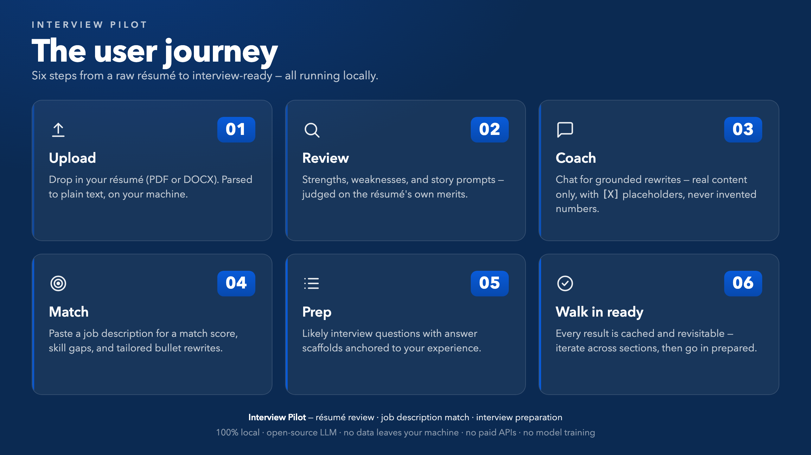
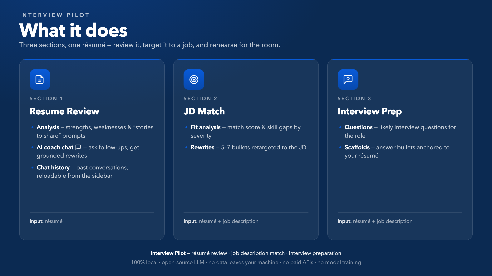
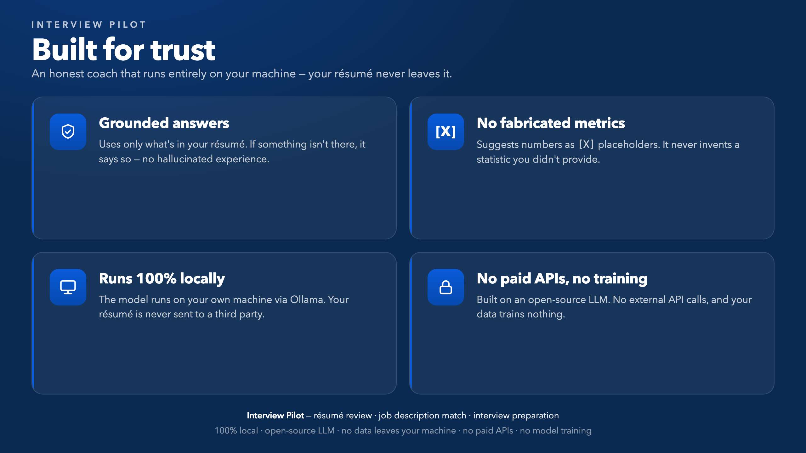
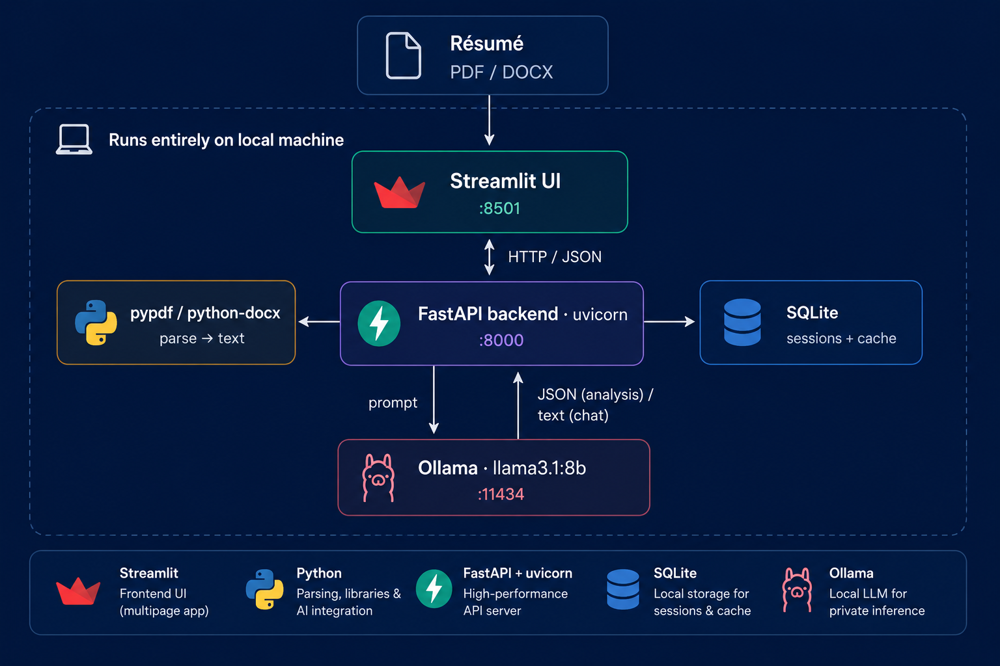
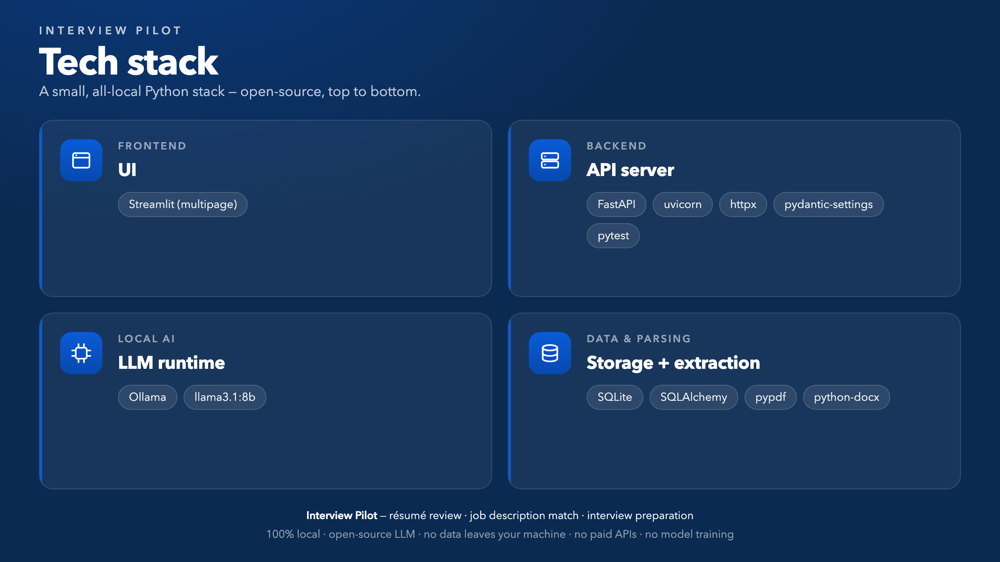

# InterviewPilot

AI-powered prep tool that helps candidates land interviews and perform once they're in the room. It reviews your résumé, tailors it to a specific job description, and generates likely interview questions with answer scaffolds — **all running locally** on an open-source LLM, so your résumé never leaves your machine.

---

## User journey

Six steps from a raw résumé to interview-ready:



1. **Upload** — Drop in your résumé (PDF/DOCX); it's parsed to plain text, locally.
2. **Review** — The model analyzes it on its own merits → strengths, weaknesses, and story prompts.
3. **Coach** — Chat with the AI coach for specific, grounded rewrites — real résumé content only, with `[X]` placeholders instead of invented numbers.
4. **Match** — Paste a job description → match score, skill gaps (by severity), and 5–7 tailored bullet rewrites.
5. **Prep** — Generate likely interview questions with answer scaffolds anchored to your résumé.
6. **Walk in ready** — Every result is cached and revisitable, so you can iterate across sections and head in prepared.

---

## Features



### 1 · Resume Review
- **Analysis** — strengths, weaknesses, and story-to-share prompts pulled from your résumé.
- "Stories to share" is the inspiration prompt list — questions like "You mention 'led a team' — how big was the team and what was the measurable outcome?"
- **AI coach chat** — ask follow-up questions ("How do I make this bullet stronger?") and get specific, grounded rewrites.
  - **Grounded & honest** — answers only from what's actually in your résumé; when something isn't there, it says so instead of inventing it.
  - **No fabricated metrics** — when suggesting numbers you haven't provided, it uses `[X]`/`[N]` placeholders rather than making up statistics.
  - **Multi-turn** — remembers the conversation, so you can say "give me two shorter variations of that."
- **Chat history** — a sidebar list of past conversations (one per résumé + section), kept for the session and reloadable on click.

### 2 · JD Match
Paste a job description to get a match score, the skills you already satisfy, gaps (with severity), and **5–7 résumé bullets rewritten** to better target that JD.

### 3 · Interview Prep
Generates likely interview questions tailored to your résumé + the JD, each with answer-bullet scaffolds and the résumé detail it's anchored to (first question expanded by default).


---

## Built for trust



- **Grounded answers** — uses only what's in your résumé; if it's not there, it says so (no hallucinated experience).
- **No fabricated metrics** — suggests numbers as `[X]`/`[N]` placeholders; never invents a statistic you didn't provide.
- **Runs 100% locally** — the model runs on your machine via Ollama; your résumé is never sent to a third party.
- **No paid APIs, no training** — built on an open-source LLM; no external API calls, and your data trains nothing.

---

## Architecture



- **Frontend** (`interview_pilot_frontend/`) — Streamlit multipage app; a thin HTTP client (`lib/api.py`) talks to the backend.
- **Backend** (`interview_pilot_backend/`) — FastAPI; parses résumés (pypdf / python-docx), builds prompts, calls Ollama's `/api/chat`, and caches results in SQLite so repeat views are instant.
- **LLM** — Ollama running `llama3.1:8b` locally. Nothing is sent to a third party.

**Résumé flow:** Upload (PDF/DOCX) → backend parses to text → stored with the session in SQLite → fed into prompts → Ollama → cached analysis.

### Workflow per section

```text
Section 1 · Resume Review   resume_text                      → prompt → LLM → JSON {strengths, weaknesses, story_prompts}
   └─ Coach chat            resume_text + review + messages   → prompt → LLM → text reply
Section 2 · JD Match        resume_text + jd_text             → prompt → LLM → JSON {match_score, matching_skills, gaps, rewrite_suggestions}
Section 3 · Interview Prep  resume_text + jd_text             → prompt → LLM → JSON {questions: [{question, category, answer_bullets, resume_anchor}]}
```

---

## Tech stack



| Layer | Choice | Why |
|---|---|---|
| Frontend | Streamlit (multipage) | Fast path to a clean, multi-section UI |
| Backend | FastAPI | Lightweight, async, automatic OpenAPI docs |
| Database | SQLite (via SQLAlchemy) | Zero-setup, file-based; caches sessions + analyses |
| LLM runtime | Ollama | Local, free, private — serves the model at `:11434` |
| Model | `llama3.1:8b` (configurable via `MODEL_NAME`) | Good quality/speed balance on a laptop |
| LLM orchestration | Direct `httpx` calls to Ollama `/api/chat` | Simple and transparent; no extra framework |
| Résumé parsing | `pypdf` (PDF) · `python-docx` (DOCX) | Straightforward text extraction |
| Frontend ↔ backend | `httpx` | Thin HTTP client in `lib/api.py` |
| Config / env | `pydantic-settings` + `python-dotenv` | Typed settings loaded from `.env` |
| Testing | `pytest` | Backend tests |

---

## Project structure

```
interview-pilot/
├── README.md
├── implementation_plan.md
├── resume_sample1_Frontend_Engineer.pdf / .docx   # sample résumé for the demo
├── docs/
│   ├── architecture.png                  # architecture diagram (Architecture section)
│   ├── features.png                      # "what it does" slide (Features section)
│   ├── tech-stack.png                    # tech-stack slide (Tech stack section)
│   ├── trust.png                         # "built for trust" slide (Built for trust section)
│   └── user-journey.png                  # user-journey slide (User journey section)
│
├── interview_pilot_backend/              # FastAPI service
│   ├── requirements.txt
│   ├── .env.example                      # OLLAMA_HOST, MODEL_NAME, DATABASE_URL, ...
│   ├── interview_pilot.db                # SQLite (created at runtime)
│   ├── app/
│   │   ├── main.py                       # FastAPI app + router registration
│   │   ├── config.py                     # settings (pydantic-settings)
│   │   ├── db.py                          # SQLAlchemy engine + session
│   │   ├── models.py                     # ORM: Session, Analysis
│   │   ├── schemas.py                    # Pydantic request/response models
│   │   ├── routers/
│   │   │   ├── upload.py                  # POST /upload (PDF/DOCX → text)
│   │   │   ├── review.py                  # POST /review  +  POST /review/chat
│   │   │   ├── match.py                   # POST /match
│   │   │   └── interview.py               # POST /interview
│   │   ├── services/
│   │   │   ├── parser.py                  # extract text from PDF/DOCX
│   │   │   ├── llm.py                     # Ollama client (chat, JSON mode, retry)
│   │   │   └── prompts.py                 # prompt templates (per section + chat)
│   │   └── utils/
│   │       └── text.py                    # text helpers
│   ├── scripts/                          # manual smoke tests
│   │   ├── smoke_llm.py
│   │   ├── smoke_review.py
│   │   └── smoke_chat.py
│   └── tests/                            # pytest (scaffold)
│
└── interview_pilot_frontend/             # Streamlit app
    ├── requirements.txt
    ├── .env.example                      # BACKEND_URL=http://localhost:8000
    ├── .streamlit/config.toml            # theme config
    ├── streamlit_app.py                  # entry page + sidebar
    ├── pages/
    │   ├── 1_Resume_Review.py            # analysis + AI coach chat
    │   ├── 2_JD_Match.py                 # match score, gaps, rewrites
    │   └── 3_Interview_Prep.py           # tailored interview questions
    └── lib/
        ├── api.py                        # thin HTTP client to the backend
        └── ui.py                         # shared CSS + chat-history helpers
```

---

## Prerequisites

- Python 3.11+
- [Ollama](https://ollama.com) installed locally
- ~8 GB free RAM for `llama3.1:8b`

---

## Setup & run

Three terminals.

### Terminal 1 — Ollama (local LLM)
```bash
ollama serve                 # serves at http://localhost:11434
ollama pull llama3.1:8b      # one-time model download (~5 GB)
```
> If Ollama is already running (e.g. the menu-bar app), `ollama serve` will say "address already in use" — that's fine, it's already up.

### Terminal 2 — Backend (FastAPI)
```bash
cd interview_pilot_backend
python -m venv .venv          # first time only
source .venv/bin/activate
pip install -r requirements.txt
cp .env.example .env          # first time only
uvicorn app.main:app --reload --port 8000
```

### Terminal 3 — Frontend (Streamlit)
```bash
cd interview_pilot_frontend
python -m venv .venv          # first time only
source .venv/bin/activate
pip install -r requirements.txt
streamlit run streamlit_app.py
```

Open **http://localhost:8501** and navigate with the sidebar: **Resume Review → JD Match → Interview Prep**.

---

## Configuration

Backend reads `interview_pilot_backend/.env`:

| Variable | Default | Purpose |
|---|---|---|
| `OLLAMA_HOST` | `http://localhost:11434` | Where Ollama is listening |
| `MODEL_NAME` | `llama3.1:8b` | Local model to use |
| `REQUEST_TIMEOUT` | `60` | Per-LLM-call timeout (seconds) |
| `DATABASE_URL` | `sqlite:///./interview_pilot.db` | Session + analysis cache |
| `MAX_UPLOAD_MB` | `5` | Max résumé upload size |

The frontend reads `BACKEND_URL` (default `http://localhost:8000`) — only set it if the backend runs elsewhere.

---

## API surface

All endpoints are JSON in/out and keyed by `session_id`, so state lives in the DB, not the client. The analysis endpoints cache their result per session and return `cached: true` when served from cache.

| Method | Path | Body | Returns |
|---|---|---|---|
| POST | `/upload` | multipart file (PDF/DOCX) | `{ session_id, resume_filename, resume_preview }` |
| POST | `/review` | `{ session_id }` | `{ strengths[], weaknesses[], story_prompts[], cached }` |
| POST | `/review/chat` | `{ session_id, messages[] }` | `{ reply }` |
| POST | `/match` | `{ session_id, jd_text }` | `{ match_score, matching_skills[], gaps[], rewrite_suggestions[], cached }` |
| POST | `/interview` | `{ session_id, jd_text? }` | `{ questions[], cached }` |

- `messages[]` is the running chat: `[{ "role": "user" | "assistant", "content": str }]`.
- `/interview` reuses the JD stored on the session if `jd_text` is omitted.

### Example — `/match` response

```json
{
  "match_score": 72,
  "matching_skills": ["React", "TypeScript", "Accessibility"],
  "gaps": [
    {"skill": "GraphQL", "severity": "high", "suggestion": "Mention any GraphQL usage, even in side projects"},
    {"skill": "Testing", "severity": "low", "suggestion": "Note any Jest / React Testing Library experience"}
  ],
  "rewrite_suggestions": [
    {"original": "Built dashboards", "improved": "Built and maintained React/TypeScript dashboards serving 40k+ monthly active users, cutting load time 35%"}
  ],
  "cached": false
}
```

---

## Database schema (SQLite)

Two tables, created on startup via `Base.metadata.create_all()` — no migration framework needed for the MVP.

**`sessions`** — one upload session (the résumé now, the JD later):

| Column | Type | Notes |
|---|---|---|
| `id` | TEXT (UUID) | Primary key |
| `created_at` | DATETIME | `datetime.utcnow()` default |
| `resume_filename` | TEXT | Original upload name |
| `resume_text` | TEXT | Extracted plain text |
| `jd_text` | TEXT (nullable) | Pasted job description (set later) |

**`analyses`** — one cached LLM result per section per session:

| Column | Type | Notes |
|---|---|---|
| `id` | INTEGER | Primary key (autoincrement) |
| `session_id` | TEXT | FK → `sessions.id` |
| `kind` | TEXT | `review` / `match` / `interview` |
| `created_at` | DATETIME | `datetime.utcnow()` default |
| `payload_json` | TEXT | Full LLM response, cached so re-renders are free |
| `model_name` | TEXT | e.g. `llama3.1:8b` |

**Why cache:** local LLM calls take ~10–60 s. Caching makes the demo snappy and lets the user switch between sections without re-hitting the model.

> Chat turns (`/review/chat`) are **not** persisted — the conversation lives only in the Streamlit session (see Notes).

---

## Notes

- **Private by design** — résumé text and analyses stay on your machine; the only network calls are localhost → Ollama.
- **Cached** — `/review`, `/match`, and `/interview` results are stored per session, so revisiting a section is instant.
- **First call is slower** — the model loads into memory on the first request (~20 s); subsequent calls are fast.
- **Chat history is in-memory** — the sidebar conversation list lives in the Streamlit session; a hard browser refresh or app restart clears it.
